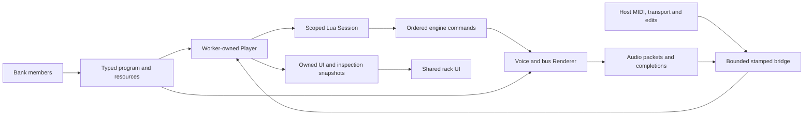

# UVI engine foundations and implementation boundaries

Research checkpoint, 2026-10-04. This maps official product contracts to the
current source and retained native evidence. It is not a claim that the manuals
reveal undocumented DSP algorithms, protection layouts or scheduling internals.
No new build, test, playback, timing, installation or native-emulation run was
performed. The separate main-checkout core refactor was untouched.

## Sources and versions

| Source | Inspected version/scope |
| --- | --- |
| [Falcon manual](https://s3.amazonaws.com/uvi/UVIFC/falcon_manual.pdf) | Software version 2026, EN251016, 361 pages; structure and relevant synthesis/modulation/event sections |
| [Workstation manual](https://cdn.uvi.net/UVIWS_Uvi_workstation/manuals/UVI_Workstation_manual_en.pdf) | Version 4.0, EN250305, 22 pages; relevant browser, load, mixer, settings and streaming sections |
| [UVI Lua reference](https://lua.uvi.net/) | Current public documentation; claims must be distinguished from older-reader observations |
| Downloaded Workstation installer | ProductVersion 4.0.9, established by bounded version-resource reads and archive listing |
| Retained access reader | Workstation VST x64, ProductVersion 4.0.9; compared with the downloaded installer manifest |
| Retained native oracle | Separately identified Workstation 4.0.9 executable/code receipts used for scoped lifecycle and DSP comparisons |

The downloaded installer and retained DLL agree in version, packaged filename
and DLL size. This does not prove byte identity or authenticate the distinct
native oracle. Its 15-entry manifest includes
Starter and English/Japanese guides, but no TagLibrary entry. Listing did not
install, launch or extract the engine. The PDF hashes are retained privately;
vendor binaries, manuals and bank payloads are not added to this repository.

## Product structure

Falcon's manual pp.18–24 separates the component hierarchy from control and
audio flow: Multi → Part → Program → Layer → Keygroup → Oscillator. Events and
control signals travel toward sound generation; generated audio returns through
the owning processing levels. Effects, modulators and event processors have
level-specific ownership. Note-triggered envelopes belong at Keygroup scope.
Oscillators may sample or synthesize; a library name alone does not establish
which physical-model implementation its selected program requires.

Workstation's manual pp.7–8 distinguishes tagged Library browsing from folder
and member browsing. Its pp.11–16 describe multi/part routing and disk streaming
with a voice cache; pp.6,16 distinguish the instrument panel from global and
script UI scaling. Those are separate product contracts, rather than automatic
consequences of decoding a preset.

## Current KONTRA flow and ownership

The following is a source map, not a diagram of authenticated native thread
internals. Each row has a distinct success boundary.

| Boundary | Current owner | What success establishes / what remains separate |
| --- | --- | --- |
| Bank and member access | `uvi/ufs.rs`, `crypto.rs`, `access.rs` | Bounded member access; not graph execution or sound fidelity |
| Program structure | `uvi/program.rs` | Original node identity, attributes and connections; not support for every parsed kind/property |
| Audio and resources | `uvi/library.rs`, `sample.rs`, `storage.rs`, `pcm_cache.rs` | Owned resident samples and resource revisions; not disk-window streaming |
| Lua object model and tasks | `uvi/host.rs`, `script.rs` | Scoped parameters, callbacks, cooperative tasks and commands; not every native parent or callback policy |
| Modulation | `uvi/modulation.rs` | Admitted source/connection clocks and conversions; not arbitrary connected graphs |
| Voice and bus processing | `uvi/playback.rs`, processor leaves | Admitted oscillator/voice/Keygroup/Layer/Program processing; leaf agreement does not prove whole-program lifecycle |
| Worker ownership | `uvi/player.rs`, `worker.rs` | Allocating Lua/DSP/resource work on its worker with stamped requests and replies |
| Host packet bridge | `uvi/bridge.rs`, `plugin/uvi.rs` | Bounded delivery, routing and failure capture; not sustainable realtime throughput |
| Panels and catalog | `plugin/uvi_ui.rs`, `ui/instrument.rs`, `library/uvi.rs` | Owned snapshots and exact bank/member rows; not official tag/preview/cover discovery |

The `uvi` Cargo feature gates this backend. Shared rack, MIDI routing, UI and
general audio facilities remain platform concerns; vendor object paths,
resource identity, scripting and decoder policy remain backend concerns.
[The player boundary](PLAYER_BACKEND_BOUNDARY.md) and
[ABI evidence](PLAYER_ABI_PLAYBACK_EVIDENCE.md) describe retained proofs and
integration limits. A proof facade does not mean production has a finished,
stable public player ABI. The user's core refactor must own that integration.

## Concrete findings from this research

1. **Master callback selection had an eager fallback bug.** Current
   [event documentation](https://lua.uvi.net/group___event_callbacks.html)
   gives `onEvent` precedence over specialized handlers. Both real source
   dispatch paths used `Option::or` with an already-evaluated fallback lookup.
   Consequently an irrelevant wrong-type `onNote`/`onController` could reject
   an event before its valid master handler ran. Source `8d7ce4d` makes that
   lookup conditional. Scheduling, routing, selected-handler errors and absent
   forwarding are retained. This enforces the source's existing priority; it
   does not claim old native hosts accept all malformed declarations.

2. **Host meter is dropped before script context.** The plugin receives time
   signature numerator/denominator and supplies them to the core rack, while
   UVI transport carries only play state, beat and tempo. Script bootstrap
   `getTimeSignature` returns 4/4 and `getBarDuration` assumes four beats.
   [Musical Context](https://lua.uvi.net/group___context.html) documents host
   meter and bar-duration queries. This is a source-visible missing contract;
   meter propagation and native unit/transition verification remain work.

3. **UI/coroutine documentation differs from current behavior.** Current
   documentation restricts widget creation after the main chunk and identifies
   non-yielding UI contexts. The current source and authored fixtures allow
   some initialization widget creation and schedule changed handlers as tasks.
   Current public documentation places `onLoad` after widget restoration,
   whereas the retained 4.0.9 lifecycle measurements establish `onLoad` → widget
   restoration → `onInit` ([recorded evidence](uvi-compatibility.md)). Preserve
   that measured older-reader order. The widget/coroutine differences lack
   equivalent older-reader evidence; this pass does not change them.

4. **Loaded defaults are not descriptor defaults.** Retained 4.0.9 observations
   give omitted Program/Layer/Keygroup PanLaw zero despite descriptor default
   one. [The default evidence](UVI_PANLAW_DEFAULT_EVIDENCE.md) explains the
   baseline correction. This is why current parameter tables alone cannot
   supply missing-property values or setter/clamping semantics.

5. **Catalog and resident caches solve different jobs.** The current saved
   index publishes library/member rows before background verification.
   Decoded-PCM caching still supplies resident sample storage. Neither is the
   streaming voice cache documented by Workstation. `AllowStreaming` metadata
   currently does not establish an execution consumer. These facts help explain
   where additional load/streaming work belongs; they do not identify a measured
   cause for the live queue backlog.

6. **Modern browser companion data is distinct from covers.** Official
   [Workstation browser support](https://support.uvi.net/hc/en-us/articles/25613610492189-UVI-Workstation-4-Browser-Edition-New-Features-and-Troubleshooting)
   describes the TagLibrary preview/indexing dependency. That does not establish
   a product-cover locator. Current UVI rows render an available supplied image;
   the source audit found no UVI-specific image bypass. Tags, preview identity
   and authentic cover discovery remain distinct data contracts. A preset panel
   should not be assumed to be a library cover.

## Next basic implementation work

Continue with host-context propagation and reference-version callback/restore
contracts, then the existing Step Envelope smoothing branch. Documented Smooth
is meaningful; an existing normal-LFO implementation cannot be substituted for
it. Positive Step smoothing needs original branch/state/numerical evidence
before admission. Connected MultiLFO, CombFilter/MS20 controls, effect tails,
streaming and outer Part/Synth behavior retain their separate limits.

For each contract, track documented behavior, exact reference-reader version,
static native evidence, implemented scope and executed verification separately.
At minimum, retain failure stage and original node identity alongside any
unsupported setting. Complete parsing, visible panels and finite output are
different milestones from native behavior and reliable live playback.

The callback change passed independent static review. Authored isolated/scoped
dispatch tests cover master selection, fallback errors, automatic forwarding and
delayed note/controller ordering; they remain **uncompiled/unrun**. Installed
binaries remain `cc54c67`. Augmented Orchestra's rejected graph and Oboe's audio
delivery backlog are not established fixed by this research or source change.
