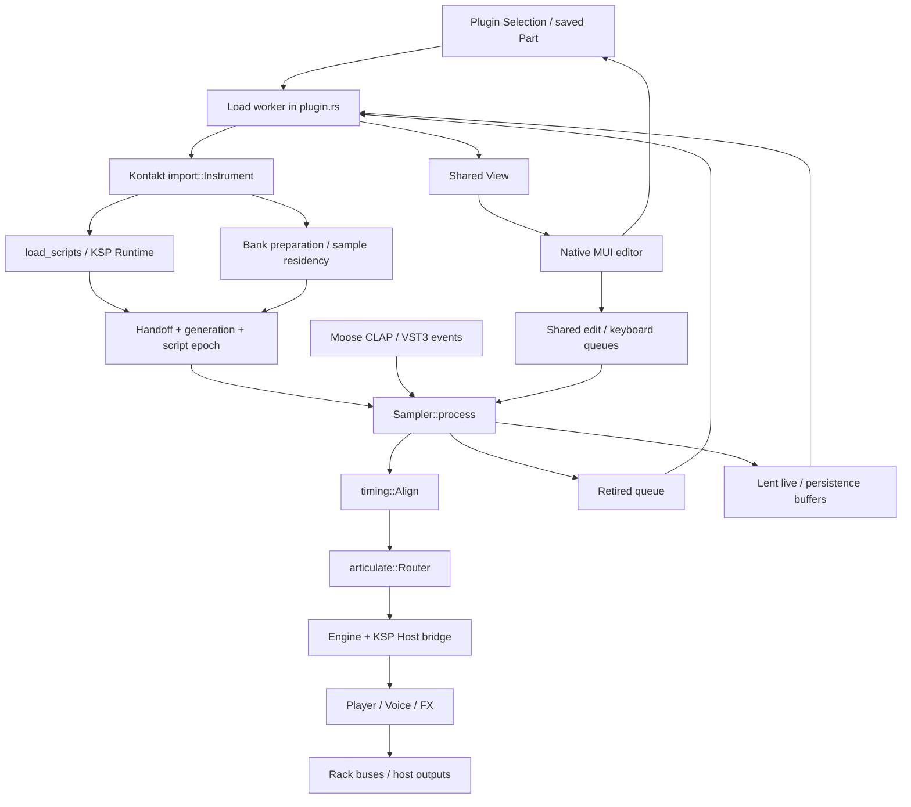

# Current architecture and ownership map

Baseline: `ac2adc981191347bbdacaee3a29c359464ec712e`, inspected 2026-10-05.
This is a focused architectural survey, not an exhaustive correctness or unsafe-code
audit. Graft supplied the entry points and caller graph; the critical source spans
were then inspected. Its lexical graph is navigation evidence, not a Rust type checker.

## What exists

The root `kontakto` package builds the engine, CLI, plugin integration, and native UI.
Default features enable plugin, CLAP, VST3, and library access. Standalone is optional.
The workspace also contains locally patched Moose host/UI packages. See
[Cargo.toml](../../Cargo.toml) and [vendor patch notes](../../vendor/MOOSE-PATCHES.md).

Tracked Rust files at this baseline: 100 under `src/` (102,380 lines), one under
`tests/` (4,054 lines), and 191 under `vendor/` (48,154 lines). Counts include comments,
blank lines, and inline tests, and exclude non-Rust files. They measure size, not
dead code or runtime cost. For example, `plugin.rs` is 8,818 lines but contains a
large regression suite; deleting those tests would not simplify the architecture.

## Current execution paths

The renderer already uses bounded handoffs; it is not simply an editor sharing an
`Arc<Mutex<Engine>>`. The problem is that many contracts live together in the plugin
and depend on knowledge of each other's generations, queues, and concrete types.

### Load, publish, and retire

[`Load::run`, plugin.rs:2055–2877](../../src/plugin.rs#L2055) drains retirement,
handles multi/snapshot requests, imports the selected program, initializes scripts,
prepares banks/effects, publishes views, and performs further preload/RAM upgrades.
Scripts and bare sample preparation can run concurrently on workers.

[`Handoff` and `Retired`, plugin.rs:1038–1084](../../src/plugin.rs#L1038) transfer
concrete `Bank`, `Runtime`, FX, sample heads, and zone data. The audio callback stops
adopting when the retirement queue is full and sends superseded payloads back for
worker destruction. Generation and script epoch are distinct checks and must not
be collapsed during extraction.

[`Engine::set_bank`, engine/mod.rs:276–300](../../src/engine/mod.rs#L276) chokes
host notes, clears voices and pending releases, and replaces the bank.
[`upgrade_bank`, 308–326](../../src/engine/mod.rs#L308) can rebind live voices for
same-instrument residency changes, with a fallback to replacement. This is not a
general old-plan/new-plan coexistence model. Both behaviors need separate tests.

### Host input to sound

[`exact_host_input`, plugin.rs:2888–2931](../../src/plugin.rs#L2888) validates and
converts exact host tuples. It retains signed host IDs and converts VST3 onset
tuning, but rounds host velocity to a `u8`. Some note-expression forms are explicitly
unsupported. A canonical high-resolution event layer remains work to do.

[`Sampler::process`, plugin.rs:3461–3951](../../src/plugin.rs#L3461) installs
worker products, handles controls, routes exact/typed events once, splits rendering
at host/alignment boundaries, mixes outputs, refreshes snapshots, and sends worker
requests. Internal chunks are capped by `MAX_BLOCK = 128`.

[`Router`, articulate.rs:446–472](../../src/articulate.rs#L446) owns held-route
tables, MPE/RPN state, expression, and knowledge of the attached script. It feeds
[`Engine`, engine/mod.rs:208–244](../../src/engine/mod.rs#L208), which owns a
concrete KSP runtime, bank, parameter-write/command queues, and player.
[`Engine::render`, 1339–1451](../../src/engine/mod.rs#L1339) runs script scheduling,
applies parameter writes before same-frame commands, segments DSP, and handles
overflow recovery. Timing therefore spans the host loop, alignment scheduler, KSP
scheduler, and command application; merging them carelessly would change semantics.

### Logical state and physical resources

| Domain | Current owner / evidence | Boundary to preserve or change |
| --- | --- | --- |
| Source data | [`Instrument/Group/Zone`, import.rs:71–214](../../src/import.rs#L71) | Kontakt types, script state, paths, defaults, and FX share one source model. Preserve source identity before neutral lowering. |
| Prepared instrument | [`Bank`, engine/bank.rs:409–462](../../src/engine/bank.rs#L409) | Shares immutable zone tables but also holds mutable group settings/base, streaming and residency state. Separate prepared topology from live state. |
| Host ownership | [`Owners/HostRef`, engine/host_notes.rs:36–150](../../src/engine/host_notes.rs#L36) | Bounded generational slots, original host tuple, live/held state, expression overlay. Capacity currently depends on `ksp::EVENT_CAPACITY`. Reuse the invariants. |
| Script ownership | [`ksp::Event`, ksp/runtime.rs:262–313](../../src/ksp/runtime.rs#L262) | Parent/children, callbacks, physical owners, generation, held/ignored state, voice reference. This is substantial working semantics, not a parser stub. |
| Player state | [`Player`, engine/mod.rs:1520–1590](../../src/engine/mod.rs#L1520) | Voice pool, controller/key arrays, pedals, release queues, expression, stream slots, clocks. Several identities coexist. |
| Voice state | [`Voice`, engine/voice.rs:957–1038](../../src/engine/voice.rs#L957) | Event and host references, release ownership, cursor, stream, envelope, modulation and filter history. Do not substitute a key index for an owner. |
| Script services | [`KspEngine`, ksp/engine.rs:90–178](../../src/ksp/engine.rs#L90) and [`engine/script.rs`](../../src/engine/script.rs) | Existing command/query seam is KSP-specific. Extract a neutral subset while retaining language rules in the adapter. |
| Asset preparation | [`Bank::load_cancelable`, engine/bank.rs:508–718](../../src/engine/bank.rs#L508), [`Source`, audio.rs:768–777](../../src/audio.rs#L768) | Resolver/codec work stays off audio; share data without sharing voice cursors. |
| Streaming | [`Streamer`, engine/stream.rs:291–433](../../src/engine/stream.rs#L291) | Per-bank stream state, bounded per-voice rings, shared worker-pool facility and worker decode cache. Not yet the proposed general source-demand page service. |
| Rack and buses | [`Rack`, engine/rack.rs:125–139](../../src/engine/rack.rs#L125), [`render_live`, 290–394](../../src/engine/rack.rs#L290) | Reuse routing/mixing behavior; keep bus state separate from note lifetime. |
| UI and recall | [`Shared`, plugin.rs:444–575](../../src/plugin.rs#L444), [`Dsp`, 3002–3038](../../src/plugin.rs#L3002), [`ui::editor`, ui/mod.rs:61–117](../../src/ui/mod.rs#L61) | The editor consumes plugin-specific views and queues. Move musical controls/recall behind a headless state contract, retaining MUI as a view. |

## Findings that should drive the migration

1. **The plugin is the application coordinator.** `Load::run` is 823 lines and
   `Sampler::process` is 491 lines. File splitting alone would leave the same
   dependency and lifecycle coupling. Extract preparation, exchange, state, and
   protocol responsibilities behind tested contracts.
2. **The core and KSP depend on each other.** `Engine` owns `Runtime`; KSP events
   contain engine host/expression references; the host-note arena uses a KSP capacity.
   The proposed neutral kernel must not import either frontend or plugin types.
3. **An imported group is overloaded.** Mapping/start conditions, source settings,
   envelopes, modulation, voice limits, and insert effects live in `Group`. The
   `start_criteria` field explicitly says it is retained but not evaluated by playback.
   Structural preservation and playable behavior must be reported separately.
4. **Ownership exists, but in several representations.** Host roots, KSP events,
   physical channel/key tables, alignment records, and voices carry related lifetimes.
   Establish one canonical logical note; retain source-specific ID projections.
   Existing generational tracking should be generalized, not discarded.
5. **Replacement has several meanings.** Preset replacement chokes; residency upgrade
   may preserve voices; script and zone work use epochs. Give each operation an
   explicit transition policy and distinguish requested, prepared, and installed state.
6. **Host precision is currently reduced at normalization.** Preserve original
   normalized values until a compatibility adapter deliberately quantizes them.
7. **Current live/offline behavior differs deliberately.** The plugin sets
   `blocking_streams` in offline mode, while `Engine::render` suppresses live
   load-shedding offline. Document these as separate contracts; do not infer block
   invariance or universal real-time safety from the presence of bounded queues.

## Risks requiring focused reproduction

These are source-review findings, not failures demonstrated by this planning change.

| Priority | Evidence and concern | First check |
| --- | --- | --- |
| P0 | `finish_host_notes` retains admitted owners on rejected NOTE_END ([2976–3000](../../src/plugin.rs#L2976)), but the no-owner/unmatched route in `process` ([3772](../../src/plugin.rs#L3772)) only increments a rejection counter after an immediate terminal push fails. | Saturate host output for consumed switches, unmatched routes and refused admissions; verify a later retry and same-key/new-ID isolation. V2-01/V2-15. |
| P0 | Persistence is copied incrementally: [`refresh_persistence_within`, runtime.rs:1399–1429](../../src/ksp/runtime.rs#L1399) reads current memory across budgets; plugin completion tracks the starting version. Coherent multi-variable capture during continuous mutation needs proof. | Mutate two correlated persistent values across multiple copy budgets and reject any impossible pair. V2-01/V2-13. |
| P1 | `Router` uses a runtime address as a script-change marker ([472 vicinity](../../src/articulate.rs#L467)); script init records zone-array pointer identity ([script.rs:46–130](../../src/engine/script.rs#L46)). | Inventory pointer-derived identities and replace semantic uses with explicit instance/generation IDs as those seams migrate. V2-02/V2-10. |
| P1 | Host generation wraps, and several clocks/capacities are specialized to today's implementation. | Force slot reuse and near-wrap clocks; specify exhaustion and stale-ID behavior before widening IDs mechanically. V2-03. |

## Reuse, replace, and defer

**Reuse after characterization:** decode and PCM primitives, loop geometry, DSP
kernels and their regressions, indexed key selection, KSP parser/bytecode/runtime,
bounded worker handoffs, explicit host ownership, MPE routing tests, diagnostics,
native editor, host wrappers, and existing build/provenance machinery.

**Replace incrementally:** vendor-shaped data in the shared runtime, scattered
ownership authority, plugin-owned application orchestration, implicit parameter
scope/units, and ad hoc generation tuples crossing every subsystem.

**Do not remove on size alone:** test suites, vendor patches, compatibility quirks,
or safety checks. No duplicate engine implementation has been justified here.
New adapters must consume shared note/voice/asset services.

## Existing evidence to carry forward

Existing tests are candidates for characterization, not newly executed results:

- [`exact_roots_keep_finite_attacks_pedals_children_and_late_expressions_without_heap`](../../src/engine/host_notes.rs#L179)
- [`ownership_exhaustion_and_duplicate_tuples_do_not_steal_generations`](../../src/engine/host_notes.rs#L361)
- [`exact_note_end_backpressure_retains_owners_for_one_retry_without_heap`](../../src/plugin.rs#L7776)
- [`replacement_runtimes_reject_queued_old_views_and_snapshots_without_audio_allocations`](../../src/plugin.rs#L5905)
- [`wait_async_retains_context_until_validated_completion_without_audio_heap_work`](../../src/ksp/tests.rs#L2337)
- [`mpe_member_controls_stop_modulating_released_notes_on_channel_reuse`](../../src/articulate.rs#L1897)

The current `set_bank` caller graph includes plugin installation, CLI render and
bench tools, playback audits, and numerous fixtures. A future migration must cover
these entry points, not only the plugin callback. Public-format adapters, reference
engine behavior, complete unsafe/lifetime review, and measured performance remain
outside this initial survey.
