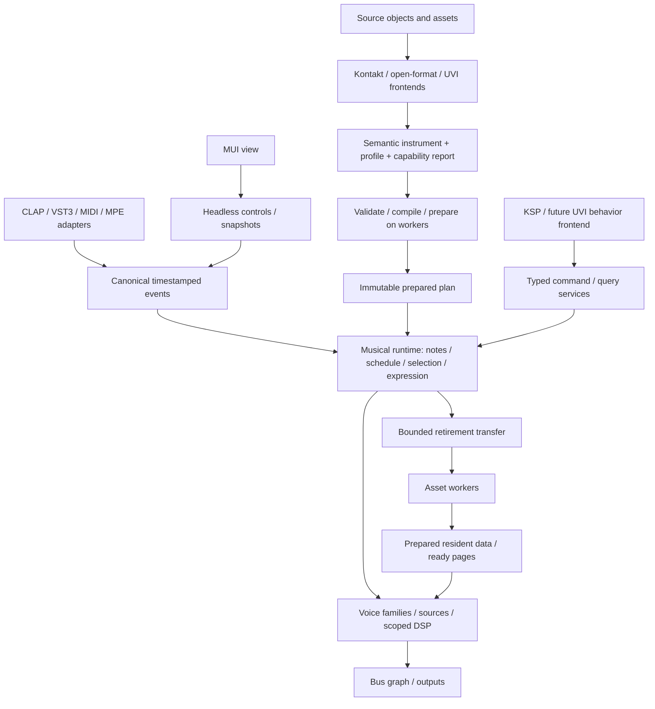

# Proposed 2.0 architecture and migration

Status: proposed implementation contract. Baseline and evidence are in
[CURRENT_STATE.md](CURRENT_STATE.md); execution work is in [TASKS.md](TASKS.md).
The first experimental subset and its checks are recorded in [IMPLEMENTATION.md](IMPLEMENTATION.md).

## Outcome

One musical runtime owns note lifetimes, scheduling, selection, expression, voice
allocation, and resource-use lifetimes. Kontakt, UVI, open formats, and native
instruments contribute source translation and explicit behavior profiles. Source
and effect implementations contribute algorithms, not independent MIDI/voice engines.

The first usable delivery is a headless native PCM fixture plus a KSP fixture that
suppresses an input, generates linked/detached children, waits, and releases safely.
It must work at different block partitions and under exhausted capacities before
becoming the production plugin path.

## Responsibility and dependency boundaries

| Responsibility | Owns | Must not own |
| --- | --- | --- |
| Source frontend | Vendor identities, units/defaults, raw extensions, source diagnostics and profile lowering | Host event dispatch, voice allocator, audio-thread file access |
| Compiler/preparer | Validation, selection indices, scoped DSP/modulation schedules, buffer/resource bounds, source-to-runtime mapping | Live notes or UI widgets |
| Musical runtime | Logical notes, relationships, gates, decision records, expression, event ordering, bounded continuation scheduling | Filesystem paths, vendor parser objects, native windows |
| Source/DSP execution | Cursor/envelope/filter history, declared latency/tail, source demand windows | Host note IDs as array indices or its own independent note manager |
| Asset service | Immutable asset identity, decode, residency, page readiness, worker lifetime | Musical note-off interpretation |
| State/control service | Stable parameter/control IDs, snapshots, profile migrations, command admission | Active voice mutation from the UI thread |
| Host adapter | Protocol interpretation, host lifecycle and terminal delivery, audio-buffer contracts | Kontakt group rules or KSP numeric conventions |
| UI | Presentation, user edits and diagnostics | Musical controls that disappear when the window closes |

Initially create **one small `crates/sampler-core` crate**, only when it ships the
first runnable note/PCM slice. Its dependency direction must be enforceable: it
cannot depend on the root `kontakto` crate, Moose/MUI, `ni-file`, or KSP types. Start
with standard-library types and private modules; do not create empty crates for
every row. The root package composes the existing application and adapters around it.

Extract existing pure DSP/PCM primitives as the slice needs them, with their tests.
Do not copy `Engine` into a second crate or introduce a second production renderer
by default. Avoid public traits until the slice has an actual boundary consumer;
prepared enums/tables can cover the initial source variants. A script service seam
is justified early because both native behavior and KSP must exercise it.

The longer-term compiler, asset, language and host module names are responsibility
names. Split further crates only when doing so prevents an observed dependency
violation or meaningfully isolates build requirements. Keep existing dependencies;
the references' mention of `rtrb`, Lua or Wasm is not a request to add them now.

## Three representations

1. **Source model:** preserves vendor hierarchy, object order/IDs, units, defaults,
   unknown material, and provenance. Existing Kontakt `Instrument` remains an adapter
   input during migration; do not rename it “universal” and keep its assumptions.
2. **Semantic model:** separates mapping regions, selection domains, articulations,
   note/family relationships, source templates, modulation, audio routing, controls,
   and compatibility requirements. Unsupported meaning survives in the source/report.
3. **Prepared plan:** immutable dense tables, resolved IDs, selection indices,
   processing schedules, bounded arena requirements and asset references. Mutable
   control values, script memory, voices and sequence counters live outside it.

Keep authoring hierarchy, event routing, modulation dependencies and audio routing
distinct. A source group is not inherently a bus. Compiler transformations must
preserve state scope, particularly nonlinear per-voice processing. Reject unsupported
cycles; causal feedback requires an explicit delayed edge or declared processor.

## Ownership contract

| Identity/state | Lifetime and authority |
| --- | --- |
| Input token | Original protocol/port/channel/key and optional signed external ID; host adapter maps it to a logical note. Original and transformed addresses remain separate. |
| Logical note | Generational handle, independent of whether a PCM source still sounds. Audio execution owns key/gate/pedal state, parent relationship and outstanding work. |
| Voice family | One coordinated selection/attack or transition decision, potentially several microphone/layer sources. Family and individual-voice commands remain distinct. |
| Render voice | Generational handle to source and per-voice DSP state; stealing it does not automatically discard required logical-note context. |
| Expression owner | Note-scoped expression with declared child inheritance: linked, snapshot or independent. MPE channel reuse cannot silently retarget release tails. |
| Plan generation | Retained by notes, voices, continuations and worker jobs that require it. New admissions can use a different generation. |
| Asset/version | Immutable data shared by source views. Loop/root/start metadata belongs to views; cursor/history belongs to voices. |
| Control identity | Stable semantic/persistent ID, independent of UI array position or compiled dense index. |

One writer per mutable domain: audio owns musical execution; workers own preparation
and destruction; the control side owns editable models and command submission.
Immutable data can be shared. No final heavyweight destructor may run as an
accidental consequence of an audio-thread `Arc` release.

For every cross-domain payload specify producer, consumer, identity, capacity,
failure policy, and final destructor. Initially use typed operations for actual
handoffs, not an untyped message bus covering hypothetical future operations.

| Transfer | Capacity/overflow contract |
| --- | --- |
| New notes/generated notes | Reserve ownership, continuation and terminal-cleanup capacity before accepting. Refuse with a reason if the admission cannot be completed. |
| Note release/choke/cancellation | Cannot be discarded as telemetry. Use retained state/reserved capacity and bounded processing; required cleanup survives pressure. |
| Prepared plan adoption | Reserve a retirement slot before transfer. Keep current state when adoption cannot proceed; backpressure the control side. |
| Async completion | Validate part identity, plan generation, script epoch and request ID as applicable. Stale products retire off audio; they do not overwrite newer state. |
| UI parameter writes | Coalesce only where the parameter contract permits it; preserve ordered edges and acknowledge rejected edits. |
| Telemetry | Bounded and optionally lossy, with a dropped-record counter. No synchronous formatting/logging in the callback. |
| Host terminal notification | Retain the original address and pending delivery until accepted, including no-voice/rejected/unmatched input paths. Recycling is separate from attempted output. |

## Native behavior decisions to ratify in V2-02

These are proposed native defaults, not claims about Kontakt or other vendors.
Record imported exceptions in concrete versioned profiles.

| Decision | Proposed first contract |
| --- | --- |
| Repeated anonymous key | FIFO per input port/channel/key. Explicit host IDs and wildcards use their adapter rules. |
| Ordering | Stable input sequence at equal sample times, with a defined causal order for newly generated events. No global event-type sort. |
| Time | Monotonic integer engine samples; separate transport epoch/beat clock. Beat waits follow musical-time policy; source profiles may differ. |
| Gates/releases | Physical release, effective gate release, source end and terminal delivery are separate transitions. Preserve attack decision context; release policy chooses which values are current versus captured. |
| Expression | Preserve host precision in canonical events. Quantize only at a profile boundary. Keep physical channel, logical part and compatibility-visible channel distinct. |
| Variation | Seeded native randomness; one take decision per coordinated family. Explicit counter scope and commit point; independent release sequences remain possible. |
| Admission | Independent note, family, voice, continuation and expensive-source budgets. Numeric limits come from V2-01 measurements and target workloads. Cleanup capacity is reserved. |
| Reconfiguration | A new preset may explicitly choke or let old notes finish; never infer the policy from a pointer swap. First cutover preserves legacy behavior. |
| Retained generations | A fixed prepared capacity, including pending adoption/retirement. When exhausted, postpone/refuse a new load on the control side. No unbounded tail retention. |
| Missing assets/pages | Failed preparation leaves the active instrument intact. Live not-ready onsets are refused; starved sources use a specified bounded fade. Import profiles must label any behavioral difference. |
| Failure | Invalid input is rejected at entry; script budget/fault cleanup resolves that script's children and future work. No silent API no-ops in strict mode. |
| Import mode | New v2 imports default to strict capability validation; explicit best-effort records every substitution. Existing projects keep their legacy path until migrated. |

Live and offline execution must be distinguished explicitly. Native offline tools
may prepare/wait outside the bounded render call. A plugin's offline behavior must
be checked against its actual host contract; do not carry the current blocking
flag into every new rendering context without review.

## Scripting, controls, and compatibility

Keep the KSP frontend and its documented/probed semantics. Introduce neutral
operations for create/release/cancel, expression, scoped parameters, waits, controls
and async requests. A synchronous command followed by a query needs immediate
logical readback; expensive preparation is asynchronous only where the API allows it.
Budget native helpers as well as VM instructions and bound zero-time generation.

Raw input and downstream script-visible/controller state are different projections.
A swallowed CC must not already have changed downstream modulation. Test this
before combining the existing schedulers or command queues.

Control values exist headlessly. Snapshot capture must have a defined consistency
point and a bounded method of producing a coherent image. Stable automation IDs,
profile IDs, source identity and schema migrations are separate from display names.
Do not overwrite legacy saved projects during experimentation.

Each import reports asset, structural, event, script, audio, and state/presentation
capabilities separately. Statuses follow the supplied architecture: `exact`,
`translated_with_verified_semantics`, `approximate`, `unsupported`, `blocked_asset`,
`unverified`. Every asserted result needs profile/version, source object, feature,
impact and evidence. Parsing, native conformance and vendor audio equivalence are
different milestones.

UVI needs a distinct source hierarchy, Lua semantics, dispatch rules and bounded
runtime policy. The existing inspector provides metadata groundwork only. SINE,
SampleTank, proprietary DSP and external module distribution remain conditional on
concrete fixtures/access and measured requirements. A tidy interface does not solve
those unknowns.

## Delivery gates

| Gate | Deliverable and dependency | Exit evidence |
| --- | --- | --- |
| M0 — baseline/contracts | V2-01/02; current code remains production | Characterization traces, risk reproductions, accepted native policies and resource budget manifest; no invented vendor goldens. |
| M1 — semantic vertical slice | V2-03–06; tiny headless core and early KSP adapter | Same-key overlap, stale handles, child cancellation, pedals, consumed CC, equal-time ordering, terminal pressure and PCM onset across variable partitions; zero callback heap work in exercised paths. |
| M2 — source/semantic separation | V2-07–09; indexed selection and scoped rendering | Kontakt subset plus one authored open-format subset use the same note kernel; slow/compiled selection agrees; unsupported requirements are explicit. |
| M3 — production resources | V2-10–12; generation exchange and asset service | Stale completion rejection, storage-stall behavior, held-note transitions, bounded retained memory, off-audio destruction. |
| M4 — application cutover | V2-13–16; controls, broader KSP, host lifecycle and plugin integration | Legacy state migration, UI-closed equivalence, coherent capture, host backpressure and DAW reset/reactivation; current legacy regressions still pass. |
| M5 — second semantic frontend | V2-17/18; UVI hierarchy/runtime slice | A pinned available fixture exercises different dispatch/hierarchy semantics through the same core; inaccessible banks stay blocked. |
| M6 — retirement and expansion | V2-19/20; remove superseded paths, optimize measured costs | No migrated callers need the old implementation; matched-workload performance report and complete required CI; wider features each have a separate capability/evidence gate. |

KSP behavior is tested at M1; broader KSP coverage continues through M4. M3 resource
contracts are designed at M0 even though production streaming arrives later. Host
terminal semantics are represented in the headless harness before full host cutover.

## Migration and rollback

Keep legacy playback as the default while M1–M3 mature. Run the experimental core
through a headless test entry point; at M4 choose the engine at instrument preparation
and activation, not with vendor/mode branches inside each sample loop. Both paths
consume the same authored fixtures, but the legacy output is a characterization
baseline, not automatically the correct result for a newly specified native contract.

Each implementation change must state: entry point migrated, compatibility
differences, evidence, remaining legacy callers, and the condition for deletion.
Move pure functions with their regressions. Never route one live note through two
allocators or migrate active raw pointers between engines.

Use separate versioned experimental state. Preserve original legacy state on load,
write migrated output to a new representation, and keep an explicit downgrade path
until the cutover is accepted. On preparation failure the old active instrument stays
valid. Roll back a failed gate by selecting the legacy path, not by trying to undo
half-applied audio-thread state.

Module responsibility is not permanent personal ownership of files. Work on bounded
contracts with small changes. Before moving/renaming shared symbols, query Graft
callers and enumerate all entry points. If concurrent work is later requested, give
each change a concrete seam and one integration change for shared boundaries; do not
rely on a perpetual “only person X may edit core.rs” rule.

## Validation and performance

Use the existing Rust test infrastructure. Start with authored impulses/tones and
small KSP scripts; no commercial sample banks are needed for the first gates.
Record event/selection/ownership traces alongside PCM, engine/profile revision,
sample hashes, seed, sample rate and block partition. Native results and licensed
reference probes have separate result records.

Initial partition matrix: 16, 32, 64, 128, 256, 512, 1024, irregular segments, zero
blocks and boundary-timestamp events; include at least 44.1 and 48 kHz before M1 exit.
Exercise both successful and saturated queues, disposal, reset, replacement and
script failures. Callback instrumentation must cover allocation **and deallocation**;
source review and targeted instrumentation must also cover locks, I/O and bounded work.

Report callback-time distributions and maximum observed time, deadline misses,
notes/families/voices, memory high-water, retained generations, page misses and
worker backlog. Compare matching source modes, DSP, layers, sample rates and quality
with cold/warm caches. Choose hardware/host-specific performance limits from baseline
measurements; no speedup is promised by this document.

Run focused checks while developing, and the applicable [CI gates](../CI.md) before
integration. Use a worktree-specific Cargo target directory. Source/DSP/unsafe or
dependency changes also need shipping-profile validation. Documentation-only planning
does not establish that these runtime gates have passed.

## Explicitly deferred

No dynamic C ABI or hot-unload SDK, fourteen-crate scaffold, new Lua/Wasm dependency,
general graph editor, independent per-vendor sampler, GPU callback path, private
render thread pool, speculative compression format, or broad DSP parity claim.
Revisit each only with a concrete consumer, source capability and measurement.
