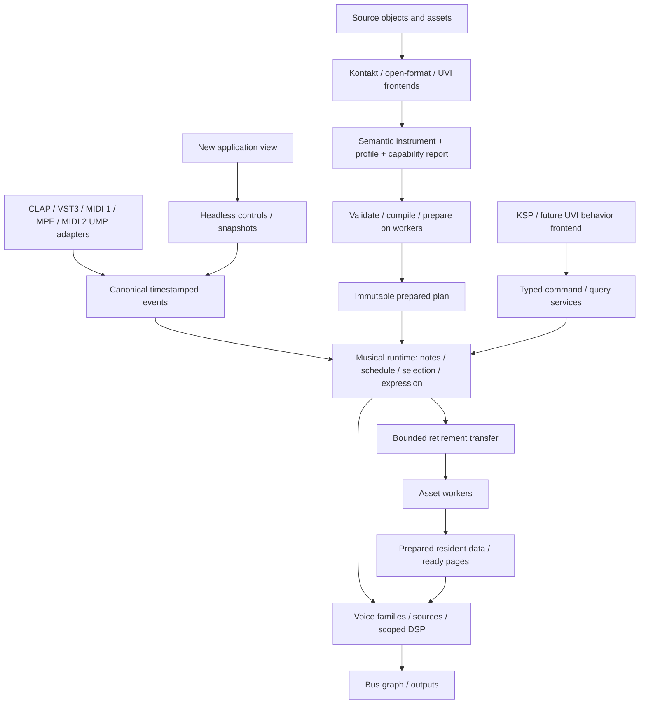

# Clean-sheet 2.0 architecture and delivery

Status: clean-sheet implementation contract, revised 2026-10-05 by explicit user direction.
No backward compatibility with KONTRA 1.x is required. This supersedes migration,
legacy reuse and rollback requirements in earlier planning and implementation notes.
The supplied reference files remain unchanged as research inputs. Baseline and evidence are in
[CURRENT_STATE.md](CURRENT_STATE.md); execution work is in [TASKS.md](TASKS.md).
The first experimental subset and its checks are recorded in [IMPLEMENTATION.md](IMPLEMENTATION.md).

## Outcome

One musical runtime owns note lifetimes, scheduling, selection, expression, voice
allocation, and resource-use lifetimes. Kontakt, UVI, open formats, and native
instruments contribute source translation and explicit behavior profiles. Source
and effect implementations contribute algorithms, not independent MIDI/voice engines.

V2 is a new implementation of the product: engine, ownership, preparation, asset
service, scripting runtime, state, host integration and application composition.
Old sessions, internal APIs, file ownership rules and playback quirks impose no
compatibility obligation. Legacy code is a source of failure cases, not the scaffold
or behavioral oracle. No legacy bug fix blocks v2 work.

Third-party instrument/protocol compatibility is a separate product capability:
Kontakt/KSP and UVI support still need explicit profiles and evidence, implemented
against the new services. They do not require reuse of the old parser or VM.
Standard libraries and independently selected dependencies remain available; a
clean-sheet product does not require reimplementing operating systems or codecs.

The existing new `sampler-core` is a tested experiment, not a frozen foundation.
Replace any prototype contract that falls short of this design. Its old-VM KSP
bridge proves a narrow experiment only and is not the v2 scripting implementation.

“Best” is a design goal measured through correctness, audio quality, bounded
resource use, callback latency and developer-facing module contracts. We will not
claim market leadership or future-proofness without comparative evidence. MIDI 2.0
is required scope from the event-model stage, not a postponed adapter.

## Current implementation priority

The user clarified the product direction again on 2026-10-05: complete the native
architecture before an early DAW/UI preview. Linux CLAP in Bitwig is the eventual
hands-on target, not a reason to rush host integration ahead of the engine.

Native expression and modulation capabilities must not be restricted by the source
format. For example, an imported Falcon instrument should be able to receive native
MPE routing even where its original authored behavior did not provide that route.
This requires distinct raw controller, expressive member-channel, musical routing,
logical-note and expression-owner identities; it does not mean applying all incoming
controllers before a script has had the opportunity to consume them.

After these foundations are ready, port useful product behavior and independently
review reusable implementations from the old product. Retain code only where it
fits the new contracts and passes independent tests; delete redundant ownership,
parallel engines and obsolete constraints. Reuse is permitted, compatibility shims
and dependence on the old core are not. Unsupported vendor behavior remains explicit.

Native [pitch/rate conversion and live note expression](RESAMPLING.md) now have
initial independent audio/ownership evidence. Expression routing, broader resampler
performance and quality coverage, and modulation remain open. Import coverage, streaming, DSP graphs,
fuller scripting, persistence and product integration remain substantial open work.
Rust Doctor configuration stays available, but repeated score scans are no longer
the interactive work loop at the user's request; correctness and realtime checks
continue with each affected implementation.

## Responsibility and dependency boundaries

| Responsibility | Owns | Must not own |
| --- | --- | --- |
| Source frontend | Vendor identities, units/defaults, raw extensions, source diagnostics and profile lowering | Host event dispatch, voice allocator, audio-thread file access |
| Compiler/preparer | Validation, selection indices, scoped DSP/modulation schedules, buffer/resource bounds, source-to-runtime mapping | Live notes or UI widgets |
| Musical runtime | Logical notes, relationships, gates, decision records, expression, event ordering, bounded continuation scheduling | Filesystem paths, vendor parser objects, native windows |
| Source/DSP execution | Cursor/envelope/filter history, declared latency/tail, source demand windows | Host note IDs as array indices or its own independent note manager |
| Asset service | Immutable asset identity, decode, residency, page readiness, worker lifetime | Musical note-off interpretation |
| State/control service | Stable parameter/control IDs, snapshots, profile migrations, command admission | Active voice mutation from the UI thread |
| Host adapter | Protocol interpretation, host lifecycle and terminal delivery, audio-buffer contracts | Kontakt group rules or KSP numeric conventions |
| UI | Presentation, user edits and diagnostics | Musical controls that disappear when the window closes |

Build independently of the legacy root application. The new core must not depend
on `kontakto`, legacy KSP/parser types, UI frameworks or host wrappers. Introduce
functional modules with explicit ownership and dependency tests; split crates where
that enforces a real boundary. Do not create empty interfaces for hypothetical uses.

Implement new source, DSP, compiler, asset and language services against these
contracts. Do not extract old engine structures and rename them. Select third-party
dependencies on their suitability for the new product, with an explicit realtime,
licensing, portability and maintenance review when adopted. No old dependency is
mandatory merely because it is already installed.

Modularity means documented inputs, outputs, lifetime, versioning, cost and failure
behavior; it does not mean a plugin framework in every hot path. Prepared tables
and statically dispatched kernels remain valid choices. External module distribution
and ABI stability need separate evidence before being promised.

## Three representations

The [shared IR contract and Luau evaluation](SHARED_IR.md) make this boundary
explicit for all format frontends. Shared instrument semantics and execution services
do not require every language or declarative format to run through a Lua-family VM.

1. **Source model:** preserves vendor hierarchy, object order/IDs, units, defaults,
   unknown material, and provenance. New frontends own these structures; do not rename the legacy Kontakt
   `Instrument` “universal” and inherit its assumptions.
2. **Semantic model:** separates mapping regions, selection domains, articulations,
   note/family relationships, source templates, modulation, audio routing, controls,
   and compatibility requirements. Unsupported meaning survives in the source/report.
3. **Prepared plan:** immutable dense tables, resolved IDs, selection indices,
   processing schedules, bounded arena requirements and asset references. Mutable
   control values, script memory, voices and sequence counters live outside it.

Keep authoring hierarchy, event routing, modulation dependencies and audio routing
distinct. A source group is not inherently a bus. Compiler transformations must
preserve state scope, particularly nonlinear per-voice processing. Reject unsupported
cycles; causal feedback requires an explicit delayed edge or declared processor.

## Ownership contract

| Identity/state | Lifetime and authority |
| --- | --- |
| Input token | Original protocol/port/channel/key and optional signed external ID; host adapter maps it to a logical note. Original and transformed addresses remain separate. |
| Logical note | Generational handle, independent of whether a PCM source still sounds. Audio execution owns key/gate/pedal state, parent relationship and outstanding work. |
| Voice family | One coordinated selection/attack or transition decision, potentially several microphone/layer sources. Family and individual-voice commands remain distinct. |
| Render voice | Generational handle to source and per-voice DSP state; stealing it does not automatically discard required logical-note context. |
| Expression owner | Note-scoped expression with declared child inheritance: linked, snapshot or independent. MPE channel reuse cannot silently retarget release tails. |
| Plan generation | Retained by notes, voices, continuations and worker jobs that require it. New admissions can use a different generation. |
| Asset/version | Immutable data shared by source views. Loop/root/start metadata belongs to views; cursor/history belongs to voices. |
| Control identity | Stable semantic/persistent ID, independent of UI array position or compiled dense index. |

One writer per mutable domain: audio owns musical execution; workers own preparation
and destruction; the control side owns editable models and command submission.
Immutable data can be shared. No final heavyweight destructor may run as an
accidental consequence of an audio-thread `Arc` release.

For every cross-domain payload specify producer, consumer, identity, capacity,
failure policy, and final destructor. Initially use typed operations for actual
handoffs, not an untyped message bus covering hypothetical future operations.

| Transfer | Capacity/overflow contract |
| --- | --- |
| New notes/generated notes | Reserve ownership, continuation and terminal-cleanup capacity before accepting. Refuse with a reason if the admission cannot be completed. |
| Note release/choke/cancellation | Cannot be discarded as telemetry. Use retained state/reserved capacity and bounded processing; required cleanup survives pressure. |
| Prepared plan adoption | Reserve a retirement slot before transfer. Keep current state when adoption cannot proceed; backpressure the control side. |
| Async completion | Validate part identity, plan generation, script epoch and request ID as applicable. Stale products retire off audio; they do not overwrite newer state. |
| UI parameter writes | Coalesce only where the parameter contract permits it; preserve ordered edges and acknowledge rejected edits. |
| Telemetry | Bounded and optionally lossy, with a dropped-record counter. No synchronous formatting/logging in the callback. |
| Host terminal notification | Retain the original address and pending delivery until accepted, including no-voice/rejected/unmatched input paths. Recycling is separate from attempted output. |

## Native behavior decisions to ratify in V2-02

These are proposed native defaults, not claims about Kontakt or other vendors.
Record imported exceptions in concrete versioned profiles.

| Decision | Proposed first contract |
| --- | --- |
| Repeated anonymous key | FIFO per input port/channel/key. Explicit host IDs and wildcards use their adapter rules. |
| Ordering | Stable input sequence at equal sample times, with a defined causal order for newly generated events. No global event-type sort. |
| Time | Monotonic integer engine samples; separate transport epoch/beat clock. Beat waits follow musical-time policy; source profiles may differ. |
| Gates/releases | Physical release, effective gate release, source end and terminal delivery are separate transitions. Preserve attack decision context; release policy chooses which values are current versus captured. |
| Expression | Preserve host precision in canonical events. Quantize only at a profile boundary. Keep physical channel, logical part and compatibility-visible channel distinct. |
| Variation | Seeded native randomness; one take decision per coordinated family. Explicit counter scope and commit point; independent release sequences remain possible. |
| Admission | Independent note, family, voice, continuation and expensive-source budgets. Numeric limits come from V2-01 measurements and target workloads. Cleanup capacity is reserved. |
| Reconfiguration | A new preset may explicitly choke or let old notes finish; never infer the policy from a pointer swap. The native policy is explicit and tested; legacy behavior is irrelevant. |
| Retained generations | A fixed prepared capacity, including pending adoption/retirement. When exhausted, postpone/refuse a new load on the control side. No unbounded tail retention. |
| Missing assets/pages | Failed preparation leaves the active instrument intact. Live not-ready onsets are refused; starved sources use a specified bounded fade. Import profiles must label any behavioral difference. |
| Failure | Invalid input is rejected at entry; script budget/fault cleanup resolves that script's children and future work. No silent API no-ops in strict mode. |
| Import mode | New v2 imports default to strict capability validation; explicit best-effort records every substitution. Old KONTRA projects have no required reader or conversion path. |

Live and offline execution must be distinguished explicitly. Native offline tools
may prepare/wait outside the bounded render call. A plugin's offline behavior must
be checked against its actual host contract; do not carry the current blocking
flag into every new rendering context without review.

## Scripting, controls, and external format support

Build a new bounded behavior runtime and language frontends. Specify supported
KSP semantics from documentation and reference probes, independently of the old VM. Introduce neutral
operations for create/release/cancel, expression, scoped parameters, waits, controls
and async requests. A synchronous command followed by a query needs immediate
logical readback; expensive preparation is asynchronous only where the API allows it.
Budget native helpers as well as VM instructions and bound zero-time generation.

Raw input and downstream script-visible/controller state are different projections.
A swallowed CC must not already have changed downstream modulation. Test this
in the new unified event pipeline.

Control values exist headlessly. Snapshot capture must have a defined consistency
point and a bounded method of producing a coherent image. Stable automation IDs,
profile IDs, source identity and schema migrations are separate from display names.
Use a new v2 state format and product identity; never overwrite old project files.
V2 schema evolution is required; importing 1.x state is not.

Each import reports asset, structural, event, script, audio, and state/presentation
capabilities separately. Statuses follow the supplied architecture: `exact`,
`translated_with_verified_semantics`, `approximate`, `unsupported`, `blocked_asset`,
`unverified`. Every asserted result needs profile/version, source object, feature,
impact and evidence. Parsing, native conformance and vendor audio equivalence are
different milestones.

UVI needs a distinct source hierarchy, Lua semantics, dispatch rules and bounded
runtime policy. The existing inspector provides metadata groundwork only. SINE,
SampleTank, proprietary DSP and external module distribution remain conditional on
concrete fixtures/access and measured requirements. A tidy interface does not solve
those unknowns.

## MIDI 2.0 and extensibility contract

Design protocol-neutral musical events together with the MIDI 2.0 adapter. Preserve
protocol address, group/channel context, original numeric precision and per-note
controller identity without reducing every event to a MIDI 1 byte tuple. Transport
address, musical-note identity, expression ownership and render-voice identity are
separate. Unsupported input is observable, never silently truncated.

V2-02 must pin applicable MIDI Association specifications and revisions before
implementation claims. V2-15 must implement and test UMP packet validation/routing,
MIDI 1/MIDI 2 translation policy, high-resolution channel/per-note expression,
note-management semantics, timestamps and malformed/reserved input handling.
Specify MIDI-CI discovery, profiles and property exchange support separately from
UMP decoding, including transport capability limits. A float velocity field or an
opaque UMP passthrough is not MIDI 2.0 support. CI/control-plane work stays off audio.

Extend capabilities through versioned semantic schemas and explicit feature reports.
Unknown optional data may be preserved for authoring; unsupported required behavior
fails preparation. Evolve v2 schemas deliberately, without universal untyped messages
or a speculative permanent ABI.

## Delivery gates

| Gate | Deliverable | Exit evidence |
| --- | --- | --- |
| M0 — native contracts | V2-01/02; workload and protocol contract | Resource manifest, pinned protocol requirements, failure fixtures and benchmark methodology; no legacy repair prerequisite. |
| M1 — musical kernel | V2-03–06; new ownership, scheduling and behavior execution | Families, expression, gates, continuations, pressure and deterministic PCM; no dependency on old VM. |
| M2 — instrument execution | V2-07–09; new compiler, selection, sources and DSP | Native authoring and declared import subsets share one runtime; quality/selection/state-scope tests. |
| M3 — resource service | V2-10–12; preparation, streaming and retirement | Bounded memory, storage stalls, stale completion rejection and off-audio destruction. |
| M4 — independent product | V2-13–16; new state, language support, hosts and app | Headless/UI equivalence, declared MIDI 2.0 scope, host lifecycle, standalone/DAW evidence; no old-session gate. |
| M5 — second semantic frontend | V2-17/18; UVI hierarchy and behavior | Different hierarchy/dispatch exercises the same services; unavailable reference assets remain explicitly blocked. |
| M6 — performance and expansion | V2-19/20 | Independent build, quality-matched measurements and verified broader capabilities. |

MIDI 2.0 event requirements enter at M0/M1 even though device/host integration is
completed at M4. Performance measurements start with M1 and run throughout; M6 is
not the first optimization pass. A milestone is a delivery sequence, not permission
to omit the wider supplied architecture requirements.

## Build independence and failure recovery

Build a new v2 composition root and executables/plugin targets. No legacy/v2 engine
selector, old state conversion, or legacy production call path is required. The old
checkout can remain available as historical evidence without entering v2 artifacts.
Identify v2 plugins/state distinctly so hosts cannot silently load old sessions into
an incompatible implementation.

Within v2, failed preparation leaves the currently active v2 plan intact. Adoption
and retirement are transactional and bounded. Recovery uses valid v2 generations;
it never hands live voices to the old engine. Do not migrate active raw pointers.

Module responsibility is not personal ownership of files. Enforce contracts through
types, dependency direction, tests and resource budgets. Query Graft callers before
changing shared symbols. No permanent “only person X may edit core.rs” rules.

## Validation and performance

Use ordinary Rust tests and a standalone v2 conformance/benchmark harness. Start with authored impulses/tones and
small KSP scripts; no commercial sample banks are needed for the first gates.
Record event/selection/ownership traces alongside PCM, engine/profile revision,
sample hashes, seed, sample rate and block partition. Native results and licensed
reference probes have separate result records.

Initial partition matrix: 16, 32, 64, 128, 256, 512, 1024, irregular segments, zero
blocks and boundary-timestamp events; include at least 44.1 and 48 kHz before M1 exit.
Exercise both successful and saturated queues, disposal, reset, replacement and
script failures. Callback instrumentation must cover allocation **and deallocation**;
source review and targeted instrumentation must also cover locks, I/O and bounded work.

Report callback-time distributions and maximum observed time, deadline misses,
notes/families/voices, memory high-water, retained generations, page misses and
worker backlog. Compare matching source modes, DSP, layers, sample rates and quality
with cold/warm caches. Choose numerical callback and memory budgets for declared minimum hardware and
workloads before accepting a production gate. Record p50/p95/p99/p99.9, worst observed
callback and deadline misses, including overload and cold storage. These are empirical
evidence, not a mathematical worst-case proof. Compare alternative layouts/SIMD and
parallel execution only at matching output quality; keep numerical reference paths.
Measure resampling/loop continuity, aliasing, modulation accuracy, latency and DSP
stability as well as throughput. More voices alone does not establish better quality.
Legacy measurements are optional comparisons, never acceptance oracles.

Run focused checks while developing, and the applicable [CI gates](../CI.md) before
integration. Use a worktree-specific Cargo target directory. Source/DSP/unsafe or
dependency changes also need shipping-profile validation. Documentation-only planning
does not establish that these runtime gates have passed.

## Explicitly deferred

No dynamic C ABI or hot-unload SDK, fourteen-crate scaffold, new Lua/Wasm dependency,
general graph editor, independent per-vendor sampler, GPU callback path, private
render thread pool, speculative compression format, or broad DSP parity claim.
Revisit each only with a concrete consumer, source capability and measurement.
