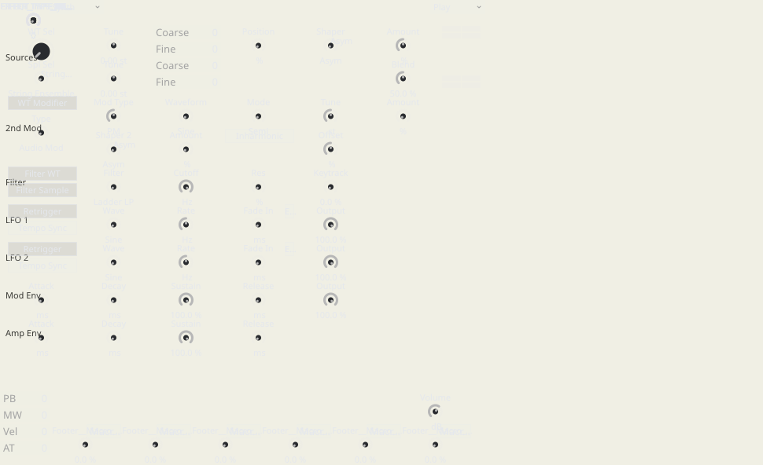
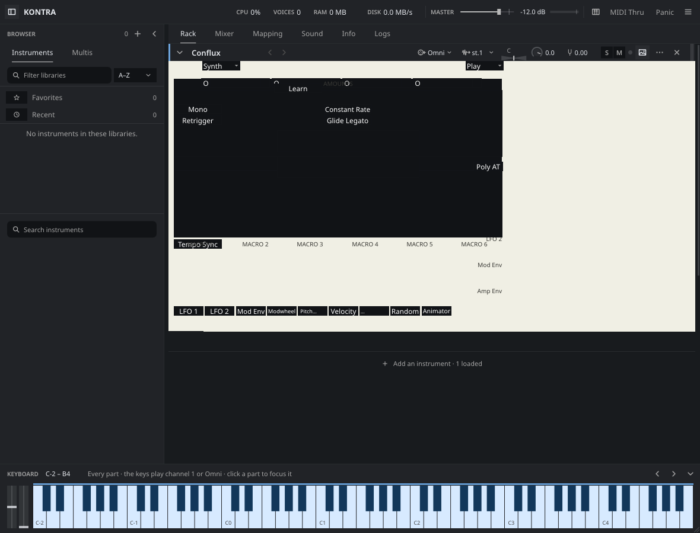

# Whole-corpus Original UI census

Scope 5, 2026-10-08. Coverage: **PARTIAL — sweep still running**. Frozen installed corpus: **834 Kontakt paths (781 NKI + 53 NKM), 660 UVI programs; 1,494 item IDs**. One row per path/program ID; each Kontakt multi includes every embedded program observed by its production loader. No product fixes. Generated from the current cache at 2026-10-08T10:54:26+00:00.

**Load admission, authored UI painting and audible audition are separate results.** The plain per-instrument answer is in [v1.tsv](/home/derpcat/.cache/kontra-scan/results/v1.tsv) and [v2.tsv](/home/derpcat/.cache/kontra-scan/results/v2.tsv). `loads=yes` means the production importer and initial playable bank/plan returned successfully. A missing image, script callback fault or silent note can coexist with admitted loading. `loads=no` includes a bounded 90-second worker timeout; it is an observed failure under this probe, not proof of permanent incompatibility.

## Frozen builds and reproducibility

Shared scanner instrumentation and CLI: `tools/kontra-scan@01178ba443e2b409c23282509f57d35a60753c36`, based on v2 `7e82b152`. Pinned Kontakt v1: `0cb7a8a0` plus scanner adapter `audit/ui-census-v1-scanner-20261008@59c6cbbbcc72cc38efda00fbde8cf9c2be8b4076`. UVI v1 is explicitly a later, separate baseline: sidecar `audit/uvi-v1-scanner-20261008@026bdbb49f29a5ad752b3470a5f6f64a20a8957d`, product base `4bffbb18`; pinned Kontakt is unchanged. All are optimized release. The adjacent [installed README](/home/derpcat/.cache/kontra-scan/bin/README.md) records exact binary hashes, build date, rebuilding and limits.

| Adapter | SHA-256 |
| --- | --- |
| v1 | 870cea2140b5c9db5361831664966848302a2f57e82fcb6c7ed1b3534545ce5e |
| v2 | d4534838916e008d32a6e0763541a8bd9285651d77f130bad18fe926d0975f5a |
| v1 UVI sidecar | 34a61e82ca6f09afc0eab692a1bf0b6765edbd7d063fccca94d95e699a93b9c1 |

```sh
~/.cache/kontakto-heavy ~/.cache/kontra-scan/bin/kontra-scan-v2 \
  --list ~/.cache/kontra-scan/v2-items.tsv --start 0 --count 25 \
  --out ~/.cache/kontra-scan/results/v2
```

Rerun the same arguments after exit 75, then advance the slice. Use the same command with `kontra-scan-v1` for the paired adapter. Every shard owns exactly one heavy call, defaults to 235 seconds, and starts a new item only if its full timeout fits. Per-item cache identity includes the binary, item/container size and mtime, sidecar and shared note-plan digest. Canonical results exclude stale revisions/signatures. No decrypted scripts, resources, PCM, keys, authored error messages, names or property payloads are persisted; counters/hashes and a small gallery of OUR renders are retained.

Validation: stdlib driver/cache/privacy checks pass; three optimized Rust scanner checks pass on each baseline; both required wrapper `cargo test --release --features shots --no-run` checks passed before push. The phase tests exercise actual evaluator/VM boundaries, including persistence failure suppressed by a successful public compiler result, v1 waiting callbacks and compiler-disabled blocks.

## Exhaustive category counts

Counts below include only the current installed revision and manifest IDs. Categories are mutually exclusive with precedence budget-hit → error → blank → missing-images → no-ui → original-ok. Mechanisms later overlap; their counts cannot be added as instruments unlocked. `original-ok` certifies requested-image resolution and successful authored-view construction/paint, not vendor pixel, gesture, typography, automation or callback parity.

| Build | Rows / 1494 | Kontakt / 834 | UVI / 660 | Loads yes | Loads no | Original OK | Missing images | Blank | No UI | Error | Budget hit | Audible | Silent |
| --- | --- | --- | --- | --- | --- | --- | --- | --- | --- | --- | --- | --- | --- |
| v1 | 350 | 350 | 0 | 350 | 0 | 321 | 29 | 0 | 0 | 0 | 0 | 2 | 0 |
| v2 | 370 | 370 | 0 | 370 | 0 | 341 | 29 | 0 | 0 | 0 | 0 | 22 | 0 |

Paired coverage: **350/1494**. V1 loads / v2 does not: **0** ([complete observed list](/home/derpcat/.cache/kontra-scan/results/v1-loads-v2-doesnt.tsv)). V2 loads / v1 does not: **0**. Fallback-note comparisons: **0**, excluded from parity. Both-loaded note mismatches: **0**, excluded from sound-regression claims. Counts are exhaustive only when the coverage marker is COMPLETE.

The UVI auditor’s prior stopped sample admitted AO **0/80 on v1 vs 80/80 on v2**, with v1 graph-preflight rejection and no timeouts. That earlier observation is separate from the current paired census. V1’s stronger typed UI/state does not imply stronger format/graph admission. The paired table above is the reproducible comparison at the declared baselines.

### Load onset and first authored frame (section J)

Numeric timing fields observe actual output/paint from the first production program import, with Original painting and audition concurrent. The lexical metadata prepass, process spawn and PNG/hash work are outside this clock. A multi shares the item clock. first_audio_ms observes the first finite, exactly nonzero output block; the audible result separately requires amplitude above1e-5. Missing/silent/no-safe-key output remains unknown, never a zero onset. These one-shot CPU-scanner wall times include machine contention and are not matched native-host or warm-cache performance acceptance.

| Build | Corpus | Timing field | Observed numeric | Unknown | Median ms | p95 ms |
| --- | --- | --- | --- | --- | --- | --- |
| v2 | Kontakt | first_audio_ms | 22 | 348 | 7027.99 | 27960.09 |
| v2 | Kontakt | ui_first_frame_ms | 370 | 0 | 313.73 | 6714.2 |
| v2 | UVI | first_audio_ms | 0 | 0 | Unknown | Unknown |
| v2 | UVI | ui_first_frame_ms | 0 | 0 | Unknown | Unknown |
| v1 | Kontakt | first_audio_ms | 2 | 348 | 1897.67 | 3649.23 |
| v1 | Kontakt | ui_first_frame_ms | 350 | 0 | 150.6 | 609.1 |
| v1 | UVI | first_audio_ms | 0 | 0 | Unknown | Unknown |
| v1 | UVI | ui_first_frame_ms | 0 | 0 | Unknown | Unknown |

| Build | Product cache state | Rows |
| --- | --- | --- |
| v2 | cold | 370 |
| v1 | cold | 350 |

load_ms is unchanged and includes pinned-v1 deferred initial sample-bank preload; it is not first sound. cache_state describes the product metadata/header cache, not metrics reuse or OS page cache. Pinned Kontakt v1 scanner disables those cache reads/writes; frozen v2 has no product metadata cache, so those adapters report cold. UVI sidecar uses Worker::start after its metadata/assets prepass, includes required pre-audition native snapshots, and observes concurrent paint/audio. Its load_ms retains its separate earlier legacy origin. The common driver forces persistent decoded PCM caching off; that observed product condition is cold. Unknown remains explicit. OS cache is uncontrolled. Future integration cache paths require actual cache-hit telemetry before warm/cold acceptance.

### Per-library breakdown

| Build | Library | Rows | Loads | Does not load | Original OK | Missing images | Blank | Error | Budget |
| --- | --- | --- | --- | --- | --- | --- | --- | --- | --- |
| v1 | ANALOG STRINGS | 1 | 1 | 0 | 1 | 0 | 0 | 0 | 0 |
| v1 | Afflatus Chapter II Brass | 348 | 348 | 0 | 320 | 28 | 0 | 0 | 0 |
| v1 | Conflux 1.1.0 [Native Instruments] | 1 | 1 | 0 | 0 | 1 | 0 | 0 | 0 |
| v2 | ANALOG STRINGS | 1 | 1 | 0 | 1 | 0 | 0 | 0 | 0 |
| v2 | Afflatus Chapter II Brass | 348 | 348 | 0 | 320 | 28 | 0 | 0 | 0 |
| v2 | Areia 1.2.0 [Audio Imperia] | 20 | 20 | 0 | 20 | 0 | 0 | 0 | 0 |
| v2 | Conflux 1.1.0 [Native Instruments] | 1 | 1 | 0 | 0 | 1 | 0 | 0 | 0 |

## Exhaustive measured failure mechanisms

An unsupported parameter can be nonvisual metadata. An outside-page or zero-size widget can be authored intentionally. The frozen scalar criterion excludes typed text/array/service bindings. Separate bound_typed counts validate text/array targets in installed KSP models; they do not prove live typed edits. UVI targets and phantom-free controls stay unknown where the frozen baseline has no accessor or origin marker. A page mostly one colour is an unreadability candidate, not proof of native mismatch. Those distinctions are retained in the report rather than labeling every occurrence broken.

| Mechanism | v2 item incidence | v1 item incidence |
| --- | --- | --- |
| font declaration not resolved by service | 370 | 0 |
| unsupported_params: renderer ignores authored drag sensitivity | 369 | 0 |
| geometry: outside authored page candidate | 350 | 350 |
| audition uses fallback note; parity excluded | 348 | 348 |
| UI missing-images | 29 | 29 |
| image lookup/decode failure | 29 | 29 |
| geometry: zero sized visible widget | 2 | 0 |
| placeholder_widgets: ui_level_meter | 2 | 0 |
| authored native frontend requested but not consumed | 1 | 0 |
| page >90% plain background candidate | 1 | 0 |
| passive paint changes semantic value | 1 | 0 |
| placeholder_widgets: ui_text_edit | 1 | 0 |
| unsupported_params: $CONTROL_PAR_NKS_NUM_VALUES | 1 | 0 |
| unsupported_params: $CONTROL_PAR_NKS_STR_VALUES[] | 1 | 0 |
| unsupported_params: $CONTROL_PAR_NKS_STYLE | 1 | 0 |
| unsupported_params: $CONTROL_PAR_NKS_TYPE | 1 | 0 |
| visible widget lacks scalar readback binding | 1 | 0 |
| KSP persistence_changed waiting | 0 | 1 |

### Script-slot, callback and saved-state partitions

Raw slots are partitioned before compilation into decode_failed / bypassed / inline_nonempty / linked_only / empty. Only actual record/parameter errors count as decode_failed; saved-table uncertainty retains decoded source disposition independently. Wire slot, owner and program index are distinct from compact runtime admission. Active slots skip bypassed/empty slots. V1 compile-admitted allows disabled non-init callback blocks; compile-clean requires zero `Program.errors`. Init and persistence_changed completion/faults are independently observed, never inferred from public `Ok`. `absent`, `compile_disabled`, `entered`, `completed`, `faulted`, `budget_stopped`, `waiting`, `deferred` and `dropped` remain distinct. Diagnostics contain a fixed safe category, static builtin and numeric location only.

| Field | v2 sum / observed rows | v1 sum / observed rows |
| --- | --- | --- |
| bound_typed | 6 / 370 | 5 / 350 |
| sample_zone_count | 2137085 / 370 | 1138393 / 350 |
| slots_seen | 1850 / 370 | 1750 / 350 |
| slots_decode_failed | 0 / 370 | 0 / 350 |
| slots_bypassed | 0 / 370 | 0 / 350 |
| slots_inline_nonempty | 374 / 370 | 354 / 350 |
| slots_linked_only | 0 / 370 | 0 / 350 |
| slots_empty | 1476 / 370 | 1396 / 350 |
| active_script_slots | 374 / 370 | 354 / 350 |
| compiled_script_slots | 374 / 370 | 354 / 350 |
| clean_compiled_slots | 374 / 370 | 354 / 350 |
| disabled_block_errors | 0 / 370 | 0 / 350 |
| init_callbacks_completed | 374 / 370 | 354 / 350 |
| persistence_changed_completed | 23 / 370 | 2 / 350 |
| load_fault_records | 0 / 370 | 77 / 350 |
| ksp_runtime_fault_records | 0 / 370 | 0 / 350 |

| Build | Observed callback phase | Status | Slot observations |
| --- | --- | --- | --- |
| v2 | init | absent | 0 |
| v2 | init | compile_disabled | 0 |
| v2 | init | entered | 0 |
| v2 | init | completed | 374 |
| v2 | init | faulted | 0 |
| v2 | init | budget_stopped | 0 |
| v2 | init | waiting | 0 |
| v2 | init | deferred | 0 |
| v2 | init | dropped | 0 |
| v2 | init | unknown | 0 |
| v2 | persistence_changed | absent | 351 |
| v2 | persistence_changed | compile_disabled | 0 |
| v2 | persistence_changed | entered | 0 |
| v2 | persistence_changed | completed | 23 |
| v2 | persistence_changed | faulted | 0 |
| v2 | persistence_changed | budget_stopped | 0 |
| v2 | persistence_changed | waiting | 0 |
| v2 | persistence_changed | deferred | 0 |
| v2 | persistence_changed | dropped | 0 |
| v2 | persistence_changed | unknown | 0 |
| v1 | init | absent | 0 |
| v1 | init | compile_disabled | 0 |
| v1 | init | entered | 0 |
| v1 | init | completed | 354 |
| v1 | init | faulted | 0 |
| v1 | init | budget_stopped | 0 |
| v1 | init | waiting | 0 |
| v1 | init | deferred | 0 |
| v1 | init | dropped | 0 |
| v1 | init | unknown | 0 |
| v1 | persistence_changed | absent | 351 |
| v1 | persistence_changed | compile_disabled | 0 |
| v1 | persistence_changed | entered | 0 |
| v1 | persistence_changed | completed | 2 |
| v1 | persistence_changed | faulted | 0 |
| v1 | persistence_changed | budget_stopped | 0 |
| v1 | persistence_changed | waiting | 1 |
| v1 | persistence_changed | deferred | 0 |
| v1 | persistence_changed | dropped | 0 |
| v1 | persistence_changed | unknown | 0 |

v2 saved-table integrity (raw slot observations): decoded=1850. Only complete raw histograms enter the counts below; these are known-subset counts, and all-slot raw totals remain unknown when any histogram is incomplete.

v1 saved-table integrity (raw slot observations): unknown=1750. Only complete raw histograms enter the counts below; these are known-subset counts, and all-slot raw totals remain unknown when any histogram is incomplete.

| Build | Fixed sigil | Raw complete-table entries | Admitted entries |
| --- | --- | --- | --- |
| v2 | $ | 30146 | 30146 |
| v2 | ~ | 0 | 0 |
| v2 | % | 2704 | 2704 |
| v2 | ? | 0 | 0 |
| v2 | @ | 110 | 110 |
| v2 | ! | 133 | 0 |
| v2 | empty | 0 | 0 |
| v2 | other | 0 | 0 |
| v1 | $ | 0 | 19066 |
| v1 | ~ | 0 | 0 |
| v1 | % | 0 | 824 |
| v1 | ? | 0 | 0 |
| v1 | @ | 0 | 10 |
| v1 | ! | 0 | 13 |
| v1 | empty | 0 | 0 |
| v1 | other | 0 | 0 |

Saved sigils use only `$ ~ % ? @ ! empty other`; malformed table framing is distinguished from params() returning an empty Vec. Raw and admitted counts do not prove declaration-aware restoration. The manifest contains no NKSN snapshots; the separate prior 1,103-snapshot audit is not this denominator.

## Conflux mandatory first witness

**v2: loads yes; Original missing-images; bindings 107/113; audition yes; note {"0":[60,64]}; load 5212.613054 ms; first sound 5257.569810999999 ms; first authored frame 5262.492196 ms; product cache cold; peak RSS 229.69 MB.**

Main authored view: 411 widgets, 134 visible, 102/108 scalar bindings; 4 image requests / 1 missing. Declared background [240, 239, 228, 255]; plain fraction 93.8985%. This is a cream, nonuniform page, not a literal all-white pixel buffer. The renderer auditor's 94.94% figure uses its separate capture/layout and must not replace this matched witness.

**v1: loads yes; Original missing-images; bindings 78/78; audition yes; note {"0":[60,64]}; load 134.102572 ms; first sound 146.11175200000002 ms; first authored frame 354.094091 ms; product cache cold; peak RSS 88.96 MB.**

W2 traced the six scalar-excluded main bindings to footer TextEdits; they are typed variable targets, not absent declarations. W5’s later implementation can type/read back all six; that later result is separate from this frozen baseline. W2 also removed 33 inferred phantom knobs, changing its later scalar denominator to about74/80 without losing real bindings. This baseline has no reliable origin marker; the census never subtracts a library-specific33.

Three active slots admit and init completes on v2, with107/113 scalar bindings and6 separate typed targets. The shared scanner tests readback, not actual dragging. Cross-scope diagnosis explains the user’s degraded result: authored native/package view requests have no frontend consumer; classic wallpaper/resource routing and contrast differ; light_under ignores solid page colours; picture/fonts and typed widgets lose authored semantics. The baseline also selects Vector when unsupported metadata is empty and resets view choice on interface publication; Conflux’s NKS diagnostics select Bitmap, so default Vector alone is not its complete explanation.

For immovable knobs, the widgets witness found all 81 visible continuous controls bound/readable and 78 main controls are knobs. The slider-axis defect cannot explain those knobs. Quantized feedback loses fine fractional drag accumulation, authored drag travel is ignored, wheel/focus routing and stale UI/publication/queue admission can produce unchanged apparent values. Native scalar admission works independently. Confirm each gesture through the widgets/loop probes; this passive census does not claim a new pointer trace.

## Ranked systemic fixes

Reach is an overlap-aware union of measured mechanism candidates or active source-token users, never a sum of occurrences. “Fully unlocked” is unmeasured for every fix until matched native render, gesture, callback and state tests pass. Ranking prioritizes breadth and the substrate needed by other fixes. Effort S = localized existing-path repair, M = several adapters plus tests, L = shared typed service/lifecycle work. V1 is the first semantic reference; keep v2 ownership/real-time boundaries.

| Rank | Mechanism | Effort | Measured v2 candidate items | Fully unlocked | Root repair / v1 reference | Proof |
| --- | --- | --- | --- | --- | --- | --- |
| 1 | Original authored view and stable choice | M | 370 | Unknown | Honor Original by default and explicit choice across interface revisions; use v1 view policy, not diagnostics to select a renderer. | Fresh load, clear diagnostics, publish a changed property, switch views: Original and user choice remain stable. |
| 2 | One correct resource resolver / native authored frontends | M/L | 29 | Unknown | Resolve source-family resources, loose/NKR/NICNT/UFS packages and wallpaper/native requests through existing bounded resolver; no library exceptions. | Authored fixture covers each container route, strip metadata and native view; every requested resource resolves and Original pixel comparison improves. |
| 3 | Typed UI mutation/getter path | M | 370 | Unknown | Normalize aliases once; typed indexed key/value/readback shares live storage and init/runtime semantics. | Set/get strings/reals/table/XY indexes independently; callback publication preserves exact values; programmatic setters do not recurse. |
| 4 | All typed widget edits and source callbacks | L | 2 | Unknown | Extend existing control ownership to table/XY/text/file/mouse/service widgets and event context; reuse v1 contracts. | Gesture → admission → value → handler → paint for every widget; include indexes, modifiers, file payloads, waits and rejected queue capacity. |
| 5 | Declared page colours, fonts and readable native styling | M | 370 | Unknown | Use declared background in contrast decisions and load custom/state fonts; preserve text alignment/style instead of stock replacement. | Matched declared-color fixture with real fonts, hover/pressed states and alpha; measure text/background contrast and native pixel regions. |
| 6 | Geometry, parenting, strip/frame value mapping | M | 370 | Unknown | Canonical geometry once; retain explicit axes, grid/pixel transitions, parent/z/hide and source frame laws. | Width-only and height-only fixtures, nested/cyclic panels, HiDPI and horizontal/vertical frame endpoints match reference. |
| 7 | Saved UI state and snapshot policy | M/L | 370 | Unknown | Integrate existing typed persistence reader, consume immediate reads once, preserve string arrays, scopes and running snapshot policies. | All fixed sigils, empty string-array cells, menu position vs semantic value, four snapshot policies and host save/reopen retain state. |
| 8 | Compiler/callback failures with visible safe diagnostics | M | 0 | Unknown | Close unsupported surface using existing runtime; distinguish admission, disabled callbacks, init/persistence faults and runaway budgets. | Authored failure-phase fixtures produce truthful sanitized diagnostics; repaired callback completes and corpus gain is measured at exact slot ownership. |
| 9 | Paint/publication budgets and incremental runtime UI | M/L | 370 | Unknown | Stable slot/control IDs and bounded incremental publication; virtualize large trees without changing authored meaning. | Large scripted scene paints within budget; waiting edits stay ordered; measure p50/p95 frame and input latency with identical scene fidelity. |
| 10 | Native drag, fine adjust, wheel and host automation | M | 370 | Unknown | Preserve fractional pointer accumulation, source sensitivity/axis/defaults and focus-aware wheel; expose authored automation IDs. | Actual pointer/keyboard/wheel/default/host gesture fixtures modify every bound continuous control; low-resolution fine drags accumulate and callbacks retain ordering. |

## Exhaustive spec incidence and status matrix

The generated scanner whitelist is the union of the repository’s UI widgets, CONTROL_PAR identifiers, UI helpers/callbacks and persistence helpers. Comments and strings are skipped; one leading underscore alias is canonicalized. The whitelist is generated from compiler UI/keyboard/persistence builtin tables plus CONTROL_PAR/spec inventory; its digest/count is attached to each metadata record. Active incidence includes inactive preprocessor branches/unreachable functions and is not an execution count. Bypassed incidence is separate. Linked unresolved/native-package declarations can be absent from lexical counters; actual renderer widget inventory supplements them. Zero means unobserved in the surfaced inline declarations, not proof of complete corpus absence; decode failures, linked/native packages and generated UI can hide lexical use even after the manifest is complete.

Expected contract, inspected v2 status and source/root-fix references below reuse the params auditor’s exhaustive matrix at `origin/audit/ui-params-20261008`. Its F1–F10 definitions and target tests are in [UI_PARAMS.md](UI_PARAMS.md); rendering and gesture status is completed by [UI_RENDER.md](UI_RENDER.md), [UI_WIDGETS.md](UI_WIDGETS.md) and [UI_LOOP.md](UI_LOOP.md). Correct means inspected/tested mechanism, not complete vendor fidelity. Unknown historical/vendor extension semantics remain explicit.

| Spec token | Expected contract | v2 inspected status / evidence / systemic fix | v2 active items | v1 active items | v2 bypassed items | v2 token occurrences |
| --- | --- | --- | --- | --- | --- | --- |
| $CONTROL_PAR_ACTIVE_INDEX | I; active XY X-coordinate index or none | missing; opaque mirror, no active-cursor state; ui:538 → F2/F10 | 0 | 0 | 0 | 0 |
| $CONTROL_PAR_ALLOW_AUTOMATION | I boolean, idx for XY; init applicability | partial; scalar IR flag, no host export/per-cursor path; ui:498 → F2/F9 | 370 | 350 | 0 | 11481 |
| $CONTROL_PAR_AUTOMATION_ID | I; vendor host parameter ID, idx for XY | partial; scalar metadata, no host mapping or conflict/range policy; ui:498 → F2/F9 | 21 | 1 | 0 | 1007 |
| $CONTROL_PAR_AUTOMATION_NAME | S; host name, idx for XY | partial; scalar IR name only; ui:498 → F2/F9 | 370 | 350 | 0 | 7949 |
| $CONTROL_PAR_BAR_COLOR | I RGB color; relevant widget paint slot | partial; IR color fields, no complete meter/waveform/table paint; ui:54,457 → F7; render/widgets scopes | 1 | 1 | 0 | 26 |
| $CONTROL_PAR_BASEPATH | S; file-selector root path | partial; IR field only; no browsing or path-boundary service; ui:408 / eval:1259 → F4/F7/F10 | 1 | 1 | 0 | 1 |
| $CONTROL_PAR_BG_ALPHA | I; opacity component | missing; unsupported independent alpha and gradient fields; ui:538 → F7; render scope | 0 | 0 | 0 | 0 |
| $CONTROL_PAR_BG_COLOR | I RGB color; relevant widget paint slot | partial; IR color fields, no complete meter/waveform/table paint; ui:54,457 → F7; render/widgets scopes | 1 | 1 | 0 | 4 |
| $CONTROL_PAR_COLUMN_WIDTH | I; file-selector column pixels | partial; IR metadata only; ui:416 → F7/F10 | 1 | 1 | 0 | 1 |
| $CONTROL_PAR_CURSOR_PICTURE | S; asset name, XY cursor may be indexed | partial; scalar asset references emitted; typed getters and indexed cursor pictures missing; ui:508 / lib:307 → F2/F4; resolution: render scope | 0 | 0 | 0 | 0 |
| $CONTROL_PAR_CUSTOM_ID | I; user metadata tag | partial; numeric store/readback works, IR labels metadata unsupported; ui:538 → F7 | 1 | 1 | 0 | 5 |
| $CONTROL_PAR_DEFAULT_VALUE | I; reset target in raw control units | partial; IR field mapped; missing defaults/readback not unified; ui:309 → F4/F1 | 370 | 350 | 0 | 18482 |
| $CONTROL_PAR_DISABLE_TEXT_SHIFTING | I boolean; pressed caption shift policy | missing; unsupported property; ui:538 → F7; render scope | 0 | 0 | 0 | 0 |
| $CONTROL_PAR_DND_ACCEPT_ARRAY | I policy; accepted drop count/type | missing; no mouse-area drop service/context; ui:538 → F7/F10 | 0 | 0 | 0 | 0 |
| $CONTROL_PAR_DND_ACCEPT_AUDIO | I policy; accepted drop count/type | missing; no mouse-area drop service/context; ui:538 → F7/F10 | 0 | 0 | 0 | 0 |
| $CONTROL_PAR_DND_ACCEPT_MIDI | I policy; accepted drop count/type | missing; no mouse-area drop service/context; ui:538 → F7/F10 | 0 | 0 | 0 | 0 |
| $CONTROL_PAR_DND_BEHAVIOUR | I; label MIDI export policy/area identity | missing; opaque unsupported metadata; ui:538 → F7/F10 | 0 | 0 | 0 | 0 |
| $CONTROL_PAR_FILEPATH | S; selected file under basepath | missing; unsupported projection and no selected-file state; ui:538 / eval:1249 → F4/F10 | 0 | 0 | 0 | 0 |
| $CONTROL_PAR_FILE_TYPE | I enum; selector filter | partial; IR filter mapped; no picker/callback service; ui:410 → F7/F10 | 1 | 1 | 0 | 1 |
| $CONTROL_PAR_FONT_TYPE | I; factory/custom font ID | partial; default/state font lookup and rendering incomplete; ui:504 → F7; render scope | 369 | 349 | 0 | 106916 |
| $CONTROL_PAR_FONT_TYPE_OFF_HOVER | I; font ID for interaction state | missing; stored as unsupported, no state style projection; ui:538 → F7; render scope | 0 | 0 | 0 | 0 |
| $CONTROL_PAR_FONT_TYPE_OFF_PRESSED | I; font ID for interaction state | missing; stored as unsupported, no state style projection; ui:538 → F7; render scope | 0 | 0 | 0 | 0 |
| $CONTROL_PAR_FONT_TYPE_ON | I; font ID for interaction state | missing; stored as unsupported, no state style projection; ui:538 → F7; render scope | 0 | 0 | 0 | 0 |
| $CONTROL_PAR_FONT_TYPE_ON_HOVER | I; font ID for interaction state | missing; stored as unsupported, no state style projection; ui:538 → F7; render scope | 0 | 0 | 0 | 0 |
| $CONTROL_PAR_FONT_TYPE_ON_PRESSED | I; font ID for interaction state | missing; stored as unsupported, no state style projection; ui:538 → F7; render scope | 0 | 0 | 0 | 0 |
| $CONTROL_PAR_GRID_HEIGHT | I; grid position/size | missing; opaque store; private move_control tags differ; eval:963 / ui:8 → F8 | 0 | 0 | 0 | 0 |
| $CONTROL_PAR_GRID_WIDTH | I; grid position/size | missing; opaque store; private move_control tags differ; eval:963 / ui:8 → F8 | 0 | 0 | 0 | 0 |
| $CONTROL_PAR_GRID_X | I; grid position/size | missing; opaque store; private move_control tags differ; eval:963 / ui:8 → F8 | 0 | 0 | 0 | 0 |
| $CONTROL_PAR_GRID_Y | I; grid position/size | missing; opaque store; private move_control tags differ; eval:963 / ui:8 → F8 | 0 | 0 | 0 | 0 |
| $CONTROL_PAR_HEIGHT | I; pixel size | partial; omitted getter = 0; one missing axis resets both; ui:423 / ir_view:137 → F8 | 369 | 349 | 0 | 134914 |
| $CONTROL_PAR_HELP | S; caption/lines/value label/help/short caption | partial; init scalar/textline overlay mapped; runtime getters empty; aliases discarded; eval:925 / ui:479 / lower:2087 → F1/F2/F4 | 369 | 349 | 0 | 4542 |
| $CONTROL_PAR_HIDE | I mask; hide whole/parts or indexed XY cursor | partial; whole/inherited hide mapped; mod-light and indexed hide unavailable; ui:433,538 → F7/F10 | 370 | 350 | 0 | 478074 |
| $CONTROL_PAR_IDENTIFIER | S read-only; declaration name without sigil | wrong; never synthesized from Widget.name; init getter returns "0", runtime ignored; eval:589,911 / lower:2087 → F4 | 0 | 0 | 0 | 0 |
| $CONTROL_PAR_KEY | Uncertain historical/vendor extension; needs profile-specific reference | missing; opaque symbol, no semantic handler; ui:538 → F7; do not invent units | 0 | 0 | 0 | 0 |
| $CONTROL_PAR_KEY_ALT | I read-only; interaction modifier snapshot | missing; no modifier fields in callback admission; control.rs:194 / lower:2920 → F4/F10 | 21 | 1 | 0 | 648 |
| $CONTROL_PAR_KEY_CONTROL | I read-only; interaction modifier snapshot | missing; no modifier fields in callback admission; control.rs:194 / lower:2920 → F4/F10 | 21 | 1 | 0 | 1382 |
| $CONTROL_PAR_KEY_SHIFT | I read-only; interaction modifier snapshot | missing; no modifier fields in callback admission; control.rs:194 / lower:2920 → F4/F10 | 1 | 1 | 0 | 8 |
| $CONTROL_PAR_LABEL | S; caption/lines/value label/help/short caption | partial; init scalar/textline overlay mapped; runtime getters empty; aliases discarded; eval:925 / ui:479 / lower:2087 → F1/F2/F4 | 370 | 350 | 0 | 21401 |
| $CONTROL_PAR_MAX_VALUE | I read-only; declared bounds | partial; declared getters seeded; illegal writes override IR but not core domain; eval:621 / lib:745 / ui:305 → F4/F7 | 1 | 1 | 0 | 37 |
| $CONTROL_PAR_MIDI_EXPORT_AREA_IDX | I; label MIDI export policy/area identity | missing; opaque unsupported metadata; ui:538 → F7/F10 | 0 | 0 | 0 | 0 |
| $CONTROL_PAR_MIN_VALUE | I read-only; declared bounds | partial; declared getters seeded; illegal writes override IR but not core domain; eval:621 / lib:745 / ui:305 → F4/F7 | 1 | 1 | 0 | 22 |
| $CONTROL_PAR_MOUSE_BEHAVIOUR | I signed sensitivity; source gesture axis/travel | wrong; negative maps horizontal in IR; source/v1 slider semantics differ; ui:448 → F7; widgets scope | 369 | 349 | 0 | 6933 |
| $CONTROL_PAR_MOUSE_BEHAVIOUR_X | I; XY axis sensitivities | partial; IR stores absolute magnitude, not full gesture/coordinate semantics; ui:388 → F2/F10 | 0 | 0 | 0 | 0 |
| $CONTROL_PAR_MOUSE_BEHAVIOUR_Y | I; XY axis sensitivities | partial; IR stores absolute magnitude, not full gesture/coordinate semantics; ui:388 → F2/F10 | 0 | 0 | 0 | 0 |
| $CONTROL_PAR_MOUSE_MODE | I enum; XY click/drag policy | partial; IR field only, no typed XY input admission; ui:392 → F10 | 0 | 0 | 0 | 0 |
| $CONTROL_PAR_NKS_NUM_VALUES | Uncertain vendor extension; resolve its legal type/index/context | missing; interned/stored but unsupported semantic projection; ui:538 → F7 | 1 | 1 | 0 | 23 |
| $CONTROL_PAR_NKS_STR_VALUES | Uncertain vendor extension; resolve its legal type/index/context | missing; interned/stored but unsupported semantic projection; ui:538 → F7 | 1 | 1 | 0 | 44 |
| $CONTROL_PAR_NKS_STYLE | Uncertain vendor extension; resolve its legal type/index/context | missing; interned/stored but unsupported semantic projection; ui:538 → F7 | 1 | 1 | 0 | 28 |
| $CONTROL_PAR_NKS_TYPE | Uncertain vendor extension; resolve its legal type/index/context | missing; interned/stored but unsupported semantic projection; ui:538 → F7 | 1 | 1 | 0 | 35 |
| $CONTROL_PAR_NONE | I sentinel; no operation | wrong; generic stores and unsupported emission instead of no-op; eval:567 / ui:538 → F7 | 0 | 0 | 0 | 0 |
| $CONTROL_PAR_NUM_ITEMS | I read-only; current menu item count | partial; init computed, runtime not seeded/derived; eval:600 / lower:2928 → F4 | 1 | 1 | 0 | 1 |
| $CONTROL_PAR_OFF_COLOR | I RGB color; relevant widget paint slot | partial; IR color fields, no complete meter/waveform/table paint; ui:54,457 → F7; render/widgets scopes | 1 | 1 | 0 | 4 |
| $CONTROL_PAR_ON_COLOR | I RGB color; relevant widget paint slot | partial; IR color fields, no complete meter/waveform/table paint; ui:54,457 → F7; render/widgets scopes | 1 | 1 | 0 | 4 |
| $CONTROL_PAR_OVERLOAD_COLOR | I RGB color; relevant widget paint slot | partial; IR color fields, no complete meter/waveform/table paint; ui:54,457 → F7; render/widgets scopes | 0 | 0 | 0 | 0 |
| $CONTROL_PAR_PARALLAX_X | I; wavetable view displacement | partial; IR retains integer pair, no visualization; ui:397 → F7; render scope | 0 | 0 | 0 | 0 |
| $CONTROL_PAR_PARALLAX_Y | I; wavetable view displacement | partial; IR retains integer pair, no visualization; ui:397 → F7; render scope | 0 | 0 | 0 | 0 |
| $CONTROL_PAR_PARENT_PANEL | I panel UI ID; child local geometry/visibility | partial; valid lookup/nesting correct; default detach and cycle cases unverified; ui:530 / ir:557,567 → F8 | 0 | 0 | 0 | 0 |
| $CONTROL_PAR_PEAK_COLOR | I RGB color; relevant widget paint slot | partial; IR color fields, no complete meter/waveform/table paint; ui:54,457 → F7; render/widgets scopes | 1 | 1 | 0 | 4 |
| $CONTROL_PAR_PICTURE | S; asset name, XY cursor may be indexed | partial; scalar asset references emitted; typed getters and indexed cursor pictures missing; ui:508 / lib:307 → F2/F4; resolution: render scope | 370 | 350 | 0 | 114701 |
| $CONTROL_PAR_PICTURE_STATE | I; explicit picture frame where supported | partial; scalar frame mapped, applicability/state behavior not enforced; ui:522 → F7; paint states: render scope | 369 | 349 | 0 | 12674 |
| $CONTROL_PAR_POS_X | I; local pixel position | partial; explicit mirror/rect, absent defaults and grid precedence differ; ui:423 → F4/F8 | 370 | 350 | 0 | 219037 |
| $CONTROL_PAR_POS_Y | I; local pixel position | partial; explicit mirror/rect, absent defaults and grid precedence differ; ui:423 → F4/F8 | 370 | 350 | 0 | 220515 |
| $CONTROL_PAR_RANGE_MAX | I; level-meter display bounds | missing; no meter-range field in IR kind; ui:401,538 → F7 | 0 | 0 | 0 | 0 |
| $CONTROL_PAR_RANGE_MIN | I; level-meter display bounds | missing; no meter-range field in IR kind; ui:401,538 → F7 | 0 | 0 | 0 | 0 |
| $CONTROL_PAR_RECEIVE_DRAG_EVENTS | I boolean; drag vs drop callback policy | missing; no source event payload; ui:538 / control.rs:194 → F10 | 0 | 0 | 0 | 0 |
| $CONTROL_PAR_SELECTED_ITEM_IDX | I; menu selected position | wrong; generic metadata independent of semantic menu value; eval:589 / ui:538 → F4 | 0 | 0 | 0 | 0 |
| $CONTROL_PAR_SHORT_NAME | S; caption/lines/value label/help/short caption | partial; init scalar/textline overlay mapped; runtime getters empty; aliases discarded; eval:925 / ui:479 / lower:2087 → F1/F2/F4 | 1 | 1 | 0 | 86 |
| $CONTROL_PAR_SHOW_ARROWS | I boolean; value-edit arrow visibility | partial; IR boolean, value edit lacks full native interaction; ui:353 → F7; widgets scope | 20 | 0 | 0 | 1660 |
| $CONTROL_PAR_SLICEMARKERS_COLOR | I RGB color; relevant widget paint slot | partial; IR color fields, no complete meter/waveform/table paint; ui:54,457 → F7; render/widgets scopes | 0 | 0 | 0 | 0 |
| $CONTROL_PAR_TEXT | S; caption/lines/value label/help/short caption | partial; init scalar/textline overlay mapped; runtime getters empty; aliases discarded; eval:925 / ui:479 / lower:2087 → F1/F2/F4 | 370 | 350 | 0 | 43770 |
| $CONTROL_PAR_TEXTLINE | S; caption/lines/value label/help/short caption | partial; init scalar/textline overlay mapped; runtime getters empty; aliases discarded; eval:925 / ui:479 / lower:2087 → F1/F2/F4 | 2 | 2 | 0 | 3 |
| $CONTROL_PAR_TEXTPOS_Y | I; caption/value vertical pixel offset | partial for TEXTPOS_Y, missing VALUEPOS_Y; ui:446,538; renderer does not consume offset → F7; render scope | 369 | 349 | 0 | 21064 |
| $CONTROL_PAR_TEXT_ALIGNMENT | I; horizontal text alignment | wrong when set alone; style only created if FONT_TYPE exists; ui:504; audit alignment probe → F7 | 370 | 350 | 0 | 16955 |
| $CONTROL_PAR_TYPE | I read-only; vendor control type | partial; static UI lookup correct; dynamic ID sees sparse mirror default; eval:595 / lower:2914 → F4 | 0 | 0 | 0 | 0 |
| $CONTROL_PAR_UNIT | I enum; native display unit | partial; integer unit translated to string; invalid enum/context unchecked; eval:948 / ui:218,319 → F1/F7 | 0 | 0 | 0 | 0 |
| $CONTROL_PAR_VALUE | I scalar, I table cells or R XY coordinates; no recursive callback | partial; scalar values native; indexed table/XY VM and presentation diverge; eval:567,886 / lower:2874 → F2/F10 | 370 | 350 | 0 | 118083 |
| $CONTROL_PAR_VALUEPOS_Y | I; caption/value vertical pixel offset | partial for TEXTPOS_Y, missing VALUEPOS_Y; ui:446,538; renderer does not consume offset → F7; render scope | 0 | 0 | 0 | 0 |
| $CONTROL_PAR_VERTICAL | I boolean; meter orientation | partial; IR mapped; no live meter source; ui:401 / ui:598 → F7/F10 | 1 | 1 | 0 | 4 |
| $CONTROL_PAR_WAVETABLE | Uncertain historical/vendor extension; needs profile-specific reference | missing; opaque symbol, no semantic handler; ui:538 → F7; do not invent units | 0 | 0 | 0 | 0 |
| $CONTROL_PAR_WAVETABLE_ALPHA | I; opacity component | missing; unsupported independent alpha and gradient fields; ui:538 → F7; render scope | 0 | 0 | 0 | 0 |
| $CONTROL_PAR_WAVETABLE_COLOR | I RGB; wavetable/gradient end color | missing; unsupported style fields; ui:538 → F7; render scope | 0 | 0 | 0 | 0 |
| $CONTROL_PAR_WAVETABLE_END_ALPHA | I; opacity component | missing; unsupported independent alpha and gradient fields; ui:538 → F7; render scope | 0 | 0 | 0 | 0 |
| $CONTROL_PAR_WAVETABLE_END_COLOR | I RGB; wavetable/gradient end color | missing; unsupported style fields; ui:538 → F7; render scope | 0 | 0 | 0 | 0 |
| $CONTROL_PAR_WAVE_ALPHA | I; opacity component | missing; unsupported independent alpha and gradient fields; ui:538 → F7; render scope | 0 | 0 | 0 | 0 |
| $CONTROL_PAR_WAVE_COLOR | I RGB color; relevant widget paint slot | partial; IR color fields, no complete meter/waveform/table paint; ui:54,457 → F7; render/widgets scopes | 0 | 0 | 0 | 0 |
| $CONTROL_PAR_WAVE_CURSOR_COLOR | I RGB color; relevant widget paint slot | partial; IR color fields, no complete meter/waveform/table paint; ui:54,457 → F7; render/widgets scopes | 0 | 0 | 0 | 0 |
| $CONTROL_PAR_WAVE_END_ | Historical waveform-end identifier/alias; confirm profile spelling and indexed units | Unknown alias semantics: lexical incidence retained; compare standard WAVE_END native getter/setter on a minimal waveform fixture. | 0 | 0 | 0 | 0 |
| $CONTROL_PAR_WAVE_END_ALPHA | I; opacity component | missing; unsupported independent alpha and gradient fields; ui:538 → F7; render scope | 0 | 0 | 0 | 0 |
| $CONTROL_PAR_WAVE_END_COLOR | I RGB; wavetable/gradient end color | missing; unsupported style fields; ui:538 → F7; render scope | 0 | 0 | 0 | 0 |
| $CONTROL_PAR_WF_VIS_MODE | I enum; waveform display mode | missing; Kind::Waveform contains no mode; ui:394,538 → F7; render scope | 0 | 0 | 0 | 0 |
| $CONTROL_PAR_WIDTH | I; pixel size | partial; omitted getter = 0; one missing axis resets both; ui:423 / ir_view:137 → F8 | 370 | 350 | 0 | 186643 |
| $CONTROL_PAR_WT_VIS_MODE | I enum; wavetable visualization | partial; metadata retained, no real source/display; ui:396 → F7; render scope | 0 | 0 | 0 | 0 |
| $CONTROL_PAR_WT_ZONE | I; attached source-zone ID | missing; opaque unsupported property; ui:538 → F7/F10 | 0 | 0 | 0 | 0 |
| $CONTROL_PAR_X | Vendor XY indexed axis/property extension; verify native profile and get/set units before claiming support | Unknown vendor semantics: fixed public token is counted, no authored value persisted; measure typed axis/index set/get against v1 and native host. | 0 | 0 | 0 | 0 |
| $CONTROL_PAR_Y | Vendor XY indexed axis/property extension; verify native profile and get/set units before claiming support | Unknown vendor semantics: fixed public token is counted, no authored value persisted; measure typed axis/index set/get against v1 and native host. | 0 | 0 | 0 | 0 |
| $CONTROL_PAR_ZERO_LINE_COLOR | I RGB color; relevant widget paint slot | partial; IR color fields, no complete meter/waveform/table paint; ui:54,457 → F7; render/widgets scopes | 1 | 1 | 0 | 4 |
| $CONTROL_PAR_Z_LAYER | I; layer then vendor widget/declaration order | partial; IR stores z; draw_order only sorts sibling z/declaration, missing widget priority; ui:432 / ir:583 → F7; render scope | 368 | 348 | 0 | 5368 |
| $HIDE_PART_BG | Bit mask selects background/title/value/cursor/modulation-light/whole widget visibility | Partial: whole/inherited hide mapped; finer source parts need widget rendering/event fidelity. UI_PARAMS F7/F10; UI_RENDER hide/z matrix. | 349 | 349 | 0 | 10540 |
| $HIDE_PART_CURSOR | Bit mask selects background/title/value/cursor/modulation-light/whole widget visibility | Partial: whole/inherited hide mapped; finer source parts need widget rendering/event fidelity. UI_PARAMS F7/F10; UI_RENDER hide/z matrix. | 0 | 0 | 0 | 0 |
| $HIDE_PART_MOD_LIGHT | Bit mask selects background/title/value/cursor/modulation-light/whole widget visibility | Partial: whole/inherited hide mapped; finer source parts need widget rendering/event fidelity. UI_PARAMS F7/F10; UI_RENDER hide/z matrix. | 0 | 0 | 0 | 0 |
| $HIDE_PART_NOTHING | Bit mask selects background/title/value/cursor/modulation-light/whole widget visibility | Partial: whole/inherited hide mapped; finer source parts need widget rendering/event fidelity. UI_PARAMS F7/F10; UI_RENDER hide/z matrix. | 370 | 350 | 0 | 311539 |
| $HIDE_PART_TITLE | Bit mask selects background/title/value/cursor/modulation-light/whole widget visibility | Partial: whole/inherited hide mapped; finer source parts need widget rendering/event fidelity. UI_PARAMS F7/F10; UI_RENDER hide/z matrix. | 0 | 0 | 0 | 0 |
| $HIDE_PART_VALUE | Bit mask selects background/title/value/cursor/modulation-light/whole widget visibility | Partial: whole/inherited hide mapped; finer source parts need widget rendering/event fidelity. UI_PARAMS F7/F10; UI_RENDER hide/z matrix. | 0 | 0 | 0 | 0 |
| $HIDE_WHOLE_CONTROL | Bit mask selects background/title/value/cursor/modulation-light/whole widget visibility | Partial: whole/inherited hide mapped; finer source parts need widget rendering/event fidelity. UI_PARAMS F7/F10; UI_RENDER hide/z matrix. | 370 | 350 | 0 | 143070 |
| $INST_ICON_ID | Special instrument icon/wallpaper UI identity; resolve authored source resource | Partial/missing: classic wallpaper and native frontend resolution are incomplete. UI_RENDER native/wallpaper matrix; route existing source-family resolver. | 370 | 350 | 0 | 370 |
| $INST_WALLPAPER_ID | Special instrument icon/wallpaper UI identity; resolve authored source resource | Partial/missing: classic wallpaper and native frontend resolution are incomplete. UI_RENDER native/wallpaper matrix; route existing source-family resolver. | 369 | 349 | 0 | 369 |
| $KNOB_UNIT_DB | Display-unit enum: none, dB, Hz, ms, octaves, percent or semitones; preserve raw control value | Partial: init unit mapped, runtime knob aliases/display getter incomplete. UI_PARAMS F1/F4/F7; v1 live knob metadata is reference. | 1 | 1 | 0 | 30 |
| $KNOB_UNIT_HZ | Display-unit enum: none, dB, Hz, ms, octaves, percent or semitones; preserve raw control value | Partial: init unit mapped, runtime knob aliases/display getter incomplete. UI_PARAMS F1/F4/F7; v1 live knob metadata is reference. | 1 | 1 | 0 | 23 |
| $KNOB_UNIT_MS | Display-unit enum: none, dB, Hz, ms, octaves, percent or semitones; preserve raw control value | Partial: init unit mapped, runtime knob aliases/display getter incomplete. UI_PARAMS F1/F4/F7; v1 live knob metadata is reference. | 2 | 2 | 0 | 35 |
| $KNOB_UNIT_NONE | Display-unit enum: none, dB, Hz, ms, octaves, percent or semitones; preserve raw control value | Partial: init unit mapped, runtime knob aliases/display getter incomplete. UI_PARAMS F1/F4/F7; v1 live knob metadata is reference. | 1 | 1 | 0 | 5 |
| $KNOB_UNIT_OCT | Display-unit enum: none, dB, Hz, ms, octaves, percent or semitones; preserve raw control value | Partial: init unit mapped, runtime knob aliases/display getter incomplete. UI_PARAMS F1/F4/F7; v1 live knob metadata is reference. | 1 | 1 | 0 | 2 |
| $KNOB_UNIT_PERCENT | Display-unit enum: none, dB, Hz, ms, octaves, percent or semitones; preserve raw control value | Partial: init unit mapped, runtime knob aliases/display getter incomplete. UI_PARAMS F1/F4/F7; v1 live knob metadata is reference. | 2 | 2 | 0 | 106 |
| $KNOB_UNIT_ST | Display-unit enum: none, dB, Hz, ms, octaves, percent or semitones; preserve raw control value | Partial: init unit mapped, runtime knob aliases/display getter incomplete. UI_PARAMS F1/F4/F7; v1 live knob metadata is reference. | 1 | 1 | 0 | 6 |
| $NI_CONTROL_PAR_IDX | Originating mouse event/inside state or indexed control position in its UI callback | Missing: ControlContext lacks source event fields; carry typed originating event across waits. UI_PARAMS F4/F10; sampler-core/control.rs:194. | 1 | 1 | 0 | 11 |
| $NI_CONTROL_TYPE_BUTTON | Read-only vendor widget type enum used by TYPE lookup | Partial: static UI type lookup retained; dynamic runtime ID getter uses sparse mirror. UI_PARAMS F4; typed lookup fixture. | 0 | 0 | 0 | 0 |
| $NI_CONTROL_TYPE_FILE_SELECTOR | Read-only vendor widget type enum used by TYPE lookup | Partial: static UI type lookup retained; dynamic runtime ID getter uses sparse mirror. UI_PARAMS F4; typed lookup fixture. | 0 | 0 | 0 | 0 |
| $NI_CONTROL_TYPE_KNOB | Read-only vendor widget type enum used by TYPE lookup | Partial: static UI type lookup retained; dynamic runtime ID getter uses sparse mirror. UI_PARAMS F4; typed lookup fixture. | 0 | 0 | 0 | 0 |
| $NI_CONTROL_TYPE_LABEL | Read-only vendor widget type enum used by TYPE lookup | Partial: static UI type lookup retained; dynamic runtime ID getter uses sparse mirror. UI_PARAMS F4; typed lookup fixture. | 0 | 0 | 0 | 0 |
| $NI_CONTROL_TYPE_LEVEL_METER | Read-only vendor widget type enum used by TYPE lookup | Partial: static UI type lookup retained; dynamic runtime ID getter uses sparse mirror. UI_PARAMS F4; typed lookup fixture. | 0 | 0 | 0 | 0 |
| $NI_CONTROL_TYPE_MENU | Read-only vendor widget type enum used by TYPE lookup | Partial: static UI type lookup retained; dynamic runtime ID getter uses sparse mirror. UI_PARAMS F4; typed lookup fixture. | 0 | 0 | 0 | 0 |
| $NI_CONTROL_TYPE_MOUSE_AREA | Read-only vendor widget type enum used by TYPE lookup | Partial: static UI type lookup retained; dynamic runtime ID getter uses sparse mirror. UI_PARAMS F4; typed lookup fixture. | 0 | 0 | 0 | 0 |
| $NI_CONTROL_TYPE_NONE | Read-only vendor widget type enum used by TYPE lookup | Partial: static UI type lookup retained; dynamic runtime ID getter uses sparse mirror. UI_PARAMS F4; typed lookup fixture. | 0 | 0 | 0 | 0 |
| $NI_CONTROL_TYPE_PANEL | Read-only vendor widget type enum used by TYPE lookup | Partial: static UI type lookup retained; dynamic runtime ID getter uses sparse mirror. UI_PARAMS F4; typed lookup fixture. | 0 | 0 | 0 | 0 |
| $NI_CONTROL_TYPE_SLIDER | Read-only vendor widget type enum used by TYPE lookup | Partial: static UI type lookup retained; dynamic runtime ID getter uses sparse mirror. UI_PARAMS F4; typed lookup fixture. | 0 | 0 | 0 | 0 |
| $NI_CONTROL_TYPE_SWITCH | Read-only vendor widget type enum used by TYPE lookup | Partial: static UI type lookup retained; dynamic runtime ID getter uses sparse mirror. UI_PARAMS F4; typed lookup fixture. | 0 | 0 | 0 | 0 |
| $NI_CONTROL_TYPE_TABLE | Read-only vendor widget type enum used by TYPE lookup | Partial: static UI type lookup retained; dynamic runtime ID getter uses sparse mirror. UI_PARAMS F4; typed lookup fixture. | 0 | 0 | 0 | 0 |
| $NI_CONTROL_TYPE_TEXT_EDIT | Read-only vendor widget type enum used by TYPE lookup | Partial: static UI type lookup retained; dynamic runtime ID getter uses sparse mirror. UI_PARAMS F4; typed lookup fixture. | 0 | 0 | 0 | 0 |
| $NI_CONTROL_TYPE_VALUE_EDIT | Read-only vendor widget type enum used by TYPE lookup | Partial: static UI type lookup retained; dynamic runtime ID getter uses sparse mirror. UI_PARAMS F4; typed lookup fixture. | 0 | 0 | 0 | 0 |
| $NI_CONTROL_TYPE_WAVEFORM | Read-only vendor widget type enum used by TYPE lookup | Partial: static UI type lookup retained; dynamic runtime ID getter uses sparse mirror. UI_PARAMS F4; typed lookup fixture. | 0 | 0 | 0 | 0 |
| $NI_CONTROL_TYPE_WAVETABLE | Read-only vendor widget type enum used by TYPE lookup | Partial: static UI type lookup retained; dynamic runtime ID getter uses sparse mirror. UI_PARAMS F4; typed lookup fixture. | 0 | 0 | 0 | 0 |
| $NI_CONTROL_TYPE_XY | Read-only vendor widget type enum used by TYPE lookup | Partial: static UI type lookup retained; dynamic runtime ID getter uses sparse mirror. UI_PARAMS F4; typed lookup fixture. | 0 | 0 | 0 | 0 |
| $NI_DND_ACCEPT_MULTIPLE | Drop acceptance cardinality or file selector filter enum | Partial/missing: metadata does not supply file/drop event payload or typed callback admission. UI_PARAMS F7/F10. | 0 | 0 | 0 | 0 |
| $NI_DND_ACCEPT_NONE | Drop acceptance cardinality or file selector filter enum | Partial/missing: metadata does not supply file/drop event payload or typed callback admission. UI_PARAMS F7/F10. | 0 | 0 | 0 | 0 |
| $NI_DND_ACCEPT_ONE | Drop acceptance cardinality or file selector filter enum | Partial/missing: metadata does not supply file/drop event payload or typed callback admission. UI_PARAMS F7/F10. | 0 | 0 | 0 | 0 |
| $NI_FILE_TYPE_ARRAY | Drop acceptance cardinality or file selector filter enum | Partial/missing: metadata does not supply file/drop event payload or typed callback admission. UI_PARAMS F7/F10. | 1 | 1 | 0 | 1 |
| $NI_FILE_TYPE_AUDIO | Drop acceptance cardinality or file selector filter enum | Partial/missing: metadata does not supply file/drop event payload or typed callback admission. UI_PARAMS F7/F10. | 0 | 0 | 0 | 0 |
| $NI_FILE_TYPE_MIDI | Drop acceptance cardinality or file selector filter enum | Partial/missing: metadata does not supply file/drop event payload or typed callback admission. UI_PARAMS F7/F10. | 0 | 0 | 0 | 0 |
| $NI_MOUSE_EVENT_TYPE | Originating mouse event/inside state or indexed control position in its UI callback | Missing: ControlContext lacks source event fields; carry typed originating event across waits. UI_PARAMS F4/F10; sampler-core/control.rs:194. | 0 | 0 | 0 | 0 |
| $NI_MOUSE_EVENT_TYPE_DRAG | Originating mouse event/inside state or indexed control position in its UI callback | Missing: ControlContext lacks source event fields; carry typed originating event across waits. UI_PARAMS F4/F10; sampler-core/control.rs:194. | 0 | 0 | 0 | 0 |
| $NI_MOUSE_EVENT_TYPE_LEFT_BUTTON_DOWN | Originating mouse event/inside state or indexed control position in its UI callback | Missing: ControlContext lacks source event fields; carry typed originating event across waits. UI_PARAMS F4/F10; sampler-core/control.rs:194. | 0 | 0 | 0 | 0 |
| $NI_MOUSE_EVENT_TYPE_LEFT_BUTTON_UP | Originating mouse event/inside state or indexed control position in its UI callback | Missing: ControlContext lacks source event fields; carry typed originating event across waits. UI_PARAMS F4/F10; sampler-core/control.rs:194. | 0 | 0 | 0 | 0 |
| $NI_MOUSE_OVER_CONTROL | Originating mouse event/inside state or indexed control position in its UI callback | Missing: ControlContext lacks source event fields; carry typed originating event across waits. UI_PARAMS F4/F10; sampler-core/control.rs:194. | 0 | 0 | 0 | 0 |
| $NI_WF_VIS_MODE_1 | Waveform/wavetable visualization mode, flags or indexed source cursor/table property; profile applicability must be verified | Partial/missing: declaration metadata is not live attachment/visualization/cursor or MIDI drag service. UI_PARAMS F2/F7/F10; UI_WIDGETS waveform/wavetable rows. | 0 | 0 | 0 | 0 |
| $NI_WF_VIS_MODE_2 | Waveform/wavetable visualization mode, flags or indexed source cursor/table property; profile applicability must be verified | Partial/missing: declaration metadata is not live attachment/visualization/cursor or MIDI drag service. UI_PARAMS F2/F7/F10; UI_WIDGETS waveform/wavetable rows. | 0 | 0 | 0 | 0 |
| $NI_WF_VIS_MODE_3 | Waveform/wavetable visualization mode, flags or indexed source cursor/table property; profile applicability must be verified | Partial/missing: declaration metadata is not live attachment/visualization/cursor or MIDI drag service. UI_PARAMS F2/F7/F10; UI_WIDGETS waveform/wavetable rows. | 0 | 0 | 0 | 0 |
| $NI_WT_VIS_2D | Waveform/wavetable visualization mode, flags or indexed source cursor/table property; profile applicability must be verified | Partial/missing: declaration metadata is not live attachment/visualization/cursor or MIDI drag service. UI_PARAMS F2/F7/F10; UI_WIDGETS waveform/wavetable rows. | 0 | 0 | 0 | 0 |
| $NI_WT_VIS_3D | Waveform/wavetable visualization mode, flags or indexed source cursor/table property; profile applicability must be verified | Partial/missing: declaration metadata is not live attachment/visualization/cursor or MIDI drag service. UI_PARAMS F2/F7/F10; UI_WIDGETS waveform/wavetable rows. | 0 | 0 | 0 | 0 |
| $UI_WAVEFORM_TABLE_IS_BIPOLAR | Waveform/wavetable visualization mode, flags or indexed source cursor/table property; profile applicability must be verified | Partial/missing: declaration metadata is not live attachment/visualization/cursor or MIDI drag service. UI_PARAMS F2/F7/F10; UI_WIDGETS waveform/wavetable rows. | 0 | 0 | 0 | 0 |
| $UI_WAVEFORM_USE_MIDI_DRAG | Waveform/wavetable visualization mode, flags or indexed source cursor/table property; profile applicability must be verified | Partial/missing: declaration metadata is not live attachment/visualization/cursor or MIDI drag service. UI_PARAMS F2/F7/F10; UI_WIDGETS waveform/wavetable rows. | 0 | 0 | 0 | 0 |
| $UI_WAVEFORM_USE_SLICES | Waveform/wavetable visualization mode, flags or indexed source cursor/table property; profile applicability must be verified | Partial/missing: declaration metadata is not live attachment/visualization/cursor or MIDI drag service. UI_PARAMS F2/F7/F10; UI_WIDGETS waveform/wavetable rows. | 0 | 0 | 0 | 0 |
| $UI_WAVEFORM_USE_TABLE | Waveform/wavetable visualization mode, flags or indexed source cursor/table property; profile applicability must be verified | Partial/missing: declaration metadata is not live attachment/visualization/cursor or MIDI drag service. UI_PARAMS F2/F7/F10; UI_WIDGETS waveform/wavetable rows. | 0 | 0 | 0 | 0 |
| $UI_WF_PROP_FLAGS | Waveform/wavetable visualization mode, flags or indexed source cursor/table property; profile applicability must be verified | Partial/missing: declaration metadata is not live attachment/visualization/cursor or MIDI drag service. UI_PARAMS F2/F7/F10; UI_WIDGETS waveform/wavetable rows. | 0 | 0 | 0 | 0 |
| $UI_WF_PROP_MIDI_DRAG_START_NOTE | Waveform/wavetable visualization mode, flags or indexed source cursor/table property; profile applicability must be verified | Partial/missing: declaration metadata is not live attachment/visualization/cursor or MIDI drag service. UI_PARAMS F2/F7/F10; UI_WIDGETS waveform/wavetable rows. | 0 | 0 | 0 | 0 |
| $UI_WF_PROP_PLAY_CURSOR | Waveform/wavetable visualization mode, flags or indexed source cursor/table property; profile applicability must be verified | Partial/missing: declaration metadata is not live attachment/visualization/cursor or MIDI drag service. UI_PARAMS F2/F7/F10; UI_WIDGETS waveform/wavetable rows. | 0 | 0 | 0 | 0 |
| $UI_WF_PROP_TABLE_IDX_HIGHLIGHT | Waveform/wavetable visualization mode, flags or indexed source cursor/table property; profile applicability must be verified | Partial/missing: declaration metadata is not live attachment/visualization/cursor or MIDI drag service. UI_PARAMS F2/F7/F10; UI_WIDGETS waveform/wavetable rows. | 0 | 0 | 0 | 0 |
| $UI_WF_PROP_TABLE_VAL | Waveform/wavetable visualization mode, flags or indexed source cursor/table property; profile applicability must be verified | Partial/missing: declaration metadata is not live attachment/visualization/cursor or MIDI drag service. UI_PARAMS F2/F7/F10; UI_WIDGETS waveform/wavetable rows. | 0 | 0 | 0 | 0 |
| add_menu_item | append ordered text + semantic value | ksp/partial init correct; runtime emitted, unhandled; eval:980 / lib:307 → F1/F4 | 370 | 350 | 0 | 4565 |
| add_text_line | append label line | ksp/partial init concatenates; runtime discarded; eval:925 / lib:307 → F1 | 125 | 105 | 0 | 4576 |
| attach_level_meter | bind meter to group/slot/channel/bus source | ksp/partial request/IR retains bus+channel, not complete source; ui:598 → F7/F10 | 2 | 2 | 0 | 9 |
| attach_zone | bind waveform to zone and flags | ksp/missing service; init request/runtime Host only; eval:1259 / lib:307 → F7/F10 | 0 | 0 | 0 | 0 |
| expose_controls | expose declared identifiers across slots to Komplete UI | ksp/missing; init no-op, no exported registry; eval:1125 → F7/F10 | 1 | 1 | 0 | 2 |
| fs_get_filename | selected filename/path from file callback | ksp/missing; empty string/ignored; eval:1249 / lower:2087 → F4/F10 | 1 | 1 | 0 | 4 |
| fs_navigate | select neighboring file and invoke its handler | ksp/missing; Host effect discarded; lower:2065 / lib:307 → F10 | 1 | 1 | 0 | 2 |
| get_control_par | partial; static VALUE/TYPE native and sparse int readback | ksp/eval:589; lower:2910; default/derived/input fields absent | 370 | 350 | 0 | 70654 |
| get_control_par_arr | wrong; init map lookup; runtime omits index and initial indexed store | ksp/eval:914; lower:2928; lib:741 | 2 | 2 | 0 | 8 |
| get_control_par_real | wrong; init int property converted to real; runtime ignored | ksp/eval:902; lower:2087 | 0 | 0 | 0 | 0 |
| get_control_par_real_arr | partial init map only; runtime ignored | ksp/eval:914; lower:2087 | 0 | 0 | 0 | 0 |
| get_control_par_str | wrong; init only reads stored property or converts 0; runtime ignored | ksp/eval:910; lower:2087 | 1 | 1 | 0 | 16 |
| get_control_par_str_arr | partial init map only; runtime ignored | ksp/eval:914; lower:2087 | 0 | 0 | 0 | 0 |
| get_folder | Return the requested host/resource folder path for a native folder-ID enum | Missing: init evaluator returns an empty string (sampler-ksp/eval.rs:1265); add bounded source-family folder service, compare v1 path resolution. | 1 | 1 | 0 | 3 |
| get_font_id | resource font name to font ID | ksp/partial init registers font name, not full font selection; eval:1053 / ui:504 → F7; render | 20 | 0 | 0 | 40 |
| get_key_color | keyboard visual/type/name/pressed/range state in vendor units | ksp/partial init keys/ranges; runtime consumer handles only color/type/pressed/name; trigger state zero; eval:1063 / lib:290 → F1/F4/F10; keyboard/render owner | 0 | 0 | 0 | 0 |
| get_key_name | keyboard visual/type/name/pressed/range state in vendor units | ksp/partial init keys/ranges; runtime consumer handles only color/type/pressed/name; trigger state zero; eval:1063 / lib:290 → F1/F4/F10; keyboard/render owner | 0 | 0 | 0 | 0 |
| get_key_triggerstate | keyboard visual/type/name/pressed/range state in vendor units | ksp/partial init keys/ranges; runtime consumer handles only color/type/pressed/name; trigger state zero; eval:1063 / lib:290 → F1/F4/F10; keyboard/render owner | 0 | 0 | 0 | 0 |
| get_key_type | keyboard visual/type/name/pressed/range state in vendor units | ksp/partial init keys/ranges; runtime consumer handles only color/type/pressed/name; trigger state zero; eval:1063 / lib:290 → F1/F4/F10; keyboard/render owner | 0 | 0 | 0 | 0 |
| get_keyrange_max_note | keyboard visual/type/name/pressed/range state in vendor units | ksp/partial init keys/ranges; runtime consumer handles only color/type/pressed/name; trigger state zero; eval:1063 / lib:290 → F1/F4/F10; keyboard/render owner | 0 | 0 | 0 | 0 |
| get_keyrange_min_note | keyboard visual/type/name/pressed/range state in vendor units | ksp/partial init keys/ranges; runtime consumer handles only color/type/pressed/name; trigger state zero; eval:1063 / lib:290 → F1/F4/F10; keyboard/render owner | 0 | 0 | 0 | 0 |
| get_keyrange_name | keyboard visual/type/name/pressed/range state in vendor units | ksp/partial init keys/ranges; runtime consumer handles only color/type/pressed/name; trigger state zero; eval:1063 / lib:290 → F1/F4/F10; keyboard/render owner | 0 | 0 | 0 | 0 |
| get_menu_item_str | current item caption by index | ksp/partial init correct; runtime ignored; eval:1007 / lower:2087 → F4 | 1 | 1 | 0 | 9 |
| get_menu_item_value | current semantic item value by index | ksp/partial init correct; runtime ignored; eval:1007 / lower:2087 → F4 | 1 | 1 | 0 | 3 |
| get_menu_item_visibility | current per-item visibility | ksp/partial init correct; runtime ignored; eval:1007 / lower:2087 → F4 | 0 | 0 | 0 | 0 |
| get_num_menu_items | current item count (historical helper) | ksp/partial init correct; runtime ignored; eval:1018 / lower:2087 → F4 | 0 | 0 | 0 | 0 |
| get_ui_id | correct for declared widgets and slot-local arithmetic | ksp/eval:880; lower:1980; FIRST_UI_ID=32768; NCKP tree order | 370 | 350 | 0 | 1377133 |
| get_ui_wf_property | waveform cursor/flags/indexed slice state | ksp/missing; returns 0; eval:1252 / lower:2087 → F7/F10 | 0 | 0 | 0 | 0 |
| hide_part | visibility mask immediately updates widget | ksp/partial init; runtime discarded; eval:946 / lib:307 → F1 | 1 | 1 | 0 | 1 |
| load_performance_view | init .nckp once per slot, widget declaration tree | ksp/partial literal pre-scan, partial type IDs and hierarchy; nckp:17,85 / load:583 → F7/F8 | 1 | 1 | 0 | 1 |
| make_instr_persistent | executed declaration flag: instrument only | ksp/partial static flag; recall ignores exclusion; sema:355 / snapshot:97 → F3/F5/F6 | 2 | 2 | 0 | 64 |
| make_perfview | init activates authored performance page | ksp/correct activation subset; conflict with NCKP not enforced; eval:1049 → F7 | 369 | 349 | 0 | 369 |
| make_persistent | executed declaration flag: instrument + snapshots | ksp/partial static flag; current-state save path absent; sema:355 / model:164 → F3/F5 | 370 | 350 | 0 | 33178 |
| move_control | grid placement, (0,0) hidden; all callbacks | ksp/partial private grid tags at init; runtime discarded; eval:963 / ui:436 → F1/F8 | 2 | 2 | 0 | 130 |
| move_control_px | local pixel placement; all callbacks | ksp/partial init pixel props; stale grid tags remain; runtime discarded; eval:963 → F1/F8 | 369 | 349 | 0 | 33802 |
| persistence_changed | Callback after native saved values are restored; derived UI/state is rebuilt before publication | Broad order retained, but faults can be suppressed as warnings; scanner independently observes completion/fault. UI_PARAMS lifecycle matrix; actual evaluator/VM scanner phase tests. | 22 | 2 | 0 | 23 |
| read_persistent_var | immediate pending saved restore, then consume entry | ksp/wrong duplicate restoration; no persistence-kind check; eval:338,1132 → F5 | 369 | 349 | 0 | 24899 |
| remove_keyrange | keyboard visual/type/name/pressed/range state in vendor units | ksp/partial init keys/ranges; runtime consumer handles only color/type/pressed/name; trigger state zero; eval:1063 / lib:290 → F1/F4/F10; keyboard/render owner | 20 | 0 | 0 | 10160 |
| reset_nks_nav | reset NKS navigation metadata | ksp/missing; Host request emitted, not consumed; eval:1259 / lib:307 → F7 | 1 | 1 | 0 | 1 |
| set_control_help | tooltip content | ksp/partial init correct; runtime discarded; eval:925 → F1 | 350 | 350 | 0 | 9702 |
| set_control_par | partial; scalar integer metadata/value | ksp/eval:567; lower:2874; lib:307; missing legality/schema | 370 | 350 | 0 | 1491364 |
| set_control_par_arr | wrong; init separate map, runtime scalar mirror | ksp/eval:886; lower:2904; lib:314 | 2 | 2 | 0 | 21 |
| set_control_par_real | wrong for fractional metadata at init; runtime effect scalar only | ksp/eval:580 casts non-string v.int(); lib:309 preserves runtime IEEE bits | 0 | 0 | 0 | 0 |
| set_control_par_real_arr | wrong; values retained only as indexed properties at init; runtime effect unhandled | ksp/eval:886; lower:2874; lib:307 lacks case | 0 | 0 | 0 | 0 |
| set_control_par_str | partial; init strings and direct runtime effects | ksp/eval:881; lib:313; typed getter missing and effect text bounded | 370 | 350 | 0 | 192437 |
| set_control_par_str_arr | partial; init textline map, runtime effect inserted | ksp/eval:895 capped at 65536 lines; lib:315; indexed images/automation not projected | 1 | 1 | 0 | 44 |
| set_key_color | keyboard visual/type/name/pressed/range state in vendor units | ksp/partial init keys/ranges; runtime consumer handles only color/type/pressed/name; trigger state zero; eval:1063 / lib:290 → F1/F4/F10; keyboard/render owner | 370 | 350 | 0 | 120265 |
| set_key_name | keyboard visual/type/name/pressed/range state in vendor units | ksp/partial init keys/ranges; runtime consumer handles only color/type/pressed/name; trigger state zero; eval:1063 / lib:290 → F1/F4/F10; keyboard/render owner | 368 | 348 | 0 | 36788 |
| set_key_pressed | keyboard visual/type/name/pressed/range state in vendor units | ksp/partial init keys/ranges; runtime consumer handles only color/type/pressed/name; trigger state zero; eval:1063 / lib:290 → F1/F4/F10; keyboard/render owner | 370 | 350 | 0 | 27251 |
| set_key_pressed_support | keyboard visual/type/name/pressed/range state in vendor units | ksp/partial init keys/ranges; runtime consumer handles only color/type/pressed/name; trigger state zero; eval:1063 / lib:290 → F1/F4/F10; keyboard/render owner | 369 | 349 | 0 | 369 |
| set_key_type | keyboard visual/type/name/pressed/range state in vendor units | ksp/partial init keys/ranges; runtime consumer handles only color/type/pressed/name; trigger state zero; eval:1063 / lib:290 → F1/F4/F10; keyboard/render owner | 370 | 350 | 0 | 112994 |
| set_keyrange | keyboard visual/type/name/pressed/range state in vendor units | ksp/partial init keys/ranges; runtime consumer handles only color/type/pressed/name; trigger state zero; eval:1063 / lib:290 → F1/F4/F10; keyboard/render owner | 23 | 3 | 0 | 66052 |
| set_knob_defval | raw reset value | ksp/partial init property; runtime discarded; eval:946 → F1/F4 | 0 | 0 | 0 | 0 |
| set_knob_label | formatted value text | ksp/partial init property; runtime discarded; eval:925 → F1 | 2 | 2 | 0 | 42 |
| set_knob_unit | display unit enum | ksp/partial init property; runtime discarded; eval:946 → F1 | 2 | 2 | 0 | 9 |
| set_menu_item_str | mutate existing item caption | ksp/partial init correct; runtime discarded; eval:988 → F1/F4 | 22 | 2 | 0 | 13860 |
| set_menu_item_value | mutate existing semantic item value | ksp/partial init correct; runtime discarded; eval:988 → F1/F4 | 0 | 0 | 0 | 0 |
| set_menu_item_visibility | mutate item visibility; selected hidden item contract | ksp/partial init data; runtime discarded; eval:988 → F1/F4 | 22 | 2 | 0 | 55973 |
| set_nks_nav_name | NKS navigation metadata name | ksp/missing; Host request emitted, not consumed; eval:1259 / lib:307 → F7 | 1 | 1 | 0 | 44 |
| set_nks_nav_par | NKS navigation parameter metadata | ksp/missing; Host request emitted, not consumed; eval:1259 / lib:307 → F7 | 1 | 1 | 0 | 200 |
| set_script_title | slot/page title, init | ksp/partial retained; native display/context limits unverified; eval:1035 → F7 | 370 | 350 | 0 | 374 |
| set_skin_offset | wallpaper crop/scroll pixels; runtime legal | ksp/wrong after init; lower calls init-only; eval:1019 / lower:2096 → F1; render | 349 | 349 | 0 | 349 |
| set_snapshot_type | four-valued recall/native-save policy across slots | ksp/missing host policy; init request retained only; eval:1125 / snapshot:97 → F6 | 2 | 2 | 0 | 2 |
| set_table_steps_shown | display window/step count | ksp/partial init mapped; runtime discarded; eval:946 / ui:383 → F1/F2 | 2 | 2 | 0 | 12 |
| set_text | replace label content or widget caption | ksp/partial init; runtime Host effect discarded; eval:925 / lib:307 → F1 | 370 | 350 | 0 | 33997 |
| set_ui_color | performance background color; runtime legal | ksp/wrong after init; lower calls init-only; eval:1125 / lower:2096 → F1 | 349 | 349 | 0 | 349 |
| set_ui_height | init view height in grid rows | ksp/partial retained; invalid value policy not enforced; eval:1023 / ui:280 → F7/F8 | 1 | 1 | 0 | 2 |
| set_ui_height_px | init view height in pixels | ksp/partial retained; invalid range/default/header semantics; eval:1027 / ui:286 → F7/F8; render | 370 | 350 | 0 | 371 |
| set_ui_wf_property | waveform cursor/flags/slice state | ksp/missing; init request/runtime Host discarded; eval:1259 / lib:307 → F7/F10 | 0 | 0 | 0 | 0 |
| set_ui_width_px | init view width in pixels | ksp/partial retained; invalid range policy unchecked; eval:1031 / ui:291 → F7/F8 | 370 | 350 | 0 | 370 |
| show_library_tab | Request the host library/browser tab to become visible | Missing: evaluator no-op and lowerer empty result (sampler-ksp/eval.rs:1139, lower.rs:2095); route an explicit editor/host request. | 21 | 1 | 0 | 21 |
| ui_button | I; 0/1 | partial; scalar callback native; caption/menu/visibility feedback can be lost; ksp/ui.rs:325, model.rs:255, sampler-core/src/control.rs:194 → F2/F4/F7/F10 | 369 | 349 | 0 | 13548 |
| ui_control | Run the originating control callback after its user edit, with current value and originating context; programmatic writes must not recurse | Partial: scalar control callback admission exists; typed service/event context and wait retention need widget/loop proof. UI_PARAMS F4/F10; UI_LOOP callback matrix. | 370 | 350 | 0 | 36843 |
| ui_controls | Multi-control callback dispatch with the native changed-control context and ordering | Unknown: distinguish callback syntax/profile from single-control admission; authored multi-control fixture plus ordered runtime observations required. KSP_SURFACE callback inventory. | 0 | 0 | 0 | 0 |
| ui_file_selector | no native saved-variable serializer; persist separate path | missing selected-file state/context; BASEPATH/FILE_TYPE metadata only; ksp/ui.rs:325, model.rs:255, sampler-core/src/control.rs:194 → F2/F4/F7/F10 | 1 | 1 | 0 | 1 |
| ui_knob | I; bounded raw scalar | partial; scalar control + callback works; display/default/automation/getter gaps; ksp/ui.rs:325, model.rs:255, sampler-core/src/control.rs:194 → F2/F4/F7/F10 | 2 | 2 | 0 | 29 |
| ui_label | no native saved-variable serializer; rebuild text from other vars | partial caption/indexed text projection; runtime aliases absent, no live string getter; ksp/ui.rs:325, model.rs:255, sampler-core/src/control.rs:194 → F2/F4/F7/F10 | 369 | 349 | 0 | 27092 |
| ui_level_meter | no native saved-variable serializer; live source state | partial colors/orientation; source attachment/ranges/getters absent; ksp/ui.rs:325, model.rs:255, sampler-core/src/control.rs:194 → F2/F4/F7/F10 | 1 | 1 | 0 | 4 |
| ui_menu | I semantic value; native file stores selected position | partial; restore maps existing item index; invalid/early indexes fall to raw value; live getter/index/item updates missing; ksp/ui.rs:325, model.rs:255, sampler-core/src/control.rs:194 → F2/F4/F7/F10 | 370 | 350 | 0 | 910 |
| ui_mouse_area | no native saved-variable serializer; source mouse/drop event | missing event fields/payload/drag policy; declaration/outline is not behavior; ksp/ui.rs:325, model.rs:255, sampler-core/src/control.rs:194 → F2/F4/F7/F10 | 0 | 0 | 0 | 0 |
| ui_panel | no native saved-variable serializer; no scalar musical value | partial parent offsets + inherited hide correct; full geometry/cycles/Z policy incomplete; ksp/ui.rs:325, model.rs:255, sampler-core/src/control.rs:194 → F2/F4/F7/F10 | 0 | 0 | 0 | 0 |
| ui_slider | I; bounded raw scalar | partial; scalar callback works; source axis sign/sensitivity projection wrong; ksp/ui.rs:325, model.rs:255, sampler-core/src/control.rs:194 → F2/F4/F7/F10 | 370 | 350 | 0 | 11584 |
| ui_switch | I; 0/1 | partial; scalar callback native; state fonts/pressed behavior absent; ksp/ui.rs:325, model.rs:255, sampler-core/src/control.rs:194 → F2/F4/F7/F10 | 370 | 350 | 0 | 9590 |
| ui_table | all I cells, not ordinary-array tail compression | wrong `_arr`/VM/IR coherence; Binding::Variable has no public UI cell edit callback service; ksp/ui.rs:325, model.rs:255, sampler-core/src/control.rs:194 → F2/F4/F7/F10 | 1 | 1 | 0 | 24 |
| ui_text_edit | S current bytes | partial restored text model; no public UI text edit/callback service; IR editor placeholder; ksp/ui.rs:325, model.rs:255, sampler-core/src/control.rs:194 → F2/F4/F7/F10 | 21 | 1 | 0 | 102 |
| ui_update | UI update callback executes at the native scheduled UI refresh boundary | Partial/unknown: source support is distinct from UI publication cadence; verify actual callback scheduling and edits across waits. UI_LOOP lifecycle matrix. | 0 | 0 | 0 | 0 |
| ui_value_edit | I bounded raw scalar | partial scalar callback native; arrows/value offset and display editing incomplete; ksp/ui.rs:325, model.rs:255, sampler-core/src/control.rs:194 → F2/F4/F7/F10 | 370 | 350 | 0 | 3212 |
| ui_waveform | native saved bounded I base state; not audio/zone/cursor serialization | partial declaration; attachment/getter/runtime cursor service missing; ksp/ui.rs:325, model.rs:255, sampler-core/src/control.rs:194 → F2/F4/F7/F10 | 0 | 0 | 0 | 0 |
| ui_wavetable | native saved bounded I base state; not wavetable asset serialization | partial declaration; zone/mode/color/source service missing; ksp/ui.rs:325, model.rs:255, sampler-core/src/control.rs:194 → F2/F4/F7/F10 | 0 | 0 | 0 | 0 |
| ui_xy | all R coordinate pairs, not ordinary-array tail compression | missing typed edit; sensitivity/mode only metadata; per-cursor property and readback gaps; ksp/ui.rs:325, model.rs:255, sampler-core/src/control.rs:194 → F2/F4/F7/F10 | 0 | 0 | 0 | 0 |

### Actual authored widget inventory

Counts sum all observed authored views/programs; they are declarations retained in UI models, including hidden widgets, not unique visible controls or source-token occurrences. Different v1/v2 projection and shell layouts prevent treating count differences as native parity.

| Widget kind | v2 widgets | v1 widgets |
| --- | --- | --- |
| ui_button | 13564 | 5614 |
| ui_file_selector | 1 | 0 |
| ui_knob | 262 | 0 |
| ui_label | 27126 | 11960 |
| ui_level_meter | 10 | 10 |
| ui_menu | 924 | 17 |
| ui_panel | 46 | 0 |
| ui_slider | 11585 | 9060 |
| ui_switch | 9628 | 1019 |
| ui_table | 30 | 5 |
| ui_text_edit | 108 | 0 |
| ui_value_edit | 3223 | 7 |

## Small gallery of OUR Original renders

Images below are rendered output, never extracted library assets. The gallery is under 50 MB. Screenshots show one observed page; successful paint does not certify interaction or a native-host match.

**v2: Conflux 1.1.0 [Native Instruments] — missing-images; loads yes.**



**v1: Conflux 1.1.0 [Native Instruments] — missing-images; loads yes.**



## Other scopes and unknowns

- Standalone authored-page paint is distinct from an unconsumed native/frontend request. Native requests are counted from actual evaluator models without args; Original OK remains a paint/resource check, not proof the native package has a consumer.
- Readability/native pixel parity: background fractions are candidates; compare authored fixtures and matched native screenshots at identical page, value, state and DPI. Uniform hidden views are not a blank visible main page.
- Bound controls: this probe checks scalar readback. Gesture, typed cell/text/file edit and source callback/automation parity need actual pointer/host traces from widgets/loop scopes.
- UVI baseline native-key metadata: v2 7e82 lacks the newer keyboard snapshot accessor. Feature-gated observation at its inert setKeyColour/resetKeyColour stub preserves production behavior but lacks processor-local identity. Conflicting writes stay unknown. Sidecar uses conservative native snapshots; record declarations separately from sample audibility.
- Shared auditions: v2 establishes per-program key/velocity. Declared white keys intersect retained sample-zone coverage at velocity64; then zone coverage near middle C; then fallback. Avoid invalid/control/keyswitch declarations. Source is native_declared / zone_coverage / fallback, never density mislabeled native-valid. One half-second audible note is not full sample/DSP correctness; silent is inconclusive for articulation/CC/noise/control regions. No audio regression claim without identical per-ID notes. The corrected scanner sends a safe explicit fallback when surviving load-time zone coverage is empty, so note callbacks still run; a fully invalid keyboard yields no safe audition and plays_note=no, not a false silent-note claim.
- Instrumentation coverage: unknown is distinct from zero. V1 UVI sidecar does not expose every requested Lua/asset/budget field; those remain unknown. Its shared-note-plan override label is kept as adapter_pick_source, while pick_source uses the matching current v2 witness’s common-plan origin; unavailable origin stays unknown. Asset success counts are observed requests, not every archive member. Custom fonts have no v2 baseline service. V1 whole-editor pixels cannot establish authored-page background coverage. V2 paints standalone authored pages, not the whole plugin shell; a whole-editor tree budget failure on another UI branch must remain a separate measurement.
- Cache reproducibility: input resources must remain immutable; container mtime/size does not detect a loose-resource replacement. Use a fresh output after resource changes. Cold/warm load wall time and peak RSS are single runs, not matched performance benchmarks.
- Scope/format limits: multi/bank execution uses admitted production programs; unresolved linked scripts/native packages need resource traversal. Snapshot files/recovery saves are excluded from the frozen1494-ID list. Fully unlocked and corrected native-host parity remain unmeasured.
- Reuse before rebuilding: v1 live UI semantics, prior Kontakt/native-resource and UVI typed-UI branches, and the existing strict typed persistence decoder are references. Audit tools do not merge those product fixes. Source line spans belong to the frozen baseline; future integration must regenerate counts with a newly built shared scanner.

## Requested extension fields and privacy boundary

[Symbol aggregates](/home/derpcat/.cache/kontra-scan/results/v2/symbol-aggregates.tsv) include attempted/parsed/lexical coverage, scanner digest, NKI/NKM and program-owner incidence, initialized widget kinds and fixed saved sigils. [V1 Original OK / v2 missing or error](/home/derpcat/.cache/kontra-scan/v1ok-v2missing.tsv) is separate from the load-admission regression list.

First nine stable fields: `path library loads ui controls_bound plays_note load_ms peak_rss_mb reason`. All columns below are exported by the ONE shared CLI; raw detailed metrics preserve independent slot/phase ownership. CONTROL_PAR refs are the `$CONTROL_PAR_*` subset of `ui_api_refs`, not a separate duplicated column.

`lua_init_faults`, `lua_init_first`, `lua_runtime_faults`, `lua_runtime_first`, `lua_budget_hits`, `controls_declared`, `controls_bound_declared`, `asset_lookup_requested`, `asset_lookup_ok`, `asset_decode_requested`, `asset_decode_ok`, `font_declared`, `font_success`, `paint_ok`, `paint_error`, `load_path`, `sample_resident_bytes`, `underruns`, `ksp_compile_ok`, `ksp_init_ok`, `first_script_error`, `active_script_slots`, `compiled_script_slots`, `clean_compiled_slots`, `init_callbacks_completed`, `persistence_changed_completed`, `load_fault_records`, `disabled_block_errors`, `widget_kind_counts`, `ui_api_refs`, `bypassed_ui_api_refs`, `saved_entry_sigils`, `custom_font_uses`, `picture_strips`, `picture_frames`, `picture_margins`, `resource_failure_reasons`, `page_background_rgba`, `plain_background_fraction`, `note_picked`, `note_policy`, `audition_status`, `pick_source`, `native_valid_keys`, `native_key_conflicts`, `native_preferred_note`, `slots_seen`, `slots_decode_failed`, `slots_bypassed`, `slots_inline_nonempty`, `slots_linked_only`, `slots_empty`, `admitted_saved_entry_sigils`, `ksp_runtime_fault_records`, `sample_zone_count`, `zero_zone_reason`, `fallback_note`, `keyswitch_picked`, `bound_typed`, `phantom_free_controls`, `first_audio_ms`, `ui_first_frame_ms`, `cache_state`

Detailed JSON retains Lua init/runtime safe first diagnostic categories/digests, actual paint and budget status, widget kinds, lookup/decode/font success/failure categories, frames/strips/margins, declared/observed background RGBA and pixel fraction, load path, sample residency/underruns, runtime behavior outcomes, wire/runtime slots, compile admission/cleanliness, and independent init/persistence phase outcomes. Never serialize authored fault messages, identifiers, saved values, source text or resource bytes.

