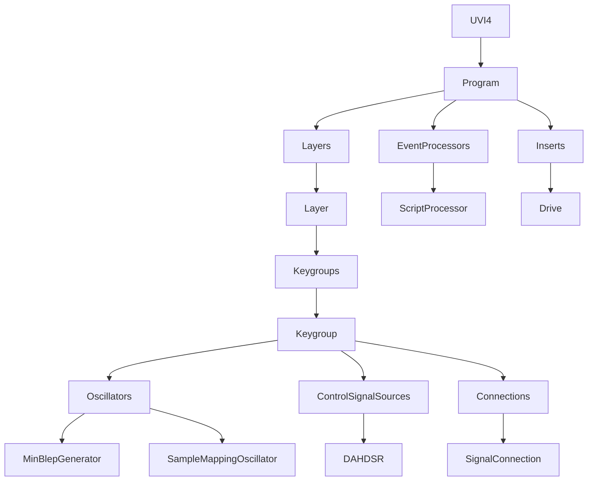

# DSP and format compatibility specification

Evidence dates: 2026-10-07 through 2026-10-08. Reference images: Kontakt Portable 8.13.1 and cached UVI Workstation 4.0.9. Falcon was not found as an executable. The [DSP/system inventory](DSP_SYSTEM_INVENTORY.md) lists all 124 documented Kontakt filter/effect names and 167 UVI element names, source engines, modulation and routing contracts. This document adds byte layouts, text syntax, saved-state schemas and explicit unresolved areas.

The inventory is exhaustive for the collected catalogs and resource corpus. It is **not a complete reconstruction of every DSP algorithm or every historical format variant**. A documented parameter, a readable preset and emitted pseudocode establish different things. Fields marked unknown must retain their bytes or spelling; they must not be silently assigned guessed meanings.

## Evidence files and coverage

All raw executable data, proprietary preset resources and automated pseudocode stay in ignored `artifacts/engine-analysis-2026-10-07/`. The documentation here is an original factual specification.

| Evidence | Scope | Result and limitation |
| --- | --- | --- |
| [Module/parameter catalog](../artifacts/engine-analysis-2026-10-07/catalog.json) | 124 Kontakt entries; 167 UVI element types | UVI includes 2,877 typed parameter rows with ranges, defaults, units and source anchors; interface facts do not certify DSP |
| [Workstation resource catalog](../artifacts/engine-analysis-2026-10-07/uvi-workstation/resource-format-catalog.json) | All 854 embedded ZIP members; all 505 FX/arp presets | 56 element tags, 1,357 distinct tag/attribute pairs, ordered trees, exact lexical values, hashes and resource coordinates |
| [Workstation code references](../artifacts/engine-analysis-2026-10-07/uvi-workstation/snapshot-string-xrefs.json) | Documented module and format label references | Instruction and containing unwind-range addresses; string presence is not runtime availability |
| [Focused Workstation decompilation](../artifacts/engine-analysis-2026-10-07/uvi-workstation/format-ghidra/decompilation.tsv) | 37 program, preset, mapping and LFO functions | All 37 emitted pseudocode; inferred types require checking against instructions |
| [Broad Workstation export](../artifacts/engine-analysis-2026-10-07/uvi-workstation/complete-export/summary.json) | 81,732 static entry candidates | 81,648 outputs, 84 failures, 21,224 outputs with warnings; the factory retry below recovers one failure |
| [Static-pointer supplement](../artifacts/engine-analysis-2026-10-07/uvi-workstation/pointer-export/summary.json) | 6,521 additional targets in readable data-pointer records | All 6,521 outputs, 1,701 with warnings; candidate pointers are not automatically validated vtables |
| [Compiled registration records](../artifacts/engine-analysis-2026-10-07/uvi-workstation/compiled-module-registry.json) | All 176 direct registration calls in factory `0x140e759b0` | Observed strings, callback candidates, instruction addresses and unassigned flags; runtime instantiation is not established |
| [Compiled structure map](../artifacts/engine-analysis-2026-10-07/uvi-workstation/compiled-module-structure.json) | All 176 registration callbacks; 174 distinct constructor candidates; 301 pointer tables | Allocation arguments, constructor assignments, method slots and 1,208 simple accessors; table boundaries and parameter identities are not fully established |
| [Format checks](../artifacts/engine-analysis-2026-10-07/uvi-workstation/format-checks.json) | 28 historical NIS files; eight NCW fixtures; 17 fixed parameter layouts | All framing checks pass; no encrypted payload decoding or fresh host audio comparison |
| [Readable interface index](../artifacts/engine-analysis-2026-10-07/uvi-workstation/interface-index.md) | Every observed tag/field spelling, registration call and documented module ID | Compact tables; full field values and public parameter metadata remain in JSON |
| [Official clear-program schemas](../artifacts/engine-analysis-2026-10-07/uvi-workstation/official-program-schemas.json) | Both downloaded official UVIP examples | Program hierarchy, observed attributes and child relationships; full multi and historical variants remain incomplete |
| [UFS directory corpus](../artifacts/engine-analysis-2026-10-07/uvi-workstation/ufs-directory-corpus.json) | All 26 local banks; 129,237 reachable entry records | 127,828 files, 1,409 folders, 4,318 directory nodes; encoded names stay opaque and asset payloads are not read by the parser |
| Actual UVI reader corpus check | All 26 banks, using existing reference-reader namespaces | Every decoded path resolves; 127,828 files and 1,409 folders match the independent numeric index; sample payloads are outside this check |
| [Kontakt original-byte checks](../artifacts/engine-analysis-2026-10-07/deep-dsp/machine-code-verification.json) | 70 isolated cases | Gain, subtype selection, Daft control laws/cadence/setup and compressor linking; substitutions are recorded |
| [Workstation original-byte checks](../artifacts/engine-analysis-2026-10-07/uvi-workstation/lfo-machine-code-verification.json) | 12 setter cases and 192 custom-table rendering blocks | No helper substitutions; custom tables are authored inputs, not recovered factory waveforms |
| [Workstation OnePole checks](../artifacts/engine-analysis-2026-10-07/uvi-workstation/onepole-machine-code-verification.json) | 10 setter cases and 480 successive sample blocks | Scalar and stereo SIMD output/history match byte for byte; coefficients are authored inputs, with conversion explicitly unresolved |
| [Accessor checks](../artifacts/engine-analysis-2026-10-07/uvi-workstation/accessor-machine-code-verification.json) | 1,208 original routines; 3,624 bit-pattern cases | State widths, offsets, argument/return registers and additional flag stores match; no helper substitutions or inferred public parameter IDs |
| [Rectifier, decimator and BitCrusher checks](../artifacts/engine-analysis-2026-10-07/uvi-workstation/shape-decimation-machine-code-verification.json) | 480 rectifier blocks; 495 fractional decimation blocks; 2,268 BitCrusher blocks | Exact sample/state comparisons without helper substitutions; authored internal parameters and filter coefficients |
| [Format topology graph](../artifacts/engine-analysis-2026-10-07/uvi-workstation/format-topology.json) | 507 documents; 1,312 nodes; 80 parent/child pairs | Exact lexical attributes, sibling order and two resolved named connections; XML containment does not certify audio routing |
| [Plugin topology and original-byte checks](../artifacts/engine-analysis-2026-10-07/plugin-topology.json) | Kontakt payload and Workstation VST3; six public method tables | 272 Kontakt and 42 Workstation original-code interface queries pass; live factory construction and plugin audio remain untested |
| [UFS original-byte checks](../artifacts/engine-analysis-2026-10-07/uvi-workstation/ufs-machine-code-verification.json) | 96 marker-dispatch cases; 48 bounded-seek cases | Version-dependent record tags and seek boundaries match; no complete native archive-reader execution |

Workstation's retained loaded `.text` is 28,083,256 bytes, SHA-256 `684a5557efed9e426a62cbba75c15cc727d764680e1660164b7c5ae88698fda1`. The retained capture ledger pins it to Workstation image SHA-256 `78729e96b752aea746280275072ad24cb4399a053739c49a161ff1fcfbf85721`. It was not recaptured in this run. Its overlay affects the analysis database and isolated CPU model only. Original PE files are unchanged. The map has 81,730 unwind/direct-call candidates plus two explicitly selected leaf entries. Protected sections outside this snapshot remain outside clear-code coverage.

The static-pointer scan observes 130,245 pointer records with 18,341 distinct in-snapshot targets; 6,521 are additional to the initial map. A 60-second factory retry successfully emits its previously timed-out function. Across the broad export, pointer supplement and that retry, 88,170 distinct candidate addresses emit pseudocode; 83 primary failures remain. These counts exclude the duplicate focused outputs. [Factory retry ledger](../artifacts/engine-analysis-2026-10-07/uvi-workstation/factory-retry/decompilation.tsv).

## Format families

These are distinct serialization layers and usage types; filename extensions alone do not select a byte grammar. The table names known families and records the strongest evidence available here. It does not assert that Workstation can import every type named in shared-engine strings.

| Family/types | Structure or syntax | Coverage here |
| --- | --- | --- |
| Kontakt `.nki`, `.nkm`, `.nkb`, `.nkg`, `.nkp` | Versioned NKS wrapper, NIS item tree or FileContainer; decoded payload can be XML or Kontakt chunks | Wrapper/chunk framing, version dispatch and selected public records described below; all object bodies are not decoded |
| Kontakt `.nksn` | Snapshot records and base-instrument identity | Recognized by existing importer; complete independent snapshot schema and persistence contract remain incomplete |
| NI legacy NKS preset container | Binary header plus zlib or FastLZ preset payload | Header families and compression dispatch known; historical big-endian and monolith variants need separate verification |
| NI NIS container | Length-delimited items, nested data layers and child descriptors | Framing described below; encrypted payloads remain opaque |
| NI FileContainer monolith | Metadata marker, TOC records and member data | Read layout known; differs from older NKS monoliths |
| Kontakt `.nkx`, older sample `.nks`, `.nkr` | Resource/archive directory and member records | Identity/framing exists in vendored reader; complete private/keyed member semantics are not inferred from headers |
| Kontakt `.nkc` and other caches | Cache/index records | Recognized signatures; full cache record semantics unresolved |
| Kontakt `.nicnt` | Library metadata, often with XML and associated resources | Do not treat XML metadata as a sample archive or a complete library-access specification |
| `.ncw` | Lossless sample codec with 120-byte header, table and channel sub-blocks | Detailed maintained format notes and bounded fixture checks; widths 0/1 and some format combinations remain restricted |
| KSP, linked script/data, Kontakt Lua, NUI/MUI assets | Source plus host APIs, saved variables and UI/resource records | KSP identifier catalog and selected script record known; source syntax alone does not reproduce the host/runtime |
| UVI `.uvip`, `.uvim` | `UVI4` program/performance hierarchy; separate binary state serialization also observed | Two official clear UVIP examples and root/writer paths inspected; mapping the binary-state form to file variants remains unverified |
| UVI `.m5p`, `.m5m` | MachFive program/performance roots and versioned wrappers | `MachFiveProgram` and `MachFivePerformance` paths observed; root recognition does not decode every legacy object |
| UVI `.uviwp`, `.uviws`, `.pspro` | Shared-engine program/performance routes | Extension checks and performance root `PSProPerformance` observed; complete schemas unresolved |
| `.ufs` | `UFS2` header, folder/file records and directory search tree | Numeric grammar and upgraded reader path/name recovery verified across 26 version-3 banks; transformed payloads and audio parity are separate checks |
| `.fxps` | `FXPreset` or `ModulePreset` XML | All 408 embedded examples cataloged; legacy attribute extension below |
| `.arp` | `ModulePreset` / `Arpeggiator` XML | All 97 embedded examples cataloged, including 128-entry step arrays |
| `.dmap`, mapping `.xml` | Lowercase `layers` / `layer` / `zone` | Official mapping contract plus Workstation extension dispatch; runtime outcomes not newly captured |
| `.sfz` | Header scopes and opcode assignments | Current UVI mapping subset documented separately from full SFZ or general program import |
| `.exs`, `.sf`, `.rex`, `.rx2` | Imported instrument/sample/sliced-loop formats | Extension routes observed; binary import grammars and roundtrip fidelity unresolved here |
| `.btkit`, `.btpk`, `.btbank`, `.btp` | BPM kit/pattern/bank families | Shared-engine dispatch labels observed; payload structure unresolved |
| `.mid` | Standard MIDI file chunks and event encoding | Shared-engine MIDI route; host scheduling and saved script references remain separate contracts |
| WAV, AIFF/AIF, FLAC, CAF, AU/SND, SD2; other supported audio | Independent standardized or historical sample containers | Codec support must be validated separately; recognition does not establish loop/metadata/streaming parity |
| PNG/SVG, fonts, JSON, audio IRs, ZIP resources | Embedded supporting assets | Workstation ZIP includes 24 PNG, 137 SVG, four fonts, one JSON and 183 AIFF/WAV members; DSP/state are not determined by asset names |
| VST3 / AU / AAX / standalone PE | Hosting and executable formats | Separate ABI and state contracts; neither a preset grammar nor a DSP implementation |

The vendor distinguishes preset and audio file types in its [Kontakt file-format documentation](https://docs.native-instruments.com/ni-tech-manuals/kontakt-manual/en/file-formats). Workstation extension evidence is address-indexed in [the focused function index](../artifacts/engine-analysis-2026-10-07/uvi-workstation/format-function-index.json), particularly `0x141016d00`, `0x140fcc870` and `0x141358a50`.

## Kontakt binary grammar

Numbers below are little-endian unless stated otherwise. `bytes[n]` is exactly n bytes; lengths must be bounded by the enclosing record. `WString := u32 code_unit_count; u16[code_unit_count]` uses UTF-16LE code units, not UTF-8 bytes or Unicode character counts. A serialized boolean occupies one byte in the records shown.

### NKS wrapper versions

Signatures interpreted as a little-endian u32 include `0xb36ee55e` for legacy V1, `0x7fa89012` for V2-style headers and `0x10874353` for a template variant. The existing historical reader dispatches header versions `0..255` to V1, `256..271` to V2 and larger values to V42. Header sizes, including the signature, compressed-length field and version, are 36, 170 and 222 bytes respectively. V1/V2 use zlib; V42 uses FastLZ with a declared decoded length. Those rules describe the reader and inspected examples, not every writer/version combination.

The current authored NKI writer embeds a 222-byte `BPatchHeaderV42` in a NIS sound-header item. Its fields are:

| Offset | Type/length | Meaning in this writer |
| ---: | --- | --- |
| 0 | u32 | `0x7fa89012` |
| 4 | u32 | zero; outer standalone NKS compressed length is not used here |
| 8 | u16 | header version `0x0110` |
| 10 | u32 | secondary magic `0xea37631a` |
| 14 | u16 | patch type, instrument = 1 |
| 16 | bytes[4] | authoring version components in reversed order |
| 20 | bytes[4] | reversed application signature, `6noK` in this template |
| 24 | u32 | Unix timestamp |
| 28 | u32 | retained/unknown field, zero here |
| 32, 34, 36 | u16 each | zone, group and instrument counts |
| 38 | u32 | total uncompressed sample bytes, capped by writer |
| 42 | u32 | monolith flag, zero here |
| 46 | bytes[4] | minimum version components |
| 50 | u32 | retained/unknown field |
| 54 | u32 | category icon |
| 58 | bytes[8] | author/application text field in template |
| 66 | bytes[3] | categories |
| 69 | bytes[85] | URL field |
| 154 | u32 | retained/unknown field |
| 158 | u32 | loading flags |
| 162 | bytes[16] | MD5 of decoded Kontakt chunk bytes in this writer |
| 178 | u32 | revision field |
| 182 | u32 | CRC32 of decoded chunk bytes in this writer |
| 186 | u32 | decoded-length field, zero in this embedded template |
| 190 | bytes[32] | retained trailing data, zero here |

The older standalone reader describes CRC32 over compressed data. That differs from the embedded writer above; checksum scope must follow the container/version rather than a universal rule. Source anchors: [sound header writer](../src/creator/nki.rs#L400), [container writer](../src/creator/nki.rs#L436), [historical format notes](../vendor/ni-file/doc/presets/Kontakt/BPatchHeader.md).

### NIS item and data-layer framing

```text
Item := u64 total_length; u32 version; bytes[4] "hsin";
        u32 header_flags; u32 reserved; bytes[16] uuid;
        DataLayer; u32 child_table_version; u32 child_count;
        Child[child_count]
Child := u32 sibling_index; bytes[4] domain; u32 item_id; Item
DataLayer := u64 layer_length; bytes[4] domain; u32 item_id; u32 version;
             [inner_DataLayer]; bytes[remaining_layer_payload]
```

Item header size is 40; data-layer header size is 20. Domains are four raw bytes on disk: `DSIN` is the representation used by the writer for NISD, `4KIN` for NIK4. Nonterminal layers contain the next layer first and their own property bytes after it. Terminal NISD Item ID 1 ends the layer nesting. Child descriptors are separate bytes and need not agree with an inferred child type; preserve them, sibling order, reserved words and UUIDs. The `header_flags` low bit is a deferred-item flag in the historical reader.

NISD Subtree item ID `0x73` has `u32 property_version`, `u8 compressed`. A compressed subtree then has `u32 decoded_bytes`, `u32 encoded_bytes`, `bytes[encoded_bytes]` and uses FastLZ in the inspected writer. An uncompressed subtree begins directly with another length-prefixed Item. Encryption item ID `0x74` is a separate layer; framing an encrypted item does not reveal its contents.

### Kontakt chunks and structured objects

```text
Chunk := u16 serialization_id; u32 payload_bytes; bytes[payload_bytes]
Structured := u8 structured; u16 object_version;
              if structured:
                u32 private_bytes; bytes[private_bytes];
                u32 public_bytes; bytes[public_bytes];
                u32 child_bytes; Chunk* bounded by child_bytes
              else: bytes[remaining_payload]
```

The structured flag does not eliminate the version field. Common IDs: script `0x06`; FX wrapper `0x25`; program `0x28`; voice groups `0x32`; group list `0x33`; zone list `0x34`; loop array `0x39`; eight-slot FX array `0x3a`; internal-mod array `0x3b`; external-mod array `0x3c`; insert bus `0x45`; save settings `0x47`; modern filename table `0x4b`; quick browse `0x4e`; snapshot family `0x4f..0x51`. Decoding an ID does not decode its complete payload.

The authored program is version `0xae`; groups `0x95`; zones `0x9a`. Their selected ordered public fields are:

| Record | Ordered public fields from the current writer |
| --- | --- |
| Program | WString name; f64 PCM bytes; i8 transpose; f32 gain/pan/tune; u8 low/high velocity and low/high key; i16 default keyswitch; i32 preload; library/fingerprint/flags; group-solo byte; i32 icon; three WStrings; six category bytes; retained template tail |
| Group | WString name; f32 gain/pan/tune; four bytes key tracking/reverse/release trigger/release-note mono; release-counter value; MIDI channel; i32 voice-group reference; i32 amp insert position; mute/solo bytes; interpolation quality; versioned child records |
| Zone | i32 start/end/start-mod; nine i16 velocity/key/fades/root fields; f32 gain/pan/tune; six retained bytes; i32 sample-table index/block alignment/rate; u8 channels; i32 source frames; retained i32; i32 root; retained f32/u8/i32; loop and resource children |

Zone lists store a u32 group reference before each structured zone. Group and zone list counts are u32. Existing private templates are retained blobs, not fully deciphered schemas. The loop record includes mode, frame start and length, count, alternating flag, tuning and crossfade; indices and frame units must not be confused with byte offsets. [Program writer](../src/creator/nki.rs#L105), [group writer](../src/creator/nki.rs#L165), [zone writer](../src/creator/nki.rs#L220).

Modern filename table `0x4b`, version 2: special-file count and paths; sample count and paths; one u64 timestamp and u32 monolith offset per sample; other-file count and paths; version-dependent trailing bytes. A path begins with i32 segment count. Tags 2/4 carry directory/file WStrings; tag 3 means parent directory with no string. Other historical tags represent roots, locations, library nodes and multi-file nodes. Preserve segment representation rather than splitting arbitrary host paths.

Script record `0x06` in this writer: unstructured flag 0, u16 version `0x60`, u32 UTF-8 source-byte count, source, three editor/touched/bypass bytes, u32 password-byte count and bytes, u32 title-byte count and title, u32 linked-file index, u32 saved-variable count and records. The writer uses no password or saved variables and `0xffffffff` for no linked file; those omissions are not a schema for populated persistent state.

### Effect parameter payloads

The following are existing importer layouts, **not newly verified complete Kontakt 8 schemas**. `F` means IEEE float32 LE, `B` one byte. Records must match their full expected length; trailing or missing bytes produce an opaque record in the current parser. `param_N` and `flag_N` names intentionally retain unassigned semantics. [Parser](../src/fx/params.rs#L400), [layouts](../src/fx/params.rs#L533).

| Kind | Ordered fields |
| --- | --- |
| Gainer | gain:F |
| Inverter | flag_0:B, flag_1:B |
| Delay | time_ms:F, damping:F, pan:F, feedback:F, time_unit:F, time_free_ms:F, param_6:F, flag_7:B |
| Chorus | depth:F, speed:F, phase:F, speed_unit:F, speed_free:F, param_5:F, flag_6:B |
| Flanger | depth:F, speed:F, phase:F, feedback:F, color:F, speed_unit:F, speed_free:F, param_7:F, flag_8:B |
| Phaser | depth:F, param_1:F, speed:F, param_3:F, speed_unit:F, speed_free:F, param_6:F, flag_7:B |
| Compressor | param_0:F, threshold_db:F, ratio:F, attack_ms:F, release_ms:F, link:B |
| SurroundPanner | param_0:F, param_1:F |
| Limiter | in_gain_db:F, release_ms:F |
| Distortion | param_0:F, drive:F, damping:F |
| LoFi | bits:F, frequency:F, noise_level:F, flag_3:B, noise_color:F |
| Skreamer | tone:F, drive:F, bass:F, bright:F, mix:F |
| Rotator | speed:F, balance:F, accel_hi:F, accel_lo:F, distance:F, mix:F |
| TapeSaturator | gain:F, warmth:F, hf_rolloff:F, quality:B |
| TransientMaster | input:F, attack:F, sustain:F, smooth:F |
| SolidGeq | lf_gain:F, lf_freq:F, lf_bell:B, lmf_gain:F, lmf_freq:F, lmf_q:F, hmf_gain:F, hmf_freq:F, hmf_q:F, hf_gain:F, hf_freq:F, hf_bell:B |
| SolidBusComp | threshold:F, ratio:F, attack:F, release:F, makeup:F, mix:F, link:B, flag_7:B, param_8:F |
| FeedbackCompressor | input:F, ratio:F, attack:F, release:F, makeup:F, mix:F, param_6:F, hq_mode:B, link:B, flag_9:B |
| StereoModeller | spread:F, pan:F, pseudo_stereo:B |
| Reverb | ten F fields: room_type, time, size, damping, modulation, diffusion, predelay, high_cut, low_shelf, stereo |
| SendLevels | u32 count + F values for sends; another count + F values for outputs |
| Convolution | ten F values, five B flags, two counted F arrays, i32 IR index; detailed record retains unassigned words |
| Filter/EQ | repeated i32 subtype; subtype-specific F values; EQ uses repeated frequency/bandwidth/gain triples; version-specific ladder records differ |

An extra versioned flag precedes the second subtype in some ladder records. Daft records use a leading gain value before cutoff/resonance. Internal DSP selector inputs and serialized filter IDs are separate mappings; the machine-code selector checks do not justify renumbering saved IDs. Public parameter scale, serialized values and internal coefficients also remain separate.

## NCW sample codec

Use the existing [maintained NCW specification](../vendor/ncw/FORMAT.md) and [validation ledger](../vendor/ncw/WRITER_VALIDATION.md). They contain substantially more verified codec evidence than the historical NI library notes. Their independent Kontakt checks target other pinned builds, including 8.9.0; this run does not recertify all of them against 8.13.1.

| Offset | Bytes | Field |
| ---: | ---: | --- |
| 0 | 8 | signature `01 a8 9e d6 31 01 00 00`; historical `30 01` variant handled separately |
| 8 | 2 | channels |
| 10 | 2 | sample bit depth |
| 12 | 4 | sample rate |
| 16 | 4 | active frame count |
| 20 | 4 | block-table offset |
| 24 | 4 | data-region offset |
| 28 | 4 | data-region byte length |
| 32 | 4 | format word; not interchangeable with block float flag |
| 36 | 84 | opaque bytes, preserved rather than treated universally as filename |

Each table entry is u32 relative to the data region. There are `ceil(frames/512)+1` entries; the last is a size sentinel. Every group contains one 16-byte sub-block header per channel **within that group**, followed by its payload; it is not all of one channel followed by all of the other.

Sub-block header: signature `16 0c 9a 3e`, i32 base, i16 width, u16 flags, u32 unknown. Positive widths encode signed deltas packed LSB first; the base is the first output and the final consumed delta has no active output. Negative widths encode sign-extended raw values. Each sub-block supplies 512 frames; discard final padding using the main frame count. Flag bit 0 enables mid/side and bit 1 selects float-bit-pattern interpretation. First-channel flag behavior and header-format behavior have separate version-scoped evidence. Widths 0/1 are not safe new encoding choices. Float mid/side, encoder policy and opaque fields must retain the limits stated in the maintained notes.

## UVI XML and resource syntax

### Programs, multis and module serialization

The two downloaded [official UVIP examples](https://lua.uvi.net/_examples_page.html) have `UVI4` roots. A representative **authored** structural sketch is:

```xml
<UVI4>
  <Program Name="Example" Gain="1" Pan="0">
    <EventProcessors/>
    <ControlSignalSources/>
    <Inserts/>
    <Layers>
      <Layer Name="Layer 1">
        <Keygroups>
          <Keygroup Name="Keygroup 1" LowKey="0" HighKey="127"
                    LowVelocity="1" HighVelocity="127">
            <Connections/>
            <ControlSignalSources/>
            <Inserts/>
            <Oscillators><SampleMappingOscillator Name="Sample"
              MappingPath="" InterpolationMode="1" RoundRobinMode="1"/></Oscillators>
          </Keygroup>
        </Keygroups>
      </Layer>
    </Layers>
  </Program>
</UVI4>
```

This shows hierarchy and spelling, not a complete default preset or a tested loadable instrument. The resource catalog preserves full observed node order. Module class names are element tags; `Name` identifies an instance and is distinct from `DisplayName`. `Properties`, `Connections`, `BusRouters`, `ControlSignalSources`, `EventProcessors`, `Inserts` and `Oscillators` are distinct scopes. `SignalConnection` stores source/destination, ratio, mapper, connection mode, bypass and inversion. Do not flatten modulation or routing into one global chain.

Program/performance paths reference `NeededFS` nodes with `Source` attributes. Program root selection at `0x140ebaf10` can choose `UVI4` or `MachFiveProgram`; performance handling at `0x140ab3320` recognizes `UVI4`, `MachFivePerformance` and `PSProPerformance`. Program creation/loading dispatches through shared module factories. Their complete type translation is unfinished.

Binary state writer `0x140aad580` emits `bytes[4] UVI4; u32_le version=1; u32_le XML_byte_length; zlib_stream`. The integer writer `0x1409390f0` writes four bytes. Stream constructor `0x14096af40` selects deflate method 8, default compression, positive window bits 15 and memory level 8; its initialization references zlib version `1.3.1`. Assigning this binary-state form to a particular saved UVIP/UVIM file variant has not been established. Both patched program readers accept authored instances of this framing and reject malformed lengths, unsupported versions, truncated/trailing/concatenated zlib data and over-expansion. Reference-host acceptance and every historical route remain untested.

The current [metadata inspector](../tools/inspect_uvi.py) supports bounded clear UVIP and UFS header inspection. It does not handle the entire binary-wrapped family, multis, all standalone modules or UFS member playback.

### Effect presets and arpeggiators

Workstation PE resource type/name `UVIRESOURCE` / `RESOURCE`, language 1033, RVA `0x2981350`, contains a 13,170,472-byte ZIP. All 505 XML presets passed member CRC checks. `.fxps` includes 401 `FXPreset` documents and seven `ModulePreset` script documents; `.arp` contributes 97 more `ModulePreset` documents.

```xml
<FXPreset><Gain Name="Example" Volume="1" Bypass="0"/></FXPreset>
```

```xml
<ModulePreset><Arpeggiator Name="Example" NumSteps="1"
  Step0State="1" Step0Size="1" Step0Level="1" Step0Offset="0" Step0CC="0"/>
</ModulePreset>
```

These are authored syntax illustrations, not reference engine acceptance tests. Missing attributes remain missing: default presets commonly contain an empty processor element, relying on engine defaults. Preserve all lexical values and unknown properties until each type's loader/default contract is known.

`Arpeggiator` has 657 observed attributes: 17 base attributes and five arrays of 128. Base names are `Name`, `Bypass`, `Mode`, `TriggerMode`, `OctaveMode`, `Octave`, `NumStrike`, `RepeatBottomNote`, `RepeatTopNote`, `Resolution`, `StepLength`, `ArpVelocityBlend`, `GrooveAmount`, `Hold`, `NumSteps`, `StepCCId`, `ArpeggiatorVersion`. Arrays use `Step{0..127}State`, `Size`, `Level`, `Offset`, `CC`. `NumSteps` is the active count and does not remove the serialized unused steps. Observed values do not establish complete enum ranges or timing laws.

Three BeatRepeat presets contain literal `BeatRepeat::Time` attribute names, rejected by strict XML parsers. The private research parser narrowly escapes that one known spelling for parsing, restores it in metadata and records the affected members. This is evidence of a legacy syntax extension, not permission to normalize arbitrary XML names.

Script presets use `ScriptProcessor` with `Properties`, embedded lowercase `script` text and `ScriptData`. `ScriptData` includes script-defined keys, comma decimal notation in some stored lists, and the literal misspelling `sequlenght`. Generic numeric parsing or corrected spelling can corrupt persistence. The catalog stores source length/hash rather than copying vendor Lua into the specification.

All processor tag/attribute schemas are in the resource catalog; an observed schema may include state absent from the documented parameter API. **165/167 public UVI module IDs** occur as exact terminated strings in Workstation. `SuperVPScrub` and `TimeAndPitchOscillator` were not found by that test. Shared-engine presence does not prove Workstation exposes or instantiates every Falcon type.

Factory `0x140e759b0` makes 138 calls to one descriptor constructor and 38 to another, followed by registration into a shared table. The instruction index records all 176 calls and their surrounding strings/callback candidates. Part's name is embedded as immediate bytes `50 61 72 74`, rather than referenced through a string pointer. Registration records reference 164 public IDs; ScriptProcessor follows other paths, while the two missing oscillator IDs remain absent from this trace. Names also include `SampleMappingOscillator`, `LfoEnvelope`, `Groove`, `AHDSR`, `Metronome`, `StepSequencer`, `ControlSignalMapper`, `PartsGroup`, `SamplingUnit` and legacy aliases. Surrounding strings can include aliases belonging to an adjacent branch; the index deliberately labels them candidates rather than inventing one canonical identity for each call.

The [readable structure index](../artifacts/engine-analysis-2026-10-07/uvi-workstation/module-structure-index.md) traces every registration callback into allocation arguments and a candidate constructor. There are 174 distinct constructors and 301 distinct contiguous code-pointer tables. Constructor assignments distinguish owner tables from other referenced tables; contiguous pointers alone do not establish a complete class identity or table boundary. Gate and Compressor share callback `0x141206680`, which constructs separate derived branches inline; both derived tables are retained. Static construction paths do not prove live Workstation availability.

The map identifies 791 simple getter and 417 simple setter routines. Of these, 897 transfer float32 and 311 transfer integer/bit values. Each executes against three raw bit patterns, checking return bits or the entire guarded state region, including additional dirty-flag writes. All 3,624 cases pass. A state offset is not a public parameter ID: the map leaves parameter identities unset unless separately established, and branch/transform accessors are outside this simple classifier. [Runnable check](../artifacts/engine-analysis-2026-10-07/uvi-workstation/verify_accessors.py).

### DMAP and SFZ mapping contract

DMAP uses lowercase `layers/layer/zone`. Zone fields include `path`, `lowKey/highKey`, `lowVel/highVel`, `baseNote`, `rr`, `tune`, `gain`, `purged`, `streaming` and `maxSampleStart`. The layer's position establishes `dim1`; `rr-1` establishes `dim2`. Those dimensions are note-event selectors rather than the zone attributes shown here. The published contract explains clamping, inherited start windows, asynchronous loading and path resolution. That documentation is newer than some cached manuals; runtime behavior must be pinned to the target build. [Official mapping reference](https://lua.uvi.net/_sample_mapping_intro.html).

```xml
<layers><layer><zone path="Samples/C4.wav" lowKey="60" highKey="60"
  lowVel="1" highVel="127" baseNote="60" tune="0" gain="0"
  rr="1"/></layer></layers>
```

Workstation dispatcher `0x14156c040` checks `.xml`, `.dmap` and `.sfz`. Native XML reader `0x14156e180` references the lowercase mapping/zone fields above. Its visible defaults include low/high key 0/127, low/high velocity 1/127, root 60, tune 0, streaming true and purged false. SFZ reader `0x14156ea50` separately references global/control/group/region scopes. Those reader bodies and their helpers are exported; their complete runtime contracts are not yet exercised. General program SFZ import is a separate route and should not be conflated with `SampleMappingOscillator.loadMapping`.

### UFS header and directory grammar

Native archive reader `0x14137ab30` accepts `UFS2` or `UPT2` magic and versions 2 or 3. The local corpus contains only `UFS2`, version 3. Its byte reads establish:

| File offset | Bytes | Field |
| ---: | ---: | --- |
| 0 | 4 | Magic |
| 4 | 4 | u32 LE version |
| 8 | 16 | Identifier bytes retained by the archive object; interpretation/byte order unassigned |
| 24 | 8 | u64 LE, read and discarded by this constructor |
| 32 | 8 | u64 LE, read and discarded by this constructor; not an established file-size field |
| 40 | 8 | u64 LE absolute root-entry offset |
| 48 | 256 | Fixed bank-name block, bounded NUL string used by the reader |
| 304 | 1 | Nonzero selects the encoded member-name reader |
| 305..319 | 15 | Unassigned in this corpus |
| 320 | 8 | u64 LE value 272 in this corpus; meaning unassigned |

All 26 root-entry offsets equal 328 and name-decoding flags equal 1. The +32 word equals file length +12 in 23 files and file length +16,644 in three. Preserve it without substituting the actual file length.

Marker normalizer `0x14137e280` maps the version-2 tags below into the version-3 values. Other values return `0xefffffff`. Its version comparison is broader than the archive constructor's accepted versions. Original execution validates 96 marker/version combinations.

| Record | Version-2 four bytes | Version-3 u32 LE |
| --- | --- | --- |
| Archive header | `UFS2` | `0x32534655` |
| File entry | `VFS2` | `0x675850e4` |
| Folder entry | `WFS2` | `0x2fba3632` |
| Directory descriptor | `XFS2` | `0x1847b398` |
| Branch node | `YFS2` | `0x4f9c82ab` |
| Leaf node | `ZFS2` | `0x3ca86aaf` |

The observed grammar uses absolute file offsets and little-endian integers:

```text
file_entry   = file_tag:u32, name:bytes[256], length:u64, base_offset:u64, flag:u8
folder_entry = folder_tag:u32, name:bytes[256], directory_offset:u64
directory    = directory_tag:u32, root_node:u64, first_leaf:u64, field_c:u64
key          = name:bytes[256], value:u64
branch       = branch_tag:u32, count:u32, key[count], child_offset:u64[count+1]
leaf         = leaf_tag:u32, count:u32, key[count], previous_leaf:u64, next_leaf:u64
```

`file_entry` is 277 bytes; `folder_entry` is 268 bytes; the directory descriptor is 28 bytes. Leaf key values point to file/folder entry records. Branch key values remain unassigned; child offsets drive lookup. The directory's third pointer matches reachable nodes in this corpus but its complete role remains unassigned. Leaf links use `0xffffffffffffffff` as the absent-node sentinel; native enumeration follows `next_leaf`. The parser also visits branch children and both leaf links with deduplication and read/object budgets. This is a directory search tree, not an established compressed-directory wrapper.

Entry reader `0x14137e360` and directory reader `0x14137d810` establish these field orders. Name reader `0x14137a7f0` reads exactly 256 bytes. With decoding enabled, version 3 supplies the stream position to the name provider; the encoded bytes remain opaque in this study. Hashes preserve their identity without pretending they are decoded filenames.

Native file-open path `0x141378c60` passes the saved base offset, length and flag to `0x14137d6f0`. Flag 0 selects a bounded plain stream: read `0x14137e7f0` uses `base_offset + cursor`, clamps to `length - cursor` and advances by the actual read count. Flag 1 chooses the first provider and other nonzero flags choose another provider; transformed-stream storage extents and payload decoding are unresolved. The corpus contains 114,791 flag-0, 26 flag-1 and 13,011 flag-2 file entries. Original stream-seek execution validates 48 boundary cases.

The [bounded metadata reader](../artifacts/engine-analysis-2026-10-07/uvi-workstation/read_ufs_directory.py) traversed all 26 banks: 129,237 unique entry records, 1,409 directory descriptors, 534 branch nodes and 3,784 leaf nodes. Its logical reads total 70,701,620 metadata bytes. All candidate `[base_offset, base_offset+length)` ranges fit their files; this does not prove transformed physical extents. Every descriptor, child, leaf link and leaf entry reference resolves in the emitted indexes. Version-2 layouts are supported by native dispatch evidence but have no real-bank corpus validation here. This independent parser decodes no member payload or name. A separate ignored integration check in the upgraded v2 reader uses the existing reference-reader namespace: all 26 banks produce the same file/folder counts, and every decoded entry has a resolved path. That check passed with 127,828 files and 1,409 folders. It does not certify member sample decoding or live host load.

## Workstation LFO mechanics established by original bytes

Setter `0x1410f8300` stores frequency at state +`0x48`; trigger value 3 additionally sets the owning current state's reset byte +`0x108`. Depth setter `0x1410f8340` stores +`0x4c`. Generator `0x1410f8ca0` uses 32-frame control spacing. In the tested custom-table path:

```text
increment = trunc(f32(f32(2^24 / sample_rate) * f32(frequency * 256)))
phase = u32(initial_phase + frame_offset * increment + phase_offset)
index = phase >> 24
fraction = f32((phase & 0xffffff) * 2^-24)
value = f32(f32(f32(1-fraction) * table[index])
            + f32(fraction * table[index+1]))
```

The table therefore requires a boundary entry at index 256. Buffer helper `0x1410e5dc0` addresses control points from a state offset and context frame offset divided by 32. The generator emits `ceil(frames/32)+1` points; the final point is a rounded-boundary lookahead. Persistent phase advances by the **actual** frame count, not the rounded lookahead count. Odd block boundaries matter.

Checks cover 44.1/48/96 kHz, four initial phases including near-wrap, and eight successive block sizes with authored square/ramp tables. All samples and phases match float32 operation order byte for byte. The test uses custom-wave selector 9, bipolar depth 1, zero delay/rise/smoothing and no retrigger; it does not certify factory wave shapes, host timing, random state, other LFO modes, envelope processing or complete Falcon parity. [Runnable original-byte check](../artifacts/engine-analysis-2026-10-07/uvi-workstation/verify_lfo_code.py).

## Workstation OnePole sample kernels established by original bytes

The `OnePole` registration callback `0x140e87470` allocates a 528-byte owner through constructor `0x1412b47c0`, which creates two 136-byte processing states. State vtable `0x141e77c30` and owner vtable `0x141e77c58` lead to the reset, parameter and sample-processing methods. This establishes a static registration-to-kernel chain; live host instantiation remains untested.

| State offset | Type | Observed use |
| ---: | --- | --- |
| `+0x08` | pointer | Owning context, including sample rate at owner `+0x38` and channel-layout descriptors at `+0x1a8` |
| `+0x20..0x2f` | four f32 | Stereo history ordered `yL[-2], yR[-2], yL[-1], yR[-1]` |
| `+0x30..0x3f` | four f32 | Stereo input history ordered `xL[-2], xR[-2], xL[-1], xR[-1]` |
| `+0x40` | u8 | Coefficient dirty flag |
| `+0x44` | f32 | `Freq`; constructor initializes 1000 Hz |
| `+0x48` | f32 | `KeyTracking`; constructor initializes 0 |
| `+0x4c` | f32 | Note used for key tracking; constructor initializes 60 |
| `+0x50` | f32 | Pole coefficient `a` |
| `+0x54..0x83` | 12 f32 | Independent scalar histories for general channel layouts |
| `+0x84` | u32 | `Mode`: zero selects lowpass; nonzero takes the highpass branch |

Frequency setter/getter `0x1412b5080` / `0x1412b5090` address `+0x44`; key-tracking setter/getter `0x1412b50c0` / `0x1412b50d0` address `+0x48`. Both setters mark coefficients dirty. Mode setter/getter `0x1412b50a0` / `0x1412b50b0` address `+0x84` without changing that flag. The public mode range is 0..1; the broader native branch condition does not expand that API contract. These leaf setters themselves do not clamp values. Higher-level validation/modulation may do so.

General-channel kernel `0x1412b3e30` obtains channel count through original helper `0x140ec9c60`. With `b = f32(1-a)`, each sample updates `y = f32(y + f32(f32(x-y)*b))`. Lowpass emits `y`; highpass emits `f32(x-y)`. It persists one history per channel. Zero-frame calls preserve sample histories.

Stereo kernel `0x1412b40d0` processes four frames at a time using two interleaved recurrence lanes per channel. It computes `aa=f32(a*a)` and `ab=f32(a*b)`. For one channel, the four lowpass values are:

```text
y0 = f32(f32(f32(x0*b) + f32(x[-1]*ab)) + f32(y[-2]*aa))
y1 = f32(f32(f32(x1*b) + f32(x0*ab))    + f32(y[-1]*aa))
y2 = f32(f32(f32(x1*ab) + f32(x2*b))   + f32(y0*aa))
y3 = f32(f32(f32(x2*ab) + f32(x3*b))   + f32(y1*aa))
```

Highpass subtracts these from the corresponding original samples. The one-to-three-frame remainder uses the scalar recurrence, while maintaining both previous output/input slots. The equations are mathematically related to the scalar filter but have different float32 operation order. An implementation using one scalar loop for every layout need not produce the stereo kernel's exact bits. Switching layouts also needs an established state-transfer contract because the two history areas are separate.

The checks execute original setters, kernels, coefficient-helper clean-return path and channel-layout helper without substitutions. They cover 1/2/4/12 channels, both modes, five authored pole coefficients, random finite input/history and 12 successive block sizes from zero through 129 frames. All 480 sample blocks match both PCM and persistent state exactly; output guards remain intact. [Runnable check](../artifacts/engine-analysis-2026-10-07/uvi-workstation/verify_onepole_code.py).

Coefficient helper `0x1412b4710` visibly calculates key displacement from 60, multiplies by `KeyTracking` and float32 `1/12`, calls float32 power with base 2, scales by `Freq`, and clamps the resulting frequency to half the sample rate. Its exponent calculation then reads a double multiplier at `0x14258c220` before calling exponential and storing float32 `a`. The retained capture contains `.text` only; that runtime-initialized multiplier is not established by the original on-disk data. The test supplies `a` and leaves the dirty flag clear. Exact cutoff conversion, reset's indirect clearing helper, bypass/automation, layout transitions and complete host parity remain unresolved.

## Workstation WaveShaper rectifier kernels established by original bytes

WaveShaper's dispatch `0x141271fd0` selects full rectification at internal mode 6 and half rectification at mode 7. Its constant-gain branch calls `0x141270960` / `0x141270520`; the changing-gain branch calls `0x141270b70` / `0x141270740`. All four kernels implement the same respective rectification operation. Their extra gain/branch arguments do not scale the isolated rectifier output. Gain preparation remains outside these kernels. These internal dispatch values have not been independently mapped through every public setter and saved-state path.

Full rectification clears the float32 sign bit: `output_bits = input_bits & 0x7fffffff`. This preserves NaN payload bits and converts negative zero to positive zero. Half rectification uses SSE `MAXPS`/`MAXSS` with positive zero as the second operand: positive finite values and positive infinity remain; negative values, either signed zero and unordered NaNs produce positive zero. A high-level comparison that retains NaNs would differ.

All 480 tested blocks pass across four kernels, 0/1/2/12 channels and frame counts 0 through 129 around SIMD boundaries. Inputs include signed zeros, minimum subnormals, infinities and quiet NaNs with payloads. Original instructions confirm `MAXSS` in the scalar tails: the decompiler's apparent comparison expression would obscure its NaN behavior. Input/output gains, pre/post filtering, wet mixing, oversampling and the other shaping modes remain separate work.

## Workstation Formant Crusher fractional decimation established by original bytes

Formant Crusher's processing entry `0x1412d4000` filters each channel before decimator `0x1412d43c0`, then mixes the wet signal. The isolated decimator state has float32 blend at `+0`, current ramp at `+0x1018`, ramp delta at `+0x101c`, held sample at `+0x1020`, double phase at `+0x1028` and double period at `+0x1030`.

```text
if phase <= 0:
    held = input
    delta = f32(f32(held-current) / f32(period))
    phase = phase + period                    # float64
old = current
current = f32(current + delta)
output = f32(f32(f32(held-old) * blend) + old)
phase = phase - 1                             # float64
```

The period remains fractional; rounding it to an integer changes trigger timing and persistent phase. All 495 blocks match output and persistent state exactly, including consecutive block boundaries, periods 1/1.25/2/3.3/8, three blend values and three initial phases. Parameters are authored internal inputs. Public `Morph`, `Q`, `Formant`, `Mix`, `Bite`, `FilterA` and `FilterB` mappings, the preceding filter, full effect mixing and live automation remain unverified. [Runnable rectifier/decimator check](../artifacts/engine-analysis-2026-10-07/uvi-workstation/verify_shape_decimation.py).

## Workstation BitCrusher processing established by original bytes

`BitCrusher` (public name UVI Destructor) processing entry `0x1412d1770` includes sample holding, quantization, rational saturation, an optional biquad and wet/dry mixing. Owner `+0x38` supplies sample rate and `+0x1f0` channel count. The processing state supplies target rate at `+0x20`, quantization exponent at `+0x24`, drive at `+0x28`, wet mix at `+0x2c`, a filter-state pointer at `+0x30` and per-channel held samples from `+0x40`. Public parameter conversion is not established by these offsets.

The native float32 power helper `0x1419ef640` calculates `scale = powf(2, exponent)`. Define `d = f32(drive * f32(0.95))`, `a = f32(d / f32(1-d))`, `norm = f32(f32(a+1)*0.5)` and `step = f32(sample_rate/target_rate)`. Each channel starts each call with local phase zero:

```text
for n in the block:
    if f32(n) >= phase:
        held = input[n]
        phase = f32(phase + step)
    t = f32(held * scale)
    q = trunc(f32(f32(floor(t)) + (t < 0)))
    z = f32(q * f32(1/scale))
    z = f32(z + z)
    z = f32(f32(z / f32(f32(abs(z)*a)+1)) * norm)
    wet = selected_biquad(z) or z
    output[n] = f32(f32(wet*mix) + f32(f32(1-mix)*input[n]))
```

The negative-integer behavior is distinctive: at exponent 2 and zero drive, a held input of `-0.5` quantizes to `-0.25`. Substituting truncation for `floor(t)+(t<0)` changes that boundary. The held samples persist, while the sampling phase restarts per channel per processing call. Carrying a decimation phase across blocks would change this kernel's behavior. A wet mix of zero still updates processing history.

Filter mode is the float32 word at filter-state `+0x1e0`. Zero bypasses; negative and positive values select independent biquad histories/coefficient regions, the latter displaced by `0xf0`. Within either region, coefficients `a1,a2,b0,b1,b2` are at `+8,+12,+16,+20,+24`; channel histories `x1,x2,y1,y2` start at `+0x1c,+0x4c,+0x7c,+0xac`, with four-byte channel strides. The operation order is `(((f32(x1*b1)+f32(z*b0))+f32(b2*x2))-f32(y1*a1))-f32(a2*y2)`, rounding after every operation, then shifting input/output histories.

All 2,268 original-code blocks match PCM, held samples and selected filter histories exactly, with intact output guards and no helper substitutions. Cases cover 1/2/12 channels, exponents 2/8/16, target rates 48,000/14,000 at a 48,000 Hz owner rate, two drives, three wet mixes, both filter branches and bypass, and successive block lengths 0/1/3/16/17/32/33. Filter coefficients and state are authored inputs. Exceptional/overflowing quantizer values, public rate/exponent laws, filter design and full live effect restoration remain unverified.

## Workstation gain and matrix topology from static code

Gain's process method `0x141337360` and Gain Matrix's `0x141338530` resolve channel buffers from the owner's `+0x1a8` descriptor array. Both obtain control records through parameter handles at owner `+0x1e8` and resolver `0x140f86260`. A control record contains a sample vector at `+0x18`, a constant value at `+0x20` and a constant/dynamic flag at `+0x34`. Dynamic controls use the processing argument's frame offset at `+0x18`.

For Gain Matrix, each input's binding record occupies `0x18` bytes; its handle array selects the output at an eight-byte stride. The observed equation is `output[j][n] = sum_i(input[i][n] * gain[i][j][n])`. Zero constant routes are skipped, unity routes copy/add directly and other routes use scaled copy/add. The first contribution initializes the destination; subsequent inputs accumulate in input order. Rows without a contribution are cleared. All outputs are computed in context scratch storage at `+0x70`, then copied back, preserving source channels throughout the matrix mix.

The descriptor switch explicitly handles 0–8 and 12 channels and maps descriptor values 13/14 to four channels. This does not establish every channel-layout enum. Exact accumulation bits and execution of the whole matrix remain unverified: several vector helpers jump through runtime-initialized pointers absent from the retained `.text`-only snapshot. [Static method/control-layout evidence](../artifacts/engine-analysis-2026-10-07/uvi-workstation/gain-routing-topology.json).

## XML hierarchy and named modulation topology

The [runnable topology extractor](../artifacts/engine-analysis-2026-10-07/uvi-workstation/trace_format_topology.py) verifies each factory member's hash against the retained ZIP and both official program-file hashes. Its 507 documents contain 1,312 nodes. Every non-root node has a resolved parent and ordered sibling index. The graph preserves all observed attribute values, 80 distinct parent/child pairs and distinct ordered child layouts.



This diagram shows observed containment across the two official examples, including alternative oscillator types. It does not imply both oscillators occur in one program. In each example, `SignalConnection` has `Source="Amp. Env"`, `Destination="Gain"`, `Ratio="1"`, empty `Mapper`, and zero `ConnectionMode`, `Bypass` and `Inverted`. Its source resolves uniquely to the keygroup's same-scope `DAHDSR`; its destination names that keygroup's existing `Gain` attribute. Those are explicit serialized connections, with modulation execution still untested. Empty `BusRouters` nodes provide no nonempty bus-router syntax evidence. Script API version 13 and script path/text identities are retained; the script runtime is not reconstructed.

Factory `FXPreset`/`ModulePreset` wrappers, program/layer/keygroup ownership, archive directory trees, compressed UVIP frames and plugin ABI state are separate format layers. A parser should retain each scope and ordered child list while preserving unknown fields. Flattening all XML children into a single audio chain would lose this structure.

## Kontakt plugin topology and v2 hosting boundary

The installed payload `Kontakt 8.vst3plugin` is a distinct PE image: 178,689,024 bytes, Kontakt 8.13.1, SHA-256 `8ed90c4b9dd2bb2c5cc45b64dea144f6cca245c706457de4aa72c643a8acc09d`. Its exported `GetPluginFactory` is `0x180d2b600`; `InitDll` is a jump at `0x180d2b830`; `ExitDll` is `0x180d2b5f0`. The earlier standalone EXE addresses and DSP checks must not be transferred to this image without tracing them again. [Pinned PE/RTTI metadata](../artifacts/engine-analysis-2026-10-07/kontakt-plugin-payload/pe.json).

The outer portable VST3 loader `0x1800f2400` locates the payload and an auxiliary `ktp8131.dll`, loads them, resolves the factory export, retains the payload's creation callback through a private factory layout and forwards module initialization/cleanup. The auxiliary DLL is not the identified audio payload. Successful loading registers the payload's audio class; the outer factory otherwise registers its `LoadErrProcessor` and `LoadErrController`. A compatibility class is also registered. That private callback extraction is specific to this wrapper and is not a public VST3 host contract.

The payload factory's audio-class creator is `0x180d25f50`. Its `NI::AB::InterfaceVST3` uses Steinberg's `SingleComponentEffect` base and exposes the processor and controller on the same object. The public IID bytes were checked against [Steinberg's component header](https://raw.githubusercontent.com/steinbergmedia/vst3_pluginterfaces/master/vst/ivstcomponent.h), [processor header](https://raw.githubusercontent.com/steinbergmedia/vst3_pluginterfaces/master/vst/ivstaudioprocessor.h) and [controller header](https://raw.githubusercontent.com/steinbergmedia/vst3_pluginterfaces/master/vst/ivsteditcontroller.h). Retained source hashes pin the protocol evidence.

| Interface | Object displacement | Vtable RVA | Relevant original target |
| --- | ---: | --- | --- |
| `IComponent` | `+0xb8` | `0x5428678` | `getBusInfo`: `0x180d606d0`; component state setter/getter: `0x180d64800` / `0x180d61720` |
| `IAudioProcessor` | `+0xc0` | `0x54286f0` | `setupProcessing`: `0x180d65fb0`; `process`: `0x180d62b30`; latency: `0x180d60f60`; tail: `0x180d61860` |
| `IEditController` | `+0x30` | `0x5428528` | `getParameterInfo`: `0x180d6ad10`; `setParamNormalized`: `0x180d6c230`; `createView`: `0x180d56bb0` |

Original-code checks execute 272 interface queries: 15 successful interface IDs and rejection of `IConnectionPoint`, each entered through 17 verified query/receiver-adjustment paths. Returned pointers, HRESULTs and reference counts match exactly, without helper substitutions. The internal vtable at `+0x1b0` starts with a destructor and is excluded; table length alone cannot identify an interface. Eight extension IDs retain their exact bytes without guessed names. Factory construction, host activation, processing and state-byte formats have not been executed in these checks. [Runnable check and static traces](../artifacts/engine-analysis-2026-10-07/trace_plugin_topology.py), [results and full public slot maps](../artifacts/engine-analysis-2026-10-07/plugin-topology.json).

V2's pinned starting point `e882a5d40d2705f18deab33e94ace8d701e7ebb6` already wraps `Sampler` through `moose::plugin!` for CLAP/VST3. In `src/plugin.rs:1456`, it declares 16 stereo outputs; reset republishes sample rate and reloads prepared parts. Processing adopts prepared parts through bounded queues, rejects stale generations, splits rendering at event offsets and `MAX_BLOCK`, maps internal buses to activated host outputs, and reports core latency. Persisted rack selection and `.kontra2-multi` JSON are distinct from NI/UVI native plugin state streams. Format importers should feed that existing preparation/IR path; plugin ABI recreation is a separate boundary from adding a file decoder. Source hashes/paths for this v2 observation are retained in the plugin topology artifact. This pass changes research artifacts and specifications; it does not add live reference-plugin hosting or new playable importers.

## Installed Workstation plugin topology

The installed `UVIWorkstation.vst3/Contents/x86_64-win/UVIWorkstation.vst3` is version 4.0.9, 55,250,272 bytes, SHA-256 `5215dd15ac95038483378925bc55380f48f991aed597ad6c20a0debfe64018b5`. It is distinct from the cached standalone EXE. Static collection finds 80,888 unwind records, 5,746 RTTI candidates and 6,184 validated RTTI-linked table runs; DSP-name matching selects 358 types and 1,395 distinct virtual targets. These are candidates, without a new full plugin decompilation. [Plugin PE metadata](../artifacts/engine-analysis-2026-10-07/uvi-plugin/pe.json).

Its public exports are `GetPluginFactory` at `0x18092feb0`, `InitDll` at `0x18093f330` and `ExitDll` at `0x18093f340`. The factory constructs a `juce::JucePluginFactory`. The two module hooks return true locally. RTTI identifies separate `juce::JuceVST3Component`, `juce::JuceVST3EditController` and editor objects, plus `uviWS::UVIWorkstation`, which has a JUCE audio-processor interface.

The component exposes `IComponent` at its object base and `IAudioProcessor` at `+8`; it rejects `IEditController`. The controller exposes `IEditController` at `+0x30` and rejects the two processing interfaces. These rejections return nonzero status 1 and null pointers. Kontakt's tested `IConnectionPoint` rejection instead returns `0x80004002`. Both are observed failure paths; a compatibility layer must not assume every rejection has one HRESULT encoding.

All 42 original-code queries pass across five component receiver paths and nine controller receiver paths, checking the three core interface IDs, exact returned pointers and reference-count changes. Processor-specific extension delegates are authored null so the checks exercise the wrapper's own interfaces. No licensing, module initialization, processor construction or live rendering is run. The cached standalone loaded-text snapshot is not overlaid on this plugin. The combined [plugin topology artifact](../artifacts/engine-analysis-2026-10-07/plugin-topology.json) records all six NI/UVI public method tables and the independent image identities.

## Remaining reconstruction work

Every cataloged module still needs a version-pinned mapping from serialized state to parameter setters, coefficient/state representation, channel/voice scope, reset/restore lifecycle, processing kernel, tails/latency and automated modulation behavior. The original-byte checks establish specific parts of this contract; complete nonlinear filters, delays/reverbs, synthesis oscillators, stretching/resampling and script/runtime behavior are not all proven. Unknown formats and private fields above are explicit research targets, not supported compatibility features.

A compatible tool must also reproduce resource lookup, voice/event ownership, streaming, sample decoding, scoped routing, asynchronous loads and persistence. A successful parse or a matching isolated equation is insufficient to claim an existing instrument plays correctly.
