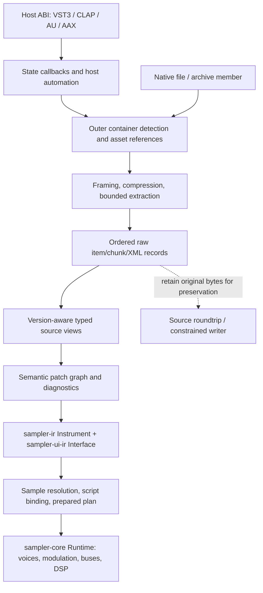
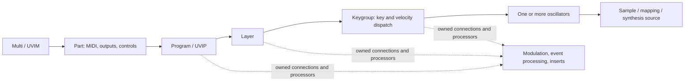

# Plugin generations, serialization boundaries, and native architecture

Research date: **2026-10-08**. This guide describes the available evidence, the current reader boundaries, and a concrete path for expanding interoperability. It does **not** certify a complete Kontakt/Falcon replacement, every historical preset variant, or every DSP algorithm.

## Scope, identities, and evidence rules

The report workspace is `/home/derpcat/.t3/worktrees/KONTAKTO/t3code-80fe786b`, observed HEAD `0cb7a8a0b4d43086596a64c77320caa1b26d6d98`. The reference implementation is the sibling `decipher-readers-v2`, observed HEAD `2fb8c926dd39bb7ac26a84d4806f42de14b6630e`. These are different checkouts. Concurrent reader fixes make the V2 working tree differ from its HEAD. The architecture delegation was cancelled after writing this guide, without its promised source ledger; the parent restored that ledger during final review. The [local source ledger](../artifacts/plugin-version-architecture-2026-10-08/local-source-provenance.json) records **parent-review** SHA-256 values, HEAD Git blob IDs, and frozen copies of modified cited files, rather than reconstructing the agent's earlier observation. “V2” below means that reference checkout, not the report workspace's older runtime.

Later Program-public and FX-reporting updates are separately pinned in the [Program parent receipt](../artifacts/ni-file-program-public-reader-2026-10-08/parent-validation.json) and [FX source ledger](../artifacts/ni-file-round2-2026-10-08/fx-source-provenance.json). The earlier architecture snapshots remain historical evidence, rather than being replaced with newer working-tree bytes.

Evidence labels apply to the associated claim, not to an entire product:

| Label | Meaning | What it establishes |
| --- | --- | --- |
| **LC** | Local source code, with file:line and hash | Actual behavior of the inspected implementation; not necessarily vendor behavior |
| **LD** | Local reverse-engineering documentation | A researched claim; may be incomplete, stale, or contradicted by implementation |
| **LT** | Version-pinned HexFiend template | A research parser/layout hypothesis; neither an official specification nor host acceptance |
| **OD** | Official vendor manual, scripting reference, or release note | Supported concepts/features and their documented version; usually not binary layouts |
| **BA** | Previously collected binary/static or isolated-byte analysis | Behavior of the identified image/function, with its existing validation limits |
| **I** | Inference or design recommendation | Reasoned consequence, explicitly not a recovered layout |
| **U** | Unknown / insufficient evidence | Must not be converted into a compatibility promise |

The upstream [ni-file GitHub repository](https://github.com/monomadic/ni-file) returned **HTTP 451** through the direct HTTP request. The browser reported an internal fetch error; it did not provide upstream source. Local vendored sources are therefore the ni-file evidence in this guide, not an asserted fresh upstream checkout. The [HexFiend repository](https://github.com/monomadic/hexfiend-templates) was accessible; inspected templates are pinned to **`c6f309bae04a03967b94f54d81dc2050f827a1e8`**, with [individual URLs and hashes](../artifacts/plugin-version-architecture-2026-10-08/template-provenance.json). **LC/LT**

The historical S3 Falcon manual URL returned HTTP 403 to direct download and failed in the browser. The current official product page links [Falcon's CDN manual](https://cdn.uvi.net/UVIFC_Falcon/manuals/Falcon_manual_en.pdf), which downloaded successfully. The browser could not open that PDF; local `pdftotext` extraction supplies page/text anchors. Download outcomes, final URLs, byte lengths and SHA-256 hashes are retained in [web provenance](../artifacts/plugin-version-architecture-2026-10-08/web-provenance.json). **OD**

Related reports retain the detailed work of other investigations:

- [ni-file coverage audit](NI_FILE_COVERAGE_AUDIT.md): container/object codec matrix and base-versus-working-tree differences.
- [ni-file NIS readers](NI_FILE_NIS_READERS.md): activated NIS APIs, shared property-reader error propagation, raw unsupported schemas and parent validation.
- [ni-file binary records](NI_FILE_BINARY_RECORDS.md): recovered VoiceGroups 0x60 grammar and exact Program dispatch/suffix evidence, pinned to the standalone image.
- [ni-file Kontakt reader limits](NI_FILE_KONTAKT_READERS.md): descriptions, private Program state and VoiceGroups; includes the concurrent V2 fixes and their limits.
- [DSP and format specification](DSP_FORMAT_SPECIFICATION.md): detailed byte layouts, binary record evidence and version-pinned plugin interface analysis.
- [DSP/system inventory](DSP_SYSTEM_INVENTORY.md): documented module catalogs and engine/runtime contracts; a catalog is not per-version DSP coverage.
- [Falcon format groundwork](FALCON_FORMAT_GROUNDWORK.md) and [Falcon runtime/UI groundwork](FALCON_RUNTIME_UI_GROUNDWORK.md): earlier constrained evidence. Their initial header-only/metadata-only scope is historical, not the full scope of the newer V2 UVI reader.

No plugin was loaded or executed for this research. No installation, access material or sample was modified. The research agent ran no cargo/rustc/build/test/clippy command, dependency installation or server. Parent reader checks are reported separately below. Existing binary analyses are cited with their provenance, not represented as freshly repeated checks.

## 1. The architecture has seven separate contracts



An extension names a use case. An outer signature identifies a container family. A decompressor produces bytes. A typed decoder identifies source fields. An adapter decides how those fields map to native semantics. The runtime decides what it can execute. **Success at one arrow is not success at the next.** **LC/I** [K-container], [K-library], [U-program], [IR], [Core-lower].

### 1.1 Host ABI and persisted state

A VST3 factory creates plugin classes; `IComponent` state streams, `IAudioProcessor` processing and `IEditController` parameter/UI behavior are distinct contracts. CLAP, AU and AAX have their own host contracts. A host project can contain wrapper state, controller state, rack configuration, references to presets/resources and script persistence. It need not embed a standalone NKI/UVIP byte-for-byte. **BA/I** [DSP format specification, plugin topology](DSP_FORMAT_SPECIFICATION.md#kontakt-plugin-topology-and-v2-hosting-boundary).

For the retained Kontakt **8.13.1 portable-wrapper image only**, the earlier analysis distinguishes outer loader, auxiliary DLL and actual Kontakt payload. The payload exposes NI's VST3 interface using Steinberg `SingleComponentEffect`; mapped component state setter/getter targets are `0x180d64800` and `0x180d61720`. The isolated interface-query checks do not establish the state-byte grammar, factory construction, host activation or audio processing. The portable wrapper's private factory forwarding must not be generalized to every NI installation or plugin format. **BA**, existing `plugin-topology.json` and specification lines 478–494.

The observed Workstation **4.0.9 VST3** instead has JUCE component/controller wrappers and a UVI processor. Official Workstation notes explicitly place adoption of JUCE plugin-format handling at **3.0.18**. This explains host integration, not UVIP XML, UFS directory records, or DSP module serialization. It provides **no evidence that NI uses JUCE**, nor that NI and UVI share a preset grammar. **OD/BA**, [Workstation release notes](https://s3.amazonaws.com/uvi/Release_Notes/uviworkstation_changelog.pdf), PDF p.4; [existing Workstation topology](DSP_FORMAT_SPECIFICATION.md#installed-workstation-plugin-topology).

V2 has its own Moose host integration: `src/plugin.rs:220` persists `SamplerParams.selection` using `#[persist = "selection"]`. That state belongs to this application. It is not NI/UVI plugin-state emulation. `sampler-native` is a command-line consumer of the same native loading/runtime path, not an alternative native vendor plugin ABI. **LC**, V2 `src/plugin.rs:220`, [Native-render].

### 1.2 Outer container and detection

Detection must precede assumptions about preset semantics. NI's local detector distinguishes NKS preset containers, NIS item repositories, FileContainer monoliths, sample/resource archives, caches and NCW audio. NIS identification includes structural reading rather than treating a file extension as proof. V2's high-level Kontakt loader only admits the NKS/NIS branches into its chunk pipeline. A detector knowing FileContainer does not make that branch playable through `sampler_kontakt::read`. **LC** [NI-detect], [K-container].

UVI's analogous separation is soundbank → member → program wrapper → XML graph. A `.ufs` is a bank, a `.uvip` is a program, and a `.uvim` is a multi. A program name is not an asset path resolver; bank volume names, member-relative paths and loose-file-relative paths need their own rules. **OD/LC** [U-bank], [U-program]; [UVI UFS explanation](https://support.uvi.net/hc/en-us/articles/201360562-What-is-a-UFS-file).

### 1.3 Compression and framing

NKS V1/V2 payload expansion uses zlib in the local implementation; V42 uses FastLZ. NIS subtrees can carry compressed nested items. NCW is a separate sample codec, not preset decompression. UVI program storage can be clear UTF-8 XML, a constrained single-entry ZIP wrapper, or a binary `UVI4` state frame containing zlib XML. Protection is a separate boundary from compression; recognizing/framing protected content does not establish clear semantics. **LC** [NI-nks], [K-nks42], [K-nis], [U-frame].

A reader must enforce declared extents, overflow checks, exact decompressed sizes, record/work limits and source path bounds. V2's borrowed framing readers expose source slices before typed admission. The high-level Kontakt loader's 128 MiB file bound is its own policy, not a vendor file-size limit. UVI's XML parser uses a 32 MiB input bound, a one-million-node bound and rejects DTDs; those too are implementation policies. **LC** [K-container], [K-raw], [U-program].

### 1.4 Versioned records

Kontakt raw chunks are `u16 SerType; u32 body_size; body`. A StructuredObject has a structure flag, a `u16` object version, and bounded private/public/child sections. Group/zone lists use their own list grammar and must not be blindly treated as generic StructuredObject children. UVI uses ordered XML elements with class tags, instance names, attributes and explicit signal connections; a recognized XML root does not validate every descendant. **LC/LT** [NI-chunk], [NI-structured], [K-raw], [U-program].

### 1.5 Semantic patch graph

Kontakt: patch kind → bank/slots/programs → groups/zones → sample table and resources. Groups also carry source mode, triggering/voice ownership, modulation and effect scope. Program-level insert/send/main racks and instrument buses are different owners; scripts can change event routing, sample selection and native state. V2 records decoded semantics and reports unmodeled meaning. **LC** [K-library], [K-effects], [K-mapping].

UVI: multi → parts → programs → layers → keygroups → oscillators. There can be several oscillators in one keygroup; keygroup membership is not a synonym for one sample. Effects, event processors and control sources have owners at multiple levels. Explicit connections add edges that XML containment alone does not express. **OD/LC**, [Falcon manual](https://cdn.uvi.net/UVIFC_Falcon/manuals/Falcon_manual_en.pdf), pp.18–19; [U-program].

### 1.6 Modular intermediate representations

`sampler-ir::Instrument` is plain semantic data: assets, groups, zones, selection sequences, articulations/switching, modulators/routes/shapes, chains, buses, impulses, controls and script behaviors. Units and scopes remain explicit. Its `SourceFormat::Kontakt { version }` stores the **Program object's serialized version**, not the Kontakt application's semantic version. `SourceFormat::Uvi` has no per-product-version fields. **LC** [IR], V2 `sampler-ir/src/lib.rs:93`.

`sampler-ui-ir::Interface` separately describes pages, widgets, images/styles, bindings and unsupported UI semantics. It has no decoded pixels or runtime handles. KSP and Falcon Lua frontends can emit that UI description; the UI is not the audio plan. **LC** [UI-IR], [KSP].

### 1.7 Runtime and fidelity

`sampler-core::lower_with` validates semantic IR and constructs a `Prepared` plan; `Runtime::render` then executes bounded note ownership, selection, modulation, voice processing, buses and tails. The core has no plugin/file/language dependencies. Script compilation, sample decoding and construction happen before audio-thread execution. **LC** [Core-lower], [Core], [Core-render].

The lowerer's rejection of unexecutable **IR** semantics does not imply exact vendor playback. Adapters may already omit a missing sample, clamp a source range, use a different envelope law, or leave a module in `Instrument::unsupported`. Lowering does not read that diagnostic vector. A usable degraded plan can therefore coexist with unsupported source behavior. The caller must inspect those findings if it requires strict admission. **LC** [IR], [K-load], [U-program].

## 2. “Version” is at least six different coordinates

| Coordinate | Concrete evidence | Correct use and limitation |
| --- | --- | --- |
| Plugin/product semantic version | Kontakt 6.7.1, 7.5, 8.x; Workstation 4.0.9; Falcon 3.0/2026 | Feature/behavior and reference-image provenance. Does not select every byte grammar. **OD/BA** |
| Authoring/patch version | `BPatchHeaderV42.patch_version`, four byte components | Recorded authoring metadata, potentially different from marketing version. Do not collapse it to major alone. **LC**, [NI-header] |
| Minimum supported application version | `min_supported_version`, separate four components | Compatibility requirement encoded in the header. It is distinct from authoring version; not sufficient to admit unknown object/module semantics. **LC**, [NI-header] |
| Outer framing/container revision | NKS format word `0x0110`; NIS item/data/child-table versions; UFS header word 3 | Dispatch/bounds of that envelope. NIS repository metadata also has its own version. **LC**, [NI-header], [K-nis], [U-ufs] |
| Application signature / domain | Logical `Kon4`, `Kon5`, `Kon6`, `Kon7`; `NISD`, `NIK4` | Chooses an application/patch schema or namespace. It is neither a DSP version nor proof of the producing plugin's major. **LC**, [NI-preset], [K-nis] |
| Object/module/API revision | Program/Group/Zone `u16` versions; FX IDs and versions; UVI class attributes and ScriptProcessor `API_version` | Typed field and behavior dispatch at the owning record. Never infer a single global version for all objects. **LC/LT**, [NI-program], [K-mapping], [K-effects], [U-program] |

The local root NKI creator gives a concrete counterexample to conflating these fields: `src/creator/nki.rs:400` emits NKS header word `0x0110` embedded in NIS, logical signature `Kon6` as disk bytes `6noK`, patch components `[0xff,1,7,6]`, and minimum-version components `[0,0,7,6]`. These are facts about **that fixed writer profile**, not evidence that every Kontakt 6/7/8 output uses those fields. **LC**, [Root-writer].

The local `KontaktPreset::read` dispatches NKI schemas by exact logical IDs `Kon4`–`Kon7`; its `_version` argument is not used to decode the layout. Other application IDs and patch kinds become raw `Unsupported` chunks. This is a reader limitation, not evidence that all newer files are incompatible or that an authoring version 8 implies a `Kon8` signature. **LC**, [NI-preset].

## 3. Kontakt generations 1 through 8

The local historical documentation says **“4.22”** at the XML → binary transition; this guide renders that stated boundary as **4.2.2**, matching the task terminology. It also documents NIS/FileContainer adoption at **5.1**. These are **LD historical boundaries**, not independently recovered save-output transitions from one actual installation of every release. No precise release date or global conversion of every file kind is asserted. The implementation corroborates coexistence of the grammars, not universal per-release writer policy. [NI-overview], [NI-nks], [NI-preset].

The old README's percentages are research estimates, not measured coverage. Its Kontakt V2 support/unsupported bullets conflict. Old fixture-path tests reference `tests/data` directories absent from this checkout; naming a test is not evidence that it ran or that its historical file is available. **LC/LD**, [NI-readme]; [reader limits report](NI_FILE_KONTAKT_READERS.md#upstream-research).

### 3.1 Reader and writer profiles used in the matrix

**R-XML:** local ni-file NKS expansion followed by `KontaktV1`/`KontaktV2` → `XMLDocument`. This exposes legacy XML, not a V2 semantic IR adapter. The legacy schema functions contain `expect("xml error")`; legacy malformed-input handling is therefore not certified here. High-level V2 `read_chunks` tries a binary chunk stream and has no XML-to-IR branch. **LC** [NI-nks], V2 `vendor/ni-file/src/kontakt/schemas/kon1.rs:11` and `kon2.rs:12`, [K-container].

**R-CHUNK:** V2 `read_chunks` → `library::read/read_program` → `Instrument`. It supports decoded chunks from the admitted NKS/NIS branches, selected Program/Group/Zone, file tables, loops, scripts, modulation and effects. Unsupported semantics are reported. It is not a major-version certification. **LC** [K-container], [K-library], [K-load].

**W-RAW:** raw `Chunk::write`, `KontaktChunks::write` and NIS `ItemContainer::write` preserve the representation they actually store, including unknown data and order where supported. There is no general NKS writer, legacy XML editor, FileContainer builder, or arbitrary decoded-instrument native serializer. **LC**, [NI-chunk], [NI-nis-write], [NI-readme].

**W-AUTHORED:** the report workspace's existing root NKI creator emits a constrained new NIS instrument with fixed defaults. It is not an imported source roundtrip or a V2 generational writer; it cannot establish Kontakt 1–8 save compatibility. **LC** [Root-writer].

### 3.2 Source-backed generation matrix

| Plugin generation | Evidenced format/container | Signature / revision / object version | Feature/topology evidence | V2 reader scope | Writer / roundtrip scope | Evidence and unresolved gaps |
| --- | --- | --- | --- | --- | --- | --- |
| **Kontakt 1** | Legacy NKS containing compressed XML. **LC/LD** | V1 header family, total 36 bytes in historical notes; local LE magic `0xb36ee55e`. No complete modern authoring/min-version tuple in the V1 struct. **LC/LD** | XML preset representation; basic sampled instrument description in local history. Full early modulation/effect topology not recovered. **LD/U** | **R-XML** only through vendor API; no XML → V2 IR lowering. Modern NKM branch does not establish legacy multi support. | No legacy native writer; retaining the original whole file is the strongest available byte preservation. **W-RAW** applies only after compatible raw framing, not arbitrary XML saves. | [NI-overview], [NI-header], [NI-nks]. Historical XML field schemas and big-endian/monolith variants remain incomplete. |
| **Kontakt 2** | Legacy NKS/XML with separate V2 XML schema identity; legacy NKS monolith family also discussed. **LC/LD** | V2 header family, historical total 170 bytes; app signature field exists. Do not equate header-family name with every major-2 file. **LC/LD** | Local history mentions zone envelopes, filters, stretching and scripting; not independently release-audited here. **LD/U** | **R-XML**; local non-monolith expansion. Legacy monolith loading returns unsupported. No V2 XML semantic adapter. | No native V2/NKS/monolith writer. Preserve original envelope; XML extraction is not a roundtrip editor. | [NI-readme], [NI-nks], [NI-header]; absent historical fixtures and conflicting README claims prevent blanket support. |
| **Kontakt 3** | Falls in the documented pre-4.2.2 NKS/XML interval. **LD**, not a separately recovered Kon3 grammar. | No separate `Kon3` schema dispatch or major-3 object-version map in inspected code. **LC/U** | Local history names Performance View and slicing changes. Their precise minor-version introduction and saved representation remain unverified. **LD/U** | No major-3 semantic adapter or acceptance evidence. Compatible legacy envelope/XML extraction may work under **R-XML**; do not advertise generation-wide support. | No major-3 native writer or certified lossless edit path. | [NI-overview], V2 `vendor/ni-file/doc/Applications.md:16`, [NI-preset]. Need genuine version-pinned clear major-3 instruments/multis. |
| **Kontakt 4, before 4.2.2** | Documented legacy NKS/XML interval. **LD** | No independently established boundary header/object tuple for all early major-4 patches. **U** | Multi scripts and richer skinned UI controls documented for major 4. **OD** | Legacy extraction, not IR support for all early-4 records. | No early-4 native writer; source-file preservation only. | [KSP version history](https://docs.native-instruments.com/ni-tech-manuals/ksp-manual/en/version-history), section Kontakt 4; [NI-overview]. UI additions do not prove a new envelope. |
| **Kontakt 4.2.2+** | Binary chunk payload while retaining NKS outer container. **LD/LC** | Logical `Kon4`; V42 header family, total 222 bytes; strict borrowed reader accepts format word `0x0110`. Program `0x80` is present in a pinned research template, not a universal major-4 version. **LC/LT** | Program → GroupList/ZoneList; insert/send racks, VoiceGroups and pre-5.1 filename-table schema. **LC** | **R-CHUNK** where records fit supported decoders; `Nks42` additionally provides bounded non-monolith raw views. | **W-RAW** chunk stream preservation; no general outer NKS writer. **W-AUTHORED** is NIS/Kon6 and does not target major 4. | [NI-overview], [K-nks42], [NI-Kon4], pinned `Kontakt/BProgram.tcl:13`. Compression is FastLZ in code despite older notes calling all NKS zlib. |
| **Kontakt 5, before 5.1** | Documented pre-NIS NKS/chunk interval after the 4.2.2 transition. **LD** | `Kon5` schema exists, but code's modern FNTableImpl profile is not proof that every 5.0.x writer used it. No release-specific object-version tuple is established. **LC/U** | Instrument-bus effect chains, async callbacks and MIDI-file scripting documented at major 5; Time Machine Pro is documented in 5.0.2 parameter history. **OD** | **R-CHUNK** admits supported pre-5.1 filename tables as well as newer ones. Individual objects still need version checks. | Raw chunks can be retained; no general 5.0.x NKS writer or save-output oracle. | [K-library], [NI-Kon5], [KSP version history](https://docs.native-instruments.com/ni-tech-manuals/ksp-manual/en/version-history). |
| **Kontakt 5.1+** | NIS repository/BNISoundPreset and AppSpecific routes; modern monolith **FileContainer** is separately documented from 5.1 onward. **LD/LC** | `Kon5`; NIS item/layer/child-table framing version 1 in readers; `NIK4` Kontakt header domain. No single Program version assigned to all 5.x. **LC/U** | Modern filename tables and SaveSettings in schema; snapshots/persistence callback at 5.4.1; real-number scripting at 5.6.0. **LC/OD** | **R-CHUNK** for NKS/NIS; vendor FileContainer member read is outside high-level V2 `read_chunks` admission. Snapshot overlay has a separate entrypoint. | **W-RAW** NIS/chunks; FileContainer is read-only here. Edited checksums/header metadata are not automatically regenerated. | [NI-overview], [NI-Kon5], [NI-filecontainer], [K-container], [KSP version history](https://docs.native-instruments.com/ni-tech-manuals/ksp-manual/en/version-history). Exact 5.1 save policy per patch kind remains a corpus gap. |
| **Kontakt 6** | Continued NIS/chunk and documented modern monolith families, not a demonstrated new outer grammar for every major-6 save. **LC/LD** | `Kon6` schema; Program object versions independently encoded. Root writer's fixed Kon6 profile is illustrative only. **LC** | Wavetable mode and new effects in 6.0.2; Creator Tools panel/performance-view hooks at 6.1; user-zone/sample editing and async load-state functions at 6.2. **OD** | **R-CHUNK**, selected snapshot/script/resource semantics; wavetable and newer FX recognition are not full native synthesis/effect execution. | **W-RAW** preservation; **W-AUTHORED** fixed-profile new instrument writer exists in root, not arbitrary source reconstruction. | [NI-Kon6], [Root-writer], [KSP version history](https://docs.native-instruments.com/ni-tech-manuals/ksp-manual/en/version-history). Native script/UI APIs and DSP need independent conformance. |
| **Kontakt 7** | NIS/chunk profile exists; same high-level envelope route in inspected code. **LC** | `Kon7`; schema comment adds a third `0x3a` rack. It does not establish the complete set of body revisions introduced by 7.x. **LC/U** | 7.1 adds six-pole SV filters and expands automation to 1,024 slots; 7.5 adds further effects. **OD** | **R-CHUNK** and diagnostics, not complete major-7 topology/DSP coverage. Semantic lowering ignores the application's marketing major once chunk records are extracted. | **W-RAW**; no generation-wide native writer. New third-rack/FX semantics cannot be reconstructed by copying only first Program and last table. | [NI-Kon7], [Kontakt release history](https://docs.native-instruments.com/ni-tech-manuals/kontakt-manual/en/version-history). Need object-level/multi/output/state and effect behavior fixtures. |
| **Kontakt 8** | Existing 8.13.1 image analysis supplies plugin/state topology. Four installed template files are independently observed as NIS with V42 headers. **BA/local fixture** | Installed `Templates/Empty.nki` has `Kon8`, header authoring `8.6.1.255`, minimum `8.6.0.0`; `Kontakt Controls.nki` has `Kon8`, `8.7.0.255`, minimum `8.5.1.0`. Hidden template copies carry `9.9.9.255` with `Kon8`; that tuple does not establish a Kontakt 9 product. All four decode to Program `b5` and Group `96`. There is **no typed Kon8 schema in inspected dispatch**. | Tools, Leap and Komplete UI are documented; KSP 8 adds wavetable shaping/modulation, MIDI 2 per-note callbacks and effect controls. **OD** | Generic vendor extraction and complete public views work for these four files. The separate `KontaktPreset` schema API returns raw Unsupported for Kon8; V2 semantic import/playback is not established by this probe. `ksp-8.12-v2` is a frontend profile label, not full KSP/Komplete Script compatibility. | **W-RAW** only for known framing; no arbitrary 8.x native writer, Leap/Tools/UI save serializer or native host-state recreation. | [Corpus and parent decode probe](NI_FILE_VERSIONED_CORPUS.md#parent-clear-fixture-decode-follow-up), [Kontakt manual](https://docs.native-instruments.com/ni-tech-manuals/kontakt-manual/en/welcome-to-kontakt), [KSP history](https://docs.native-instruments.com/ni-tech-manuals/ksp-manual/en/version-history), [NI-preset]. Release-wide transitions and present-S real fixtures remain unassigned. |

Feature cells are examples relevant to architecture, not exhaustive release-note transcriptions. Minor versions change runtime semantics within a stable envelope. A major release can add source modes, script services or FX while reusing the same outer container; equally, a minor update can introduce a new inner record revision. **OD/LC/I**

### 3.3 Application schema differences that actually exist in code

| Local profile | Recorded top-level / Program topology | Actual typed conversion boundary |
| --- | --- | --- |
| `Kon4` | Program `0x28`, racks `0x3a`, VoiceGroups `0x32`, GroupList `0x33`, ZoneList `0x34`; old table `0x3d` | Converter takes first chunk as Program, last as `FileNameListPreK51`. **LC**, [NI-Kon4] |
| `Kon5` / `Kon6` | Program with racks, up to 16 InsertBus records `0x45`, script records `0x06`, QuickBrowse `0x4e`, groups/zones; SaveSettings `0x47`, modern table `0x4b` | Converter returns Program and FNTableImpl. Comments record topology; conversion does not type every child. **LC**, [NI-Kon5], [NI-Kon6] |
| `Kon7` | Similar schema with another `0x3a` Program rack in the comment | Same Program/FNTableImpl conversion shape. An additional rack is meaningful even if outer framing is unchanged. **LC**, [NI-Kon7] |

These comments describe the reverse-engineered profile, not mandatory cardinality constraints for every patch. Duplicate IDs matter: insert, send and main racks share an ID, and script slots repeat `0x06`. A dictionary keyed only by SerType would destroy source order/identity. `StructuredObject.children` is an ordered vector; preserve it. **LC/I** [NI-structured], [K-effects].

## 4. Kontakt file roles and exact serializer boundaries

### 4.1 Presets, resources, audio and integration are different families

| Name/type | Role | What must not be confused |
| --- | --- | --- |
| `.nki` / type 1 | Instrument program | Does not imply NKS rather than NIS/FileContainer; does not include a universal sample-access/runtime promise. **OD/LC** |
| `.nkm` / type 0 | Multi/rack | Bank/slots/programs and MIDI/output relationships; not simply concatenated independently playable NKIs. **OD/LC** |
| `.nkb` / type 2 | Instrument bank | Bank/program-switching semantics are distinct from a multi's rack routing. Exact NKB body schema/writer is not complete here. **OD/LC/U** |
| `.nkp` / type 3 | Module preset | Scope-specific saved settings, not automatically a full instrument. Exact subtype layouts vary/are incomplete. **OD/LC/U** |
| `.nkg` / type 4 | Group | Group/zone/settings role; recognizing type does not expose a complete standalone NKG semantic adapter. **LC/U** |
| `.nkz` / type 5 | Recognized patch-kind value | **Layout/meaning unresolved in examined sources.** Do not rename it “zone preset” from the extension alone. **LC/U**, [NI-header] |
| Legacy **NKS preset container** | Header plus compressed preset | This internal family name is not the `.nks` sample-archive role or modern Native Kontrol Standard integration. **LC/LD** |
| Older sample `.nks`, `.nkx` | Sample/library archives | Archive/member resolution differs from NKI preset expansion. Detector recognition does not establish all payloads as clear/playable. **LC/OD**, [NI-detect] |
| `.nkr` | Kontakt resource container | UI/supporting resource paths and archive members; not NIS preset state or a UVI bank. **LC/OD** |
| `.nksf` | RIFF-based modern preset/integration family | A local `nksf` scaffold is not a complete NKSF API, plugin-state decoder or Kontakt native writer. **LC**, V2 `vendor/ni-file/src/nksf/mod.rs:1` |
| `.ncw` | Compressed sample audio | Independent codec/channel/block grammar. Audio decoding success does not recover mapping, groups or DSP. **LC/OD** |
| `.nksn` | Snapshot | Overlay plus base-instrument relationship; not standalone recovery of sample mapping and full original instrument. **LC**, V2 `sampler-kontakt/src/snapshot.rs:1` |

NI's [file-format manual](https://docs.native-instruments.com/ni-tech-manuals/kontakt-manual/en/file-formats) supplies current instrument/multi/bank/preset roles. Local patch-type IDs come from [NI-header], not from guessed extension spellings. Legacy archives and newer integration formats require independent evidence; the current manual is not a binary schema.

### 4.2 NKS header and compression dispatch

The operative local header reader dispatches format words `0..255` to V1, `256..271` to V2, and larger words to V42. Historical notes associate total sizes 36, 170 and 222 bytes with these families. The strict V2 borrowed `Nks42` view accepts **exactly `0x0110`**, requires the secondary marker `0xea37631a`, rejects a monolith flag, and exposes original header/footer/compressed slices. **LC/LD**, [NI-header], [K-nks42].

Do not trust every old schematic literally: local `doc/containers/NKS.md` says all NKS is zlib and has inconsistent version/size examples, while executable Rust dispatches V42 to FastLZ. The pinned template still calls that segment `zlibCompressedData`. Its label does not override the actual reader. This discrepancy is documented evidence debt, not a reason to remove format discrimination. **LC/LD/LT**, [NI-nks], template `NKS/NKS.tcl:30`.

The V42 header separately carries patch kind, authoring/patch components, reversed logical application ID, timestamp/counts, monolith flag, minimum-version components, author/categories, flags, checksums and decoded size. A newer authoring version in that header is not itself a new chunk/body schema. The local header reader skips trailing 32 bytes instead of storing them; parsing/re-encoding that typed header is consequently not a whole-header lossless path. **LC**, [NI-header].

### 4.3 NIS item/layer grammar and application wrappers

The implemented little-endian framing is:

```text
Item = u64 total_length + u32 item_version + bytes[4] "hsin"
     + u32 flags + u32 reserved + bytes[16] UUID
     + DataLayer + u32 child_table_version + u32 child_count
     + repeated (bytes[12] descriptor + Item) + retained trailing bytes

DataLayer = u64 total_length + bytes[4] disk_domain + u32 item_id
          + u32 layer_version + [inner DataLayer] + remaining properties
```

The Item header occupies 40 bytes; the layer header occupies 20. A terminal generic Item layer ends nesting. Logical four-character domains are normalized by the reader; root writer disk representations include `DSIN` for NISD and `4KIN` for NIK4. Child descriptors remain independently preserved; do not rewrite them from guessed child semantics. **LC/LT**, [K-nis], [NI-nis-write], root `src/creator/nki.rs:317`, pinned template `NIS/NISD.tcl:51`.

A Kontakt repository can contain a BNISoundPreset with sound header/info/controller/authorization items and an EncryptionItem/Subtree carrying the inner PresetChunkItem. AppSpecific is an additional application-owned wrapper; V2 follows at most four nested levels. The subtree may be compressed without being encrypted. V2's borrowed `Item::unencrypted_subtree` rejects the encrypted marker instead of claiming decrypted contents. **LC**, [K-container], [K-nis].

Unknown **properties** in known item framing can remain raw. Unknown framing **versions** are not automatically understood: the borrowed NIS helper admits version 1 and returns `UnsupportedVersion` otherwise. The outer file can still be preserved intact without exposing invented child/typed views. **LC/I** [K-nis].

### 4.4 Modern FileContainer is not an NIS item repository

The local FileContainer reader expects a 16-byte metadata marker, an opaque 256-byte block, file count and total member bytes, TOC markers/blocks and entries. Each interpreted TOC entry has an index, opaque bytes, a fixed 600-byte UTF-16 filename region, another retained-as-uninterpreted word and a cumulative end offset. Member sizes come from differences between consecutive ends; a file-section base is applied when reading a member. **LC**, [NI-filecontainer].

This establishes the **implemented profile**, not complete meanings of every skipped byte. Member reads reject ambiguous indexes, oversized reads and offset overflow. The vendor reader can expose a preset member, but the high-level V2 `read_chunks` match does not currently consume `NIFile::FileContainer`. A bank listing or extracted member is not by itself a monolith playback adapter or writer. **LC**, [NI-filecontainer], [K-container].

The pinned upstream `000-default.nki` and `001-multi.nkm` fixtures each have one member: TOC order 0, stored index **1**, UTF-16 `patch.nki` or `patch.nkm`, and file-section base 2176. Their member sizes are 2297/3724 bytes and both contain NIS metadata with `Kon7`, header `7.1.3.255` and minimum `7.1.0.0`. Actual filename bytes confirm UTF-16 for these fixtures; the old template's ASCII label reads only `p`. Both files lack embedded audio members, so they do not prove filename-table-to-TOC sample mapping. TOC ordinal, stored member index and sample filename index remain separate coordinates. **Local fixture**, [pinned corpus ledger](../artifacts/ni-file-versioned-corpus-2026-10-08/manifest.json).

The [parent vendor-API probe](NI_FILE_VERSIONED_CORPUS.md#parent-clear-fixture-decode-follow-up) reads the actual bounded member bytes, expands their clear preset streams and decodes Program `af`/Group `95`. The NKM retains programs in slots 0 and 1; both containers' decoded filename lookups are empty. This proves selected framing/public views without adding high-level FileContainer import or embedded-sample resolution. **Local fixture/test**.

### 4.5 Object versions and typed-view limits

| Record | Bounded raw/typed behavior in V2 | Implication |
| --- | --- | --- |
| `Chunks`, `Chunk`, `Structured` | Borrow source byte slices; preserve raw bodies and duplicate IDs, expose private/public/version separately. **LC**, [K-raw] | Original bytes can survive even if semantic interpretation fails. Not a writable typed model. |
| Group list `0x33` / zone list `0x34` | Different list grammar; zone records retain original group ID. **LC**, [K-raw] | Do not reorder zones/groups without updating identity references. |
| Borrowed Group | Typed public view accepts version **0x95**, keeps extension/private bytes through the source view. **LC**, [K-mapping] | No basis to decode every future group version using the same offsets. |
| Borrowed Zone | Accepts **0x95/0x98/0x9a**; version 0x9a adds six bytes before the filename ID; metadata tail stays raw. **LC**, [K-mapping] | This is a concrete object-level compatibility split, not a Kontakt major-version boundary. |
| Vendor Program | Wraps StructuredObject; public parser receives `_version` but reads a fixed prefix; optional resource/wallpaper fields are not completely decoded. **LC**, [NI-program] | A successful public prefix read does not establish version-complete Program semantics. |
| Program private / VoiceGroups | Private Program remains opaque/rejected as a complete typed body. VoiceGroups **0x60** wire recovery and the now-observed typed follow-up are documented below. The decoder keeps 128 indexed optional overrides; its parent recheck remains separately scoped. Original bodies remain accessible. **LC/BA**, [reader limits](NI_FILE_KONTAKT_READERS.md), [binary records](NI_FILE_BINARY_RECORDS.md) | Wire grammar, implemented decoder, source roundtrip and native playback are separately admitted. |
| FX arrays/racks | Repeated `0x3a` racks, `0x45` buses and per-group private racks; slots can be holes. **LC**, [K-effects] | Position, owner, bypass and version matter in addition to module ID. |

The pinned Program template explicitly admits only version `0x80`. Its many companion public-layout templates illustrate evolving records, but their filenames are not a release-to-object-version catalog. Fresh standalone evidence extends the exact accepted Program set through 0xb5 (next section), but no complete matrix assigning every Program/Group/Zone version to Kontakt 1–8 was recovered. **LT/U** [template ledger](../artifacts/plugin-version-architecture-2026-10-08/template-provenance.json).

The [coverage audit's object matrix](NI_FILE_COVERAGE_AUDIT.md#exact-object-support-and-opaque-boundaries) supplies additional independently versioned **local codec** axes: FNTableImpl admits revisions 2/3 but its editable raw-record codec only 2; slot-array revisions 0x10/0x12/0x13 have different count/slot rules; AHDSR 0x11, flex-envelope 0x11/0x12 and LFO 0x71–0x73 are distinct module profiles. Source identity admits selected 0x102/0x103/0x104/0x106 records, while native snapshots have their own object/group revisions. **LC via cited audit**

Those versions describe field interpretation, not recovered vendor algorithm revisions. A readable source-identity/wavetable record does not execute the wavetable oscillator; an envelope/LFO codec does not establish its exact curve law, scheduling or persisted phase. Use the cited matrix and its source anchors for full codec detail rather than equating any of these hex values with the product major. **LC/I**

### 4.6 Fresh native record recovery: explicit version sets, not marketing majors

The [binary-record investigation](NI_FILE_BINARY_RECORDS.md) identifies Kontakt standalone **8.13.1**, image base `0x140000000`, SHA-256 `0fe6356e0879d058b6e5b73507c54c5e345cea451b35287c974e438291d4dae8`. The separately identified VST3 payload has base `0x180000000` and SHA-256 `8ed90c4b9dd2bb2c5cc45b64dea144f6cca245c706457de4aa72c643a8acc09d`. All serializer addresses in this section belong to the **standalone**. Equal product versions do not prove matching payload serializers. **BA**

The static original-byte check passed **162 Program dispatch entries** across public/private/children readers, plus ownership/getter and selected helper-call checks. It reads instructions and tables, not a running Kontakt decoder or plugin. Exact addresses, function-range hashes and original pseudocode spans are in the linked report and its `check-results.json`. **BA**

**VoiceGroups `0x32`, version 0x60.** The recovered body begins with one instrument-wide inline VoiceLimit, followed by a **16-byte mask for 128 groups**, then one inline VoiceLimit per set bit, ascending group index. There is no extra VoiceGroups header, no per-group `0x2b` chunk tag/length and no stored count/index. Each inline record is:

```text
u8 structured = 0 ; u16 version = 0x60 ;
u32 UTF16_code_unit_count N ; u16 name[N] ;
i16 kill_mode ; u8 prefer_released ;
i32 maximum_voices ; i32 stolen_voice_fade_ms ; i32 exclusion_group
```

Its size is `22 + 2*N` bytes. With empty instrument name and no overrides, the body is 38 bytes; the outer six-byte chunk header brings the total to 44. A clear mask bit omits a default native group, rather than serializing an empty record. The observed default exclusion sentinel is **-1**, not a guessed 0. Full wire order is corroborated by standalone readers and reciprocal writer; typed field meanings/signedness also use the existing local VoiceLimit/IR translation. **BA/LC**, [binary report section 1](NI_FILE_BINARY_RECORDS.md#1-voicegroups-0x32-concrete-0x60-layout).

V2 already had a 16-byte/128-index interpretation in `sampler-kontakt/src/library.rs:440`; the original ni-file typed stub inspected far less and returned false empty success. The captured working tree now contains `VoiceGroups::read` using that 16-byte mask and `Vec<Option<VoiceGroup>>` with exactly 128 positions, `VoiceLimit::read_inline` validating flag 0/version 0x60, and complete chunk-consumption checks. Names and signed scalars are retained; nonzero prefer-released bytes normalize to bool, so byte-exact reserialization still requires the parent raw chunk. The parent rechecked this decoder as part of **12 focused reader tests, all passing**. Synthetic records cover indices 0, 7, 8, 63, 64 and 127, empty/full masks, UTF-16 names, truncations, flags/versions, trailing bytes and exact raw chunk preservation. This is not real-file or native-host acceptance. **LC/parent validation**, V2 `vendor/ni-file/src/kontakt/objects/voice_groups.rs:11`, `voice_limit.rs:27`, `voice_group.rs:25`; [decoder report](NI_FILE_KONTAKT_READERS.md#regression-coverage-and-validation).

**Program `0x28`.** The standalone current-version getter returns **0xb5**. Its public/private/child dispatchers accept exactly:

```text
{0x80, 0x82, 0x90, 0x91, 0x92} UNION {0xa0 through 0xb5}
```

This is **not** a continuous `0x80..=0xb5` interval: accepting its holes is incorrect. Conversely, the older local “0x80..0xaf” comment is incomplete. These are serializer dispatch versions, not a statement that 0xb5 was introduced by Kontakt 8, nor a saved-file signature `Kon8`. **BA**, [binary report section 2](NI_FILE_BINARY_RECORDS.md#2-program-0x28-proven-dispatch-bounded-fields).

The common public prefix has 23 fields implemented by 24 helper calls in eleven public case bodies. It occupies `70 + 2*(Nname+Ncredits+Nauthor+Nurl)` bytes, including the four UTF-16 lengths. Subsequent public cases add fields:

| Program versions | Recovered public suffix shape / dispatch consequence |
| --- | --- |
| `80,82,90` | No suffix after the common prefix. **BA** |
| `91,92,a0,a1` | F0. **BA** |
| `a2..a5` | F0 F2; F2 is a post-switch read. **BA** |
| `a6` | F0, two consumed legacy strings, W0, F1, F2. **BA** |
| `a7` | F0 W0 F1 F2. **BA** |
| `a8..ae` | F0 W0 W1 F1 F2; W1 is always present on the wire. **BA** |
| `af` | F0 W0 W1 U0 F1 F2. **BA** |
| `b0` | F0 W0 W1 U0 S0 F1 F2. **BA** |
| `b1` | F0 W0 W1 U0 S0 Q0 S1 F1 F2. **BA** |
| `b2` | F0 W0 W1 U0 S0 Q0 S1 U1 F1 F2. **BA** |
| `b3` | F0 W0 W1 U0 S0 Q0 S1 U1 B0 F1 F2. **BA** |
| `b4,b5` | F0 W0 W1 U0 S0 Q0 S1 U1 B0 U2 F1 F2. **BA** |

The [public-tail investigation](NI_FILE_PROGRAM_PUBLIC_TAILS.md) supersedes the initial case-local map by including both final filename references. F0/F1/F2 are distinct signed i32 table references; preserve exact negative empty sentinels. W denotes counted UTF-16, U neutral u32 and Q a neutral byte. B0 has a u32 byte count and arbitrary byte contents; its encoding and meaning remain unproven. Context affects W1's native interpretation, not whether it is consumed. **BA/U**

S0/S1 are inline BNISoundData version 1, flag 0, with nonzero presence semantics. Their positional Metadata2 version 2 and Groups1 version 1 bodies, counted collections and optional 16-byte value now have verified boundaries. They lack generic StructuredObject framing. Unknown nested versions must fail a typed view while preserving the complete raw public section. This static record recovery does not prove native file acceptance or DSP behavior. **BA/U**, [nested-body grammar](NI_FILE_PROGRAM_PUBLIC_TAILS.md#exact-body-grammar).

The private dispatcher has thirteen case groups over the same version set. Its leading u32 maps wire `0→0`, `1→1`, `2→3` in native state; it is **not proven to be an inner version**. Further nested serializers/arrays remain incomplete. Thus a recovered private branch table justifies explicit known-version admission, not a complete typed Program private editor. **BA/U**, [private dispatch evidence](NI_FILE_BINARY_RECORDS.md#private-dispatch-what-is-established-and-what-remains-opaque).

The V2 working tree now exposes `Program::public_record()` as a complete read-only view of this public grammar, including both present sound bodies. It rejects unsupported public/nested versions, hostile counts, invalid UTF-16 and trailing bytes while retaining the raw parent sections. The existing `params()` method remains prefix-only for importer compatibility. Parent review and **15 passing focused reader tests** are recorded in the [implementation report](NI_FILE_PROGRAM_PUBLIC_READER.md). This API adds neither a typed native writer nor complete private decoding. **LC/test**, not native acceptance.

### 4.7 Working-tree NIS integration and validation status

The base V2 `nis/mod.rs` commented out `items` and `schemas`. Parent integration enables the item API and **only `schemas::kontakt`**; the unrelated old repository schema remains disabled. This dormant API activation is distinct from the already-existing active `nis::schema` path used by the high-level loader. Shared preset/header property readers now return errors for missing/unsupported/malformed frames instead of panic/false absence. **LC**, [NIS integration report](NI_FILE_NIS_READERS.md#parent-integration).

Kon4–Kon7 NKI dispatch remains active; other app signatures/patch kinds return raw `Unsupported(KontaktChunks)`. Absent optional wrappers remain absence, present malformed wrappers return errors. No alias from `Kon8` to `Kon7` was added. Raw chunk order, duplicate IDs and bytes remain accessible when semantic schema admission fails. **LC**, [NI-preset], [NIS reader behavior](NI_FILE_NIS_READERS.md#behavior).

Malformed occupied FX slots, racks, buses and group inserts now reach the existing IR Unsupported list with source coordinates; valid sibling slots remain available. Parent validation passed **30 sampler-kontakt library tests**, with three surveys ignored. The [FX reporting report](NI_FILE_FX_DECODE_REPORTING.md) records the exact tested source snapshots and remaining module/DSP boundaries. **LC/test**.

The earlier integration passed **11 focused reader tests and 32 compatibility tests**. After the VoiceGroups follow-up, the parent reran both checks: **12 focused reader tests and 32 compatibility tests passed, 0 failed**, with `serde` enabled for the compatibility suite. Checks ran sequentially using the shared cargo configuration. Existing deprecated-API warnings remain. This research agent ran none of those checks. Authored cases cover the named boundaries, not every historical file or native playback. **Parent validation evidence**, [validation report](NI_FILE_NIS_READERS.md#validation-for-parent), [decoder validation](NI_FILE_KONTAKT_READERS.md#regression-coverage-and-validation).

## 5. UVI generations and format architecture

### 5.1 Stable conceptual hierarchy, independently versioned modules



The official hierarchy establishes ownership levels, not an arbitrary XML-to-audio routing algorithm. Program/layer/keygroup effects and control signals must retain scope. The local translator currently reports active Program/Layer modulation as unsupported; it cannot be silently collapsed onto per-voice modulation. **OD/LC**, Falcon manual pp.18–19; V2 `sampler-uvi/src/lib.rs:379`.

UVI also documents a distinct UVIScript-too-new compatibility failure, requiring a sufficiently recent engine/plugin even when the outer program/bank loads. This is direct evidence that script API compatibility is its own axis. **OD**, [UVI script-version support note](https://support.uvi.net/hc/en-us/articles/19464456889117-Error-Message-This-script-was-created-with-a-more-recent-version-of-UVIScript-xx-Please-upgrade-your-software).

A `SampleMappingOscillator` adds a separate mapping table; it is not merely another Keygroup XML node. UVI's official mapping guide describes key/velocity plus `dim1` and `dim2`, lowercase `layers/layer/zone` DMAP/XML, and an SFZ subset. Layer order supplies dim1; `rr - 1` supplies dim2. Those axes can often map to IR articulations/sequences, but script-selected dimensions and async purge/load state must remain explicit. **OD/I**, [UVI mapping guide](https://lua.uvi.net/_sample_mapping_intro.html).

### 5.2 Workstation historical major-version matrix

The retrieved official Workstation changelog ends in the 3.x family. It contains 1.x, 2.x and 3.x history, but no 4.0 section. The separately retrieved official manual identifies **Version 4.0**. Thus the major-4 feature evidence comes from that manual and the identified 4.0.9 binary, not an invented continuation of the old PDF. **OD/BA**

| Workstation generation | Evidenced format/container | Signature / revision / object version | Feature/topology evidence | V2 reader scope | Writer / roundtrip scope | Evidence and unresolved gaps |
| --- | --- | --- | --- | --- | --- | --- |
| **1.x** | Official notes discuss saved presets/session reload, loop/sample and multi behavior; no complete per-major preset byte specification. **OD/U** | No verified generation-1 UVIP/UFS revision or authoring signature mapping. **U** | Notes include release-trigger, sustain, convolution and streaming fixes. **OD** | No dedicated 1.x dispatch/fixture certification. Current compatible XML may be translatable; extension alone cannot prove it. | No native program/multi/UFS writer. | [Workstation history](https://s3.amazonaws.com/uvi/Release_Notes/uviworkstation_changelog.pdf), pp.16–22. Need original clear presets and state from an identified 1.x release. |
| **2.x** | Programs, multis, bank loading and scripts in official notes. No documented new preset grammar at 2.0. **OD/U** | Unknown per-major container/object revisions. Do not label the XML root `UVI2` without a source. **U** | 2.0 adds 64-bit hosting, script/macros and voice handling changes; later 2.x synchronizes engine features with Falcon. **OD** | V2 graph translation is based on actual module tags, not Workstation 2.x product version. UFS reader only admits its supported bank profile. | No native writer or per-generation roundtrip certification. | Official history pp.6–15; [U-program], [U-ufs]. Host architecture changes do not date preset transitions. |
| **3.x** | Official notes continue program/bank/session behavior, and document shared engine updates with Falcon 1/2 releases. **OD** | No public 3.x preset-revision matrix. JUCE transition is **3.0.18**, not a UVIP version. **OD/U** | 3.0 adds UI scaling/browser/arp changes; later minors update the shared engine. **OD** | Existing module/graph subset only; no promise that every 3.x bank or script is understood. | No native writer. Retain original XML/program envelope for preservation. | Official history pp.1–6. Product major is not mapped to XML `UVI4` or UFS word 3. |
| **4.x** | Manual identifies version 4.0; static 4.0.9 evidence shows program/performance, `UVI4` and bank machinery. **OD/BA** | V2 admits UFS2 **word 3**, and binary UVI4 frame **word 1**; neither is a Workstation major number. Full module save-revision map unknown. **LC/U** | Version-4 manual describes browser improvements, scalable UI, multi mixing, unlimited parts and effects; the official Browser Edition support page independently identifies the major-4 browser update. **OD** | Plain Program/UVI4 one-Program XML; conditional UFS bank reader; partial modulation/oscillator/script/UI translation. Not Workstation-equivalent playback. | No UVIP/UVIM/UFS writer or vendor host-state serializer. Raw directory/footer retention is not whole-bank re-emission. | [Workstation manual](https://cdn.uvi.net/UVIWS_Uvi_workstation/manuals/UVI_Workstation_manual_en.pdf), pp.1/4; [official Browser Edition note](https://support.uvi.net/hc/en-us/articles/25613610492189-UVI-Workstation-4-Browser-Edition-New-Features-and-Troubleshooting); [U-program], [U-frame], [U-ufs]; existing 4.0.9 binary report. |

### 5.3 Falcon historical major-version matrix

The current official manual contains historical 1.x/2.x/3.x notes and a **Falcon 2026** section. Neither source here establishes that “2026” is a binary major 4; it is kept as the published generation label. **OD/U**

| Falcon generation | Evidenced format/container | Signature / revision / object version | Feature/topology evidence | V2 reader scope | Writer / roundtrip scope | Evidence and unresolved gaps |
| --- | --- | --- | --- | --- | --- | --- |
| **1.x** | Programs/multis and UVI bank interoperability appear in official history; current manual distinguishes UVIP/UVIM. **OD** | No verified per-1.x preset revision, UFS revision or class-version catalog. **U** | Historical notes discuss keygroup processing, scripts and modulation changes. Exact initial module set is not fully reconstructed. **OD/U** | V2 consumes compatible clear graph records, without Falcon 1.x product-version dispatch. | No native Falcon program/multi/bank writer. | [Falcon manual](https://cdn.uvi.net/UVIFC_Falcon/manuals/Falcon_manual_en.pdf), historical changelog pp.9–11; [U-program]. Historical source files absent. |
| **2.x** | Same named program/multi usage, with new graph modules; no officially documented outer-grammar migration tied to 2.0. **OD/U** | No per-major UVIP/UFS revision established. Module availability changes within 2.x. **U/OD** | 2.0 adds Additive oscillator, Tape Echo and new modulators; later 2.x adds further synthesis/effects. **OD** | Supported sampled/graph subset only. New oscillator names are unsupported evidence unless an actual translator/runtime implementation exists. | No native writer; original graph/envelope retention required. | Falcon manual p.8 and [U-program]. Synth algorithms and script/runtime services cannot be inferred from XML tags. |
| **3.x** | Programs/multis remain the documented conceptual objects; no verified new outer revision assigned to major 3. **OD/U** | UVI4 root and individual API/module revisions must be checked independently. **LC/U** | 3.0 adds VOSIM, Bowed String and Harmonic Resonators, MIDI Out and mapper/UI changes; 3.1 changes browsing. **OD** | No complete synthesis/module lowering or Falcon 3.x behavioral certification. Single-program reader is not full UVIM multi support. | No native writer or generation-wide roundtrip. | Falcon manual p.7; [U-program], [IR]. Scope/routing and event-output behavior require more than sample-zone conversion. |
| **Falcon 2026** | Current official product/manual generation. No independent executable was identified in the earlier corpus. **OD/BA/U** | No evidenced `UVI2026` root, major-4 binary schema or UFS revision transition. **U** | New oscillators, effects and modulators are officially listed, including Phase Shaper, SupraSaw and Grains. **OD** | Not newly implemented by this research. Existing reader/runtime limits remain module-specific. | No native writer or full DSP equivalence. | [Official Falcon page](https://www.uvi.net/falcon), “Added in Version 2026”; current manual p.7. Need clear generation-pinned saves and a reference behavior corpus. |

These version tables document **feature evolution and missing serializer evidence separately**. They intentionally do not assign an invented UVIP revision to each major, or claim that all Workstation and Falcon modules are interchangeable because release notes mention a shared engine.

### 5.4 Concrete UVI clear-program and framing evidence

The official [MappingArticulations.uvip](https://lua.uvi.net/MappingArticulations.uvip) and [FXControls.uvip](https://lua.uvi.net/FXControls.uvip) examples contain `UVI4/Program/Layers/Layer/Keygroups/Keygroup`. Their ScriptProcessor records have observed `API_version="13"`; examples include explicit SignalConnection and modulation/effect/oscillator tags. That proves those source spellings and relationships, **not** that API 13 is the only supported historical API or that every Workstation/Falcon release writes the same module data. **OD/local XML**, earlier [clear-program evidence](FALCON_FORMAT_GROUNDWORK.md#concrete-clear-program-evidence), refreshed source hashes in web provenance.

V2 `parse_program_xml/translate_full` admits a direct `Program` or a `UVI4` root containing **exactly one direct Program**. It rejects other roots and password-prefixed Program attributes. The reader reports unconsumed modules; it is not a generic performance/multi decoder just because `.uvim` is a vendor extension. **LC** [U-program].

The existing UVI binary-state frame is:

```text
bytes[4] "UVI4" ; u32_le framing_version = 1 ; u32_le XML_byte_length ; zlib_stream
```

The V2 reader enforces framing version 1, exact XML output length, complete stream consumption and an expansion budget. The earlier static state-writer analysis independently reports this profile, but mapping it to **every saved UVIP/UVIM route or every historical major** remains unresolved. ZIP wrapping is another separately checked profile, not evidence that every UVI file is ZIP. **LC/BA/U** [U-frame]; [binary writer evidence](DSP_FORMAT_SPECIFICATION.md#programs-multis-and-module-serialization).

### 5.5 UFS framing is not program semantics

V2 `Ufs::open` reads a **320-byte header prefix**, requires ASCII `UFS2` at offset 0, and only accepts little-endian word **3 at +4**. It reads UUID bytes at +8, keeps the +32 word under the historical field name `expected_size` with an explicit unverified-size warning, treats +40 as root-entry offset and reads a NUL-terminated bank name at +48. This is current reader behavior; it does not retroactively turn every earlier numeric observation into a universal specification. **LC** [U-ufs].

The earlier groundwork inspected **328 bytes**, including an additional eight-byte word at +320. That broader observation window and the newer 320-byte header reader are different operations, not conflicting claims that a complete archive has only 320 or 328 bytes. The directory has separately framed records, search-tree/index links and member offsets. Version-dependent tags recovered in prior binary work cannot establish unsupported archive versions as readable by V2's version-3-only branch. **LC/BA/I**, [U-ufs], [UFS corpus evidence](DSP_FORMAT_SPECIFICATION.md#ufs-header-and-directory-grammar).

The reader retains opaque member/folder footers and distinguishes protection states, but it has no UFS writer. A directory census, successful path lookup, a clear program, decoded sample PCM and a reference audio comparison are five separate outcomes. The earlier 26-bank directory comparison must not be restated as 26-bank complete plugin playback fidelity. **LC/BA** [U-ufs], [DSP evidence table](DSP_FORMAT_SPECIFICATION.md#evidence-files-and-coverage).

## 6. Actual V2 entrypoints and lowering flow

| Stage | Kontakt path | UVI path | Shared/native destination |
| --- | --- | --- | --- |
| Inspect raw framing | `Chunks::parse`, `Chunk::structured/records`, `Nks42::parse`, `nis::Item::parse` | `Ufs::open` and bounded directory/member paths; program-wrapper decoding | Source records stay distinct from semantic IR. **LC** [K-raw], [K-nks42], [K-nis], [U-ufs] |
| Open/extract preset | `read_chunks` → NIFile NKS/NIS; AppSpecific → subtree → PresetChunkItem | `Bank::program` or loose program read; `crypto::decode_program_bytes` on admitted encoded paths | Decoded chunk stream or UTF-8 graph. **LC** [K-container], [U-bank], [U-frame] |
| Select logical program | `read`, `read_program`, `read_multi`; snapshot has separate `read_with_snapshot` | `read/translate`; `translate_path` for bank/member versus loose source | Program selection is explicit; single-program loading does not reconstruct the entire vendor multi. **LC** [K-library], [U-program] |
| Adapt into semantics | `library::translate`, group/zone/modulation/effect/script conversion | `translate_full` with Program/Layer/Keygroup/Oscillator traversal and findings | `sampler_ir::Instrument`, assets and paths. **LC** [K-library], [U-program], [IR] |
| Resolve audio/resources | `Samples`, `load_read` or `load_read_streamed`, resource container | `assemble_translated`, bank-relative resources or loose decoder, streamed variants | Resident PCM or streaming sources; independent from UI pixels/scripts. **LC** [K-load], [U-program] |
| Bind behavior/UI | `sampler_ksp::compile_with` → `bind_modules`; performance-view/resource hooks | `Translated::attach_script` → dedicated script driver and UI interface; scripted load entrypoints | Bounded core behavior/control services and `sampler_ui_ir::Interface`. **LC** [KSP], [K-load], [UI-IR], V2 `sampler-uvi/src/lib.rs:920` |
| Prepare/play | `finish/prepare` | `assemble_translated` uses shared Kontakt Options/result type for native assembly | `sampler_core::lower_with` → Prepared → Runtime event/render path. **LC** [K-load], [Core-lower], [Core-render] |
| Headless consumer | `sampler-native::render_kontakt` | `sampler-native::render_uvi` | Drives native runtime and WAV output; not vendor-host reference playback. **LC** [Native-render] |

The UVI caller reusing `sampler_kontakt::Loaded/Options` is an existing assembly choice, not evidence that UVI formats are Kontakt formats. The source adapters remain distinct. Likewise UFS must not be routed into NKR just because both expose archive members. **LC/I**

KSP's existing frontend profile is `ksp-8.12-v2`. It has lexer/preprocessor, AST, name/type resolution, control-thread init evaluation and bounded callback lowering. Warnings and per-builtin coverage describe ignored/approximated services. That label does not certify every KSP command, native asynchronous service, Komplete Script UI or old version-specific behavior. **LC** [KSP].

## 7. Preservation, typed decoding, and playback are different guarantees

| Guarantee | Available evidence | Limits |
| --- | --- | --- |
| Whole-file byte preservation | Keep the original immutable byte sequence, with source identity/hash. **I** | Works without knowing unknown framing. Not an edit or conversion. |
| Raw source-record preservation | Borrowed Kontakt `raw()` views; vendor raw chunk write; NIS properties/UUID/descriptors/trailing data retained. **LC** [K-raw], [NI-chunk], [NI-nis-write] | Only represented, admitted grammars. Does not certify unknown framing versions or all skipped header fields. |
| Typed decoding | Selected public fields, version-dispatched Group/Zone views and source schemas. **LC** [K-mapping], [NI-program] | A fixed-prefix read can leave undocumented tails. Typed success is not full semantic coverage. |
| Semantic conversion | `Instrument`, behavior/UI representations and findings. **LC** [IR], [UI-IR] | IR lacks arbitrary source records and the complete product/container/version tuple. Diagnostics are not a reconstructable source tree. |
| Native playback | Prepared native plan, decoded/resolved assets and runtime checks. **LC** [K-load], [Core] | Different curves, dropped zones, unresolved scripts/modules, routing differences or missing assets can change sound. |
| Vendor-equivalent playback | Requires version-pinned reference scenarios covering algorithms, state, timing and ownership. **I** | Existing isolated DSP/interface checks establish specific routines only; every DSP/full plugin equivalence is unproven. |

Unknown-field preservation should continue **at the source layer**. Do not enlarge the semantic IR into an unbounded opaque-object framework solely to make it look lossless. Keep original bytes/XML and a typed view beside the semantic result where an editing/export operation needs them. Decode only supported ID/version combinations; retain unsupported records as opaque source plus location/version diagnostics. **I**, consistent with [K-raw] and [IR].

For UVI specifically, a parsed document retaining XML attributes is not the same as `Instrument` retaining them. The translator's unsupported-node scan suppresses nodes under consumed ancestors, and it does not promise to enumerate every unknown attribute on an otherwise supported element. `Translated.text` retains original XML for script handling; the returned semantic `Uvi` structure has no native writer/source-tree field. Therefore neither unsupported findings nor a playable IR are a lossless UVIP roundtrip. **LC** [U-program], V2 `sampler-uvi/src/lib.rs:243` and `:900`.

### 7.1 Native writes need a concrete version profile

A correct native edited save may require rebuilding, in the owning profile:

1. Enclosing lengths, child counts, compressed/decoded lengths and archive TOC member offsets.
2. Patch kind, authoring version, minimum supported version, application signature and object/API revisions.
3. Filename/resource references, group/zone IDs, duplicate rack/script order and cross-object identities.
4. Header counts/PCM sizes, checksum scope and application-specific saved-state metadata.
5. Script persistence, snapshot/base identity, bypass/routing and linked assets.

These requirements follow from the observed readers/writer; they do not imply a universal algorithm for unknown fields. **LC/I** [NI-header], [NI-filecontainer], [NI-nis-write], [K-library], [Root-writer].

The root authored NKI writer computes MD5 and CRC32 over **expanded Kontakt chunks** in its embedded NIS sound header. The standalone historical header model describes CRC32 over **compressed data** and MD5 over decompressed chunks. Keep that discrepancy/profile distinction explicit. Recompressing an edited subtree while leaving its sound header untouched is not a certified valid native save. **LC**, [Root-writer], [NI-header].

NIS raw writing emits supported framing version 1, retains child descriptors/UUID/reserved/properties/trailing bytes, and recomputes structural lengths. It does not automatically repair Kontakt's application-specific sound-header metadata/checksums. Recompression also does not promise identical compressed bytes. A raw inner chunk roundtrip and an unchanged whole-file byte roundtrip must be tested separately. **LC/I** [NI-nis-write], [NI-readme].

## 8. Safe expansion using the existing architecture

This is a bounded expansion plan, not a new framework proposal. **I**

| Evidence-supported next step | Reuse | Admission gate |
| --- | --- | --- |
| Add a historical XML source adapter when real XML examples are available | Existing asset/group/zone/modulation/behavior IR and validators | Version-pinned XML schemas; preserve source XML; report unsupported source modes/effects/scripts. Do not treat extracted XML as a decoded modern chunk program. |
| Add FileContainer high-level loading for clear preset/sample members | Existing bounded member reader and chunk/sample loaders | Resolve the correct preset/member indexes without ambiguous fallback; feed extracted bytes through established detection; retain opaque metadata. |
| Expand Kontakt typed public objects | Existing `Chunk/Structured/Bytes` and record/version branches | Proven offsets for an exact SerType/version; unsupported versions keep raw bytes and return an explicit typed error. |
| Expand UVI sample mappings | Existing zones, selection sequences/articulations and asset resolver | Distinguish DMAP/SFZ from UVIP; preserve dim1/dim2, RR policy, paths and async/purge behavior. |
| Add a UVI/NI DSP module | Existing scoped Processor/Chain/Route/control representation | Verify units, parameter laws, automation rate, ownership/reset/tail/latency and kernel. Unknown vendor processors remain findings; use current enum variants only when their behavior fits. |
| Expand script services/UI | Existing KSP coverage and UVI script driver/UI IR | Version/API-specific command behavior, persistence ordering, event ownership and actual host service completion; a syntax parser alone is insufficient. |
| Add a native writer | Existing raw source preservation and one concrete envelope writer profile | Target a documented application/container/object profile; recompute required metadata; verify re-read and authorized target-host acceptance before claiming interoperability. |

A version ledger belongs to the retained **source identity**, since current semantic SourceFormat intentionally does not carry all version axes. A small explicit match on a newly proven object revision is preferable to speculative global version negotiation. Only add a new IR processor/source variant when a concrete supported runtime behavior requires it. **LC/I** [IR], [K-mapping], [Core-lower].

### 8.1 Evidence still required before stronger claims

- **Historical save corpus:** original clear files for each major and the 4.2.2/5.1 boundaries, with exact plugin builds, outer/header/object versions and hashes. Existing test path names are not that corpus. **U**
- **Patch-kind corpus:** native NKB/NKP/NKG/NKZ, legacy NKM and snapshots with base references. The patch-type enum alone supplies no complete body/write schema. **U**
- **Kontakt 8 save identity:** actual authoring/min-version/signature and new object/module records for Tools/Leap/Komplete UI. An 8.13.1 executable version cannot fill this table. **U**
- **UVI historical serializers:** per-generation clear programs/multis, binary/ZIP wrapper saves, bank revisions and module/API versions. No invented one-revision-per-major map. **U**
- **Host state:** complete processor/controller save/restore lifecycle and schema; factory/interface-query checks do not establish it. **U**
- **DSP/playback:** module-specific coefficient/state laws, channel scopes, modulation cadence, reset/restore and reference renders, including different rates/block boundaries, voice stealing, note overlaps and tails. **U**
- **Lossless edited saves:** source-byte retention and all enclosing references/checksums/version requirements, followed by native-reader acceptance. A parse/write test of raw records proves only that narrower contract. **U**

This guide is complete for the **available inspected evidence and explicitly bounded architecture/version questions**. The unknown cells are deliberate findings. It is not complete documentation of every private serializer, historical version, DSP or vendor runtime.

## Source anchors

Paths beginning `V2` refer to the sibling checkout. Line numbers identify the inspected symbol/prefix; whole-file hashes and base Git blob IDs are in the local source ledger. Root code was located through Graft before opening its returned spans. Local docs and unindexed V2/vendor sources were read directly.

| Reference | File:line | Scope |
| --- | --- | --- |
| NI-readme | V2 `vendor/ni-file/README.md:19` | Raw writer limitations, support caveats, template provenance |
| NI-overview | V2 `vendor/ni-file/doc/README.md:11` | Historical 4.22 and 5.1 statements |
| NI-detect | V2 `vendor/ni-file/src/detect.rs:43` | Signature and NIS detection |
| NI-header | V2 `vendor/ni-file/src/kontakt/objects/header.rs:23`, `:36`, `:234`, `:367` | Header-family dispatch, version coordinates, wire read, patch kinds |
| NI-nks | V2 `vendor/ni-file/src/nks/container.rs:25`, `:95`, `:139` | NKS envelope, decompression, legacy XML selection |
| NI-preset | V2 `vendor/ni-file/src/kontakt/schemas/preset.rs:27` | Kon4–Kon7 NKI dispatch and raw unsupported branch |
| NI-Kon4/5/6/7 | V2 `vendor/ni-file/src/kontakt/schemas/kon4.rs:9`, `kon5.rs:1`, `kon6.rs:1`, `kon7.rs:1` | Research schema topology and actual first/last conversion |
| NI-chunk | V2 `vendor/ni-file/src/kontakt/chunk.rs:19` | Exact raw chunk read/write |
| NI-structured | V2 `vendor/ni-file/src/kontakt/structured_object.rs:9` | Private/public/children framing |
| NI-program | V2 `vendor/ni-file/src/kontakt/objects/program.rs:49` | Fixed public prefix, version parameter limitation |
| NI-filecontainer | V2 `vendor/ni-file/src/file_container/mod.rs:21`, `:46` | Bounded member read and implemented TOC grammar |
| NI-nis-write | V2 `vendor/ni-file/src/nis/container/container.rs:44`, `:84` | Raw representation/trailing data and supported writer framing |
| K-container | V2 `crates/sampler-kontakt/src/container.rs:88`, `:113` | High-level NKS/NIS admission, subtree recursion |
| K-library | V2 `crates/sampler-kontakt/src/library.rs:41`, `:85`, `:136` | Instrument/multi adapter into IR |
| K-raw | V2 `crates/sampler-kontakt/src/lib.rs:419`, `:457`, `:514` | Borrowed raw chunks, record lists, structured views |
| K-nks42 | V2 `crates/sampler-kontakt/src/nks.rs:3`, `:24`, `:69` | Strict 222-byte non-monolith profile, bounded FastLZ |
| K-nis | V2 `crates/sampler-kontakt/src/nis.rs:6`, `:28`, `:105` | Framing version gate, raw retained fields, clear subtree |
| K-mapping | V2 `crates/sampler-kontakt/src/mapping.rs:28`, `:90` | Typed group/zone version admission |
| K-effects | V2 `crates/sampler-kontakt/src/effects.rs:1` | Rack/bus/group ownership and module identities |
| K-load | V2 `crates/sampler-kontakt/src/load.rs:156`, `:291`, `:488`, `:613` | Sample decode, source-range adjustments, script/lowering flow |
| U-program | V2 `crates/sampler-uvi/src/lib.rs:152`, `:188`, `:243`, `:379`, `:896`, `:957` | Root/graph admission, findings, scope, assembly |
| U-bank | V2 `crates/sampler-uvi/src/bank.rs:142`, `:236`, `:274` | Program members, resource roots, unambiguous resolution |
| U-frame | V2 `crates/sampler-uvi/src/crypto.rs:152`, `:265`, `:286` | ZIP and UVI4 binary-state wrapper |
| U-ufs | V2 `crates/sampler-uvi/src/ufs.rs:14`, `:22`, `:43`, `:208` | Header profile, raw directory records, version 3 gate |
| IR | V2 `crates/sampler-ir/src/lib.rs:1`, `:51`, `:93`, `:899` | Semantic ownership, provenance limits, processor subset |
| KSP | V2 `crates/sampler-ksp/src/lib.rs:1`, `:30`, `:131`, `:328`, `:433` | Frontend, profile, coverage, binding |
| UI-IR | V2 `crates/sampler-ui-ir/src/lib.rs:1`, `:44` | UI-only representation and source identities |
| Core | V2 `crates/sampler-core/src/lib.rs:1` | Dependency boundary and runtime ownership |
| Core-lower | V2 `crates/sampler-core/src/lower.rs:1`, `:214` | Semantic validation and prepare/lowering |
| Core-render | V2 `crates/sampler-core/src/render.rs:122` | Native render consumer |
| Native-render | V2 `crates/sampler-native/src/render_kontakt.rs:1`; `render_uvi.rs:1` | Headless consumer of native plans |
| Root-writer | Root `src/creator/nki.rs:400`, `:436` | Fixed-profile sound header and authored NIS instrument |

[NI-readme]: ../../decipher-readers-v2/vendor/ni-file/README.md
[NI-overview]: ../../decipher-readers-v2/vendor/ni-file/doc/README.md
[NI-detect]: ../../decipher-readers-v2/vendor/ni-file/src/detect.rs
[NI-header]: ../../decipher-readers-v2/vendor/ni-file/src/kontakt/objects/header.rs
[NI-nks]: ../../decipher-readers-v2/vendor/ni-file/src/nks/container.rs
[NI-preset]: ../../decipher-readers-v2/vendor/ni-file/src/kontakt/schemas/preset.rs
[NI-Kon4]: ../../decipher-readers-v2/vendor/ni-file/src/kontakt/schemas/kon4.rs
[NI-Kon5]: ../../decipher-readers-v2/vendor/ni-file/src/kontakt/schemas/kon5.rs
[NI-Kon6]: ../../decipher-readers-v2/vendor/ni-file/src/kontakt/schemas/kon6.rs
[NI-Kon7]: ../../decipher-readers-v2/vendor/ni-file/src/kontakt/schemas/kon7.rs
[NI-chunk]: ../../decipher-readers-v2/vendor/ni-file/src/kontakt/chunk.rs
[NI-structured]: ../../decipher-readers-v2/vendor/ni-file/src/kontakt/structured_object.rs
[NI-program]: ../../decipher-readers-v2/vendor/ni-file/src/kontakt/objects/program.rs
[NI-filecontainer]: ../../decipher-readers-v2/vendor/ni-file/src/file_container/mod.rs
[NI-nis-write]: ../../decipher-readers-v2/vendor/ni-file/src/nis/container/container.rs
[K-container]: ../../decipher-readers-v2/crates/sampler-kontakt/src/container.rs
[K-library]: ../../decipher-readers-v2/crates/sampler-kontakt/src/library.rs
[K-raw]: ../../decipher-readers-v2/crates/sampler-kontakt/src/lib.rs
[K-nks42]: ../../decipher-readers-v2/crates/sampler-kontakt/src/nks.rs
[K-nis]: ../../decipher-readers-v2/crates/sampler-kontakt/src/nis.rs
[K-mapping]: ../../decipher-readers-v2/crates/sampler-kontakt/src/mapping.rs
[K-effects]: ../../decipher-readers-v2/crates/sampler-kontakt/src/effects.rs
[K-load]: ../../decipher-readers-v2/crates/sampler-kontakt/src/load.rs
[U-program]: ../../decipher-readers-v2/crates/sampler-uvi/src/lib.rs
[U-bank]: ../../decipher-readers-v2/crates/sampler-uvi/src/bank.rs
[U-frame]: ../../decipher-readers-v2/crates/sampler-uvi/src/crypto.rs
[U-ufs]: ../../decipher-readers-v2/crates/sampler-uvi/src/ufs.rs
[IR]: ../../decipher-readers-v2/crates/sampler-ir/src/lib.rs
[KSP]: ../../decipher-readers-v2/crates/sampler-ksp/src/lib.rs
[UI-IR]: ../../decipher-readers-v2/crates/sampler-ui-ir/src/lib.rs
[Core]: ../../decipher-readers-v2/crates/sampler-core/src/lib.rs
[Core-lower]: ../../decipher-readers-v2/crates/sampler-core/src/lower.rs
[Core-render]: ../../decipher-readers-v2/crates/sampler-core/src/render.rs
[Native-render]: ../../decipher-readers-v2/crates/sampler-native/src/render_kontakt.rs
[Root-writer]: ../src/creator/nki.rs
